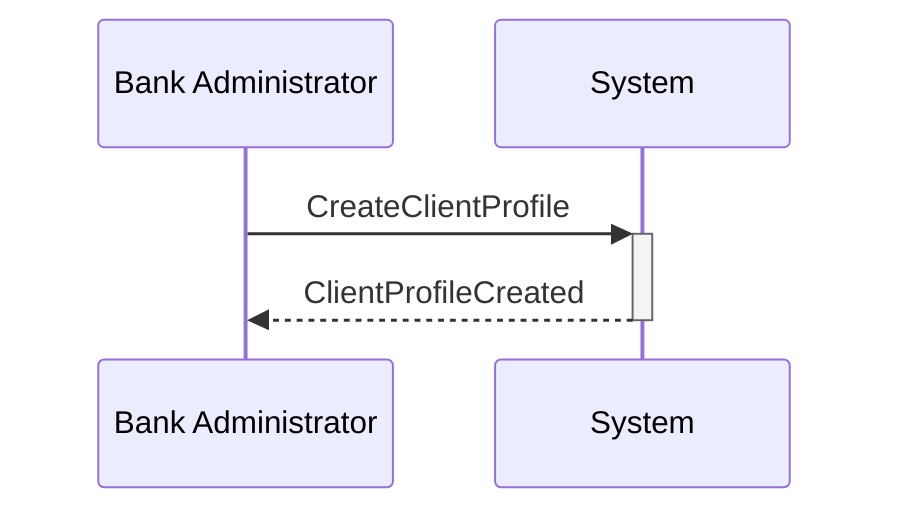

# Domain Stories Visualization Tool

A Python-based converter that transforms Domain Stories YAML models into **structured Markdown documentation with embedded Mermaid diagrams**.

## Overview

This tool converts complex Domain-Driven Design (DDD) models from YAML format into human-readable, GitHub-friendly documentation with interactive visualizations.

### Features

- **Dual Output Modes**: Generate either multiple files (one per story) or a single comprehensive file with navigation
- **Structured Markdown Generation**: Creates organized documentation with table of contents, catalogs, and cross-references
- **Embedded Mermaid Diagrams**: Generates sequence diagrams and flowcharts that render natively in GitHub/GitLab
- **Multi-Story Support**: Handles large models with 30+ domain stories (tested with 33 stories)
- **Smart Navigation**: Anchor links, "Back to Top" buttons, and cross-story references
- **Entity Catalogs**: Auto-generates actor, aggregate, and command catalogs with usage tracking
- **Tag-Based Organization**: Groups stories by tags for easy navigation
- **No External Dependencies**: Uses only PyYAML - renders anywhere Markdown is supported

## Installation

### Prerequisites

- Python 3.8+
- Virtual environment (recommended)

### Setup

```bash
# Clone or navigate to the project
cd domain-stories-visual

# Create virtual environment
python3 -m venv venv

# Activate virtual environment
source venv/bin/activate  # On Windows: venv\Scripts\activate

# Install dependencies
pip install -r requirements.txt
```

## Usage

### Basic Conversion (Multiple Files)

Generate separate markdown files for each story plus index and catalogs:

```bash
# Activate virtual environment
source venv/bin/activate

# Convert YAML to multiple Markdown files
python convert_to_markdown.py <input.yaml> <output_dir>

# Example
python convert_to_markdown.py cb-domain-stories.yaml output/
```

**Output Structure** (37 files):

```
output/
├── index.md                           # Main index with story catalog
├── actors.md                          # Complete actor catalog
├── aggregates.md                      # Complete aggregate catalog
├── commands.md                        # Complete command catalog
├── dst_client_profile_creation.md    # Individual story pages
├── dst_user_registration.md
├── dst_approval_workflow_submit.md
└── ... (33 total story files)
```

### Single File Conversion (Recommended for Viewing)

Generate a single comprehensive markdown file with complete navigation:

```bash
# Activate virtual environment
source venv/bin/activate

# Convert YAML to single Markdown file
python convert_to_markdown.py <input.yaml> <output_dir> --single-file

# Example
python convert_to_markdown.py cb-domain-stories.yaml output/ --single-file
```

**Output**: `output/domain-stories-complete.md` (3000+ lines, 128KB)

**Features**:
- Complete table of contents with anchor links
- Stories organized by tags (click to jump to story)
- All stories listing table with quick navigation
- "Back to Top" links throughout
- Entity catalogs with cross-story anchor links
- All Mermaid diagrams embedded
- Perfect for sharing or viewing in one place

## Generated Documentation

### 1. Index Page (index.md)

The main entry point with:
- Story count and version
- Stories grouped by tags (Priority, Phase, MVP, etc.)
- Complete story listing with links
- Links to entity catalogs

### 2. Individual Story Pages

Each story includes:

#### Metadata
- Story ID, title, tags
- Comprehensive description

#### Actors Section
| Actor ID | Name | Kind | Description |
|----------|------|------|-------------|
| `act_bank_admin` | Bank Administrator | person | Bank employee who... |

#### Domain Model
- **Aggregates**: With invariants and business rules
- **Work Objects**: With full attribute tables (name, type, required, description)

#### Commands, Queries, Events, Policies
- Structured tables showing relationships
- Cross-references using entity IDs

#### Visualizations

**Sequence Diagram** (Mermaid):


**Command-Event-Policy Flow** (Mermaid):


### 3. Entity Catalogs

#### Actor Catalog (actors.md)
Lists all unique actors across all stories with:
- Actor ID, name, kind
- Links to stories where they appear

#### Aggregate Catalog (aggregates.md)
Lists all aggregates with:
- Aggregate ID and name
- Links to stories where they're used

#### Command Catalog (commands.md)
Lists all commands with:
- Command ID and name
- Links to stories where they appear

## Input Format

The tool expects YAML files following the `domain-stories-schema.yaml` specification.

### Example Input Structure

```yaml
version: "2.0.0"

domain_stories:
  - domain_story_id: dst_example
    title: "Example Domain Story"
    description: "Story description..."
    tags:
      - user_management
      - priority_1

    actors:
      - actor_id: act_user
        name: "User"
        kind: person
        description: "End user..."

    commands:
      - command_id: cmd_submit_order
        name: "SubmitOrder"
        actor_ids:
          - act_user
        emits_events:
          - evt_order_submitted

    events:
      - event_id: evt_order_submitted
        name: "OrderSubmitted"
        caused_by:
          command_id: cmd_submit_order
```

See `cb-domain-stories.yaml` for a complete example with 33 stories.

## Visualization Options

### Supported Diagram Types

1. **Sequence Diagrams**: Show actor interactions over time
   - Actor → System → Events
   - Limited to first 5 commands per story (prevents clutter)

2. **Command-Event-Policy Flowcharts**: Show causal chains
   - Commands emit Events
   - Events trigger Policies
   - Policies issue new Commands
   - Limited to 15 nodes (prevents diagram explosion)

### GitHub Rendering

All Mermaid diagrams render natively in:
- GitHub (markdown preview)
- GitLab
- VS Code (with Markdown Preview Mermaid extension)
- Obsidian
- Most modern markdown viewers

## Advanced Features

### Limiting Diagram Complexity

For stories with many entities, the converter automatically:
- Limits sequence diagrams to 5 commands
- Limits flowcharts to 15 nodes
- Shows first 2 events per command
- Shows first 1 policy per event

This prevents diagram overload while maintaining readability.

### Cross-Story References

The catalogs link entities across stories:
- See which stories use the same actor
- Find all uses of an aggregate
- Track command usage patterns

### Customization

To modify diagram limits or styling, edit `convert_to_markdown.py`:

```python
# In generate_mermaid_sequence():
for cmd in commands[:5]:  # Change limit here

# In generate_mermaid_flow():
max_nodes = 15  # Change maximum nodes
```

## Research Documentation

For detailed analysis of visualization options, see:
- **[ds-visual-prompt-research.md](ds-visual-prompt-research.md)**: Complete research on 10+ visualization approaches

This document explores:
- Markdown options
- Mermaid diagrams
- PlantUML
- Graphviz
- Interactive HTML (D3.js, Cytoscape)
- C4 Model diagrams
- And more...

## Schema Reference

The tool validates against:
- **[domain-stories-schema.yaml](domain-stories-schema.yaml)**: JSON Schema specification
- **[domain-stories-context.md](domain-stories-context.md)**: Taxonomy and relationships

### Entity ID Conventions

| Entity Type | Prefix | Example |
|-------------|--------|---------|
| Domain Story | `dst_` | `dst_checkout_process` |
| Actor | `act_` | `act_customer` |
| Command | `cmd_` | `cmd_submit_order` |
| Query | `qry_` | `qry_get_status` |
| Event | `evt_` | `evt_order_created` |
| Policy | `pol_` | `pol_notify_user` |
| Aggregate | `agg_` | `agg_order` |
| Work Object | `wobj_` | `wobj_invoice` |
| Activity | `actv_` | `actv_process_payment` |

All IDs use `lower_snake_case` format.

## Example: Commercial Banking Platform

The included example (`cb-domain-stories.yaml`) demonstrates:
- **33 domain stories** covering user management, service enrollment, approval workflows
- **700+ business entities** (actors, commands, events, aggregates)
- **Multi-tier relationships** (Bank → Client → Payors)
- **Integration patterns** (Okta, Express, Anti-Corruption Layer)
- **Approval workflows** (single/dual approvers, thresholds, parallel approval)

### Generated Output Stats

- 36 markdown files (33 stories + 3 catalogs + index)
- 12 unique actors
- 28 unique aggregates
- 80+ unique commands
- Native GitHub rendering with interactive Mermaid diagrams

## Troubleshooting

### Mermaid Diagrams Not Rendering

**Problem**: Diagrams show as code blocks

**Solution**: Ensure you're viewing on:
- GitHub (built-in support)
- GitLab (built-in support)
- VS Code with "Markdown Preview Mermaid Support" extension
- Obsidian (built-in support)

### Large Diagram Errors

**Problem**: Complex stories create unreadable diagrams

**Solution**: The converter auto-limits nodes. To further reduce:
1. Split large stories into smaller stories
2. Adjust limits in `convert_to_markdown.py`

### YAML Parsing Errors

**Problem**: Conversion fails with YAML errors

**Solution**: Validate your YAML:
```bash
python -c "import yaml; yaml.safe_load(open('your-file.yaml'))"
```

Check for:
- Proper indentation
- Matching ID patterns (`act_`, `cmd_`, etc.)
- Required fields (see schema)

## Contributing

### Adding New Visualization Types

To add new diagram types:

1. Create a new method in `DomainStoryConverter` class:
```python
def generate_mermaid_state_diagram(self, story: Dict[str, Any]) -> str:
    """Generate Mermaid state diagram for aggregate lifecycle."""
    # Implementation here
```

2. Add to `generate_story_markdown()`:
```python
md.append("### State Diagram\n")
md.append(self.generate_mermaid_state_diagram(story))
```

### Extending Catalogs

To add new catalog types (e.g., Events Catalog):

1. Add method:
```python
def generate_event_catalog(self):
    """Generate catalog of all events."""
    # Similar to generate_actor_catalog()
```

2. Call in `convert_all()`:
```python
self.generate_event_catalog()
```

## Performance

- **Conversion Time**: ~1-2 seconds for 33 stories (40K+ YAML tokens)
- **Output Size**: ~200KB total markdown
- **Memory**: Minimal (<50MB for large models)

## License

This tool is provided as-is for Domain Storytelling and DDD modeling purposes.

## Resources

- **Domain Storytelling**: https://domainstorytelling.org/
- **Mermaid Documentation**: https://mermaid.js.org/
- **DDD Patterns**: https://www.domainlanguage.com/ddd/
- **JSON Schema**: https://json-schema.org/

---

## Quick Start Examples

### Multi-File Output

```bash
# Setup
python3 -m venv venv
source venv/bin/activate
pip install -r requirements.txt

# Convert to multiple files
python convert_to_markdown.py cb-domain-stories.yaml output/

# View
open output/index.md  # Or view in VS Code, GitHub, etc.
```

**Result**: 37 markdown files with embedded Mermaid diagrams, ready to commit to your repository!

### Single-File Output (Recommended)

```bash
# Setup (if not done already)
python3 -m venv venv
source venv/bin/activate
pip install -r requirements.txt

# Convert to single file
python convert_to_markdown.py cb-domain-stories.yaml output/ --single-file

# View
open output/domain-stories-complete.md  # Or view in VS Code, GitHub, etc.
```

**Result**: One comprehensive markdown file (3000+ lines) with full navigation and embedded Mermaid diagrams!

---

**Questions?** Check [ds-visual-prompt-research.md](ds-visual-prompt-research.md) for detailed visualization research and alternative approaches.
