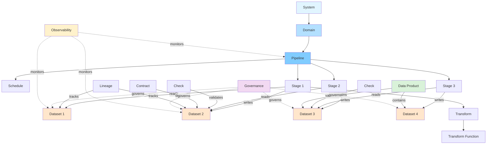

# Data Engineering Schema Hierarchy

## Entity Relationship Tree

```
System (sys-*)
├── Domains [] (dom-*)
│   └── Pipelines [] (pip-*)
│       ├── Schedule (sch-*)
│       │   └── Triggers []
│       │       └── Types: dataset-updated, api-call, message, time, cdc-event
│       ├── Pipeline Template Reference (tpl-*)
│       └── Stages [] (stg-*)
│           ├── Depends On [] → Other Stages (stg-*)
│           ├── Uses Patterns [] (pat-*) [from taxonomy]
│           ├── Input Datasets [] → (ds-*)
│           ├── Output Datasets [] → (ds-*)
│           └── Transforms [] (trf-*)
│               └── Function Reference (tfn-*)
│                   ├── Input Schema
│                   └── Output Schema
│
├── Datasets [] (ds-*)
│   ├── Schema
│   │   └── Fields []
│   │       ├── name
│   │       ├── type
│   │       ├── nullable
│   │       └── pii (boolean)
│   ├── Partitioning
│   │   └── Strategy Reference (dps-*)
│   ├── Quality Dimensions [] → (dqd-*)
│   ├── Access Pattern Reference → (dap-*)
│   ├── Retention Tier Reference → (drt-*)
│   └── Replication Config Reference → (drc-*)
│
├── Contracts [] (ctr-*)
│   ├── Dataset Reference → (ds-*)
│   ├── Schema Reference
│   ├── SLA
│   │   ├── freshness_minutes
│   │   ├── completeness_percent
│   │   └── availability_percent
│   ├── Owners []
│   └── Consumers []
│
├── Checks [] (chk-*)
│   ├── Dataset Reference → (ds-*)
│   ├── Validation Rule Type Reference → (vrt-*)
│   ├── Threshold
│   ├── Assertions []
│   └── Alert
│       ├── channel: email, slack, pagerduty, webhook, none
│       └── escalation
│
├── Lineage [] (lin-*)
│   ├── Upstream → Dataset (ds-*)
│   ├── Downstream → Dataset (ds-*)
│   ├── Transform → (trf-*)
│   └── Relationship: one-to-one, one-to-many, many-to-one, many-to-many
│
├── Data Products [] (dp-*)
│   ├── Owner
│   ├── Datasets [] → (ds-*)
│   ├── SLA
│   ├── Consumers []
│   └── Bounded Context Reference (optional)
│
├── Data Contracts [] (dctr-*)
│   ├── Provider
│   ├── Consumer
│   ├── Schema Reference
│   ├── SLA
│   └── Version (semantic)
│
├── Governance
│   ├── Retention []
│   │   ├── Dataset → (ds-*)
│   │   └── Policy: delete-after-days, archive-after-years, retain-indefinitely
│   ├── Access []
│   │   ├── Dataset → (ds-*)
│   │   ├── Tier: public, general, restricted, confidential
│   │   └── Roles []
│   └── PII Handling []
│       ├── Dataset → (ds-*)
│       ├── Masking []
│       └── Masking Method: redact, hash, tokenize, encrypt, pseudonymize
│
└── Observability
    ├── Metrics []
    │   ├── Dataset → (ds-*)
    │   └── Type: counter, gauge, histogram
    ├── SLOs []
    │   ├── Target
    │   ├── Unit: percent, seconds, count
    │   ├── Window
    │   └── Linked Check → (chk-*)
    └── Alerts []
        ├── Condition
        ├── Severity: low, medium, high, critical
        └── Channel: email, slack, pagerduty, webhook
```

## Reference Entities (Supporting Definitions)

These entities are referenced by the main hierarchy:

```
Data Quality Dimensions (dqd-*)
├── Name: accuracy, completeness, timeliness, consistency
├── Description
└── Measurement Method

Data Catalog Entries (dce-*)
├── Dataset Reference → (ds-*)
├── Tags []
├── Documentation
├── Last Updated
└── Owner

Pipeline Templates (tpl-*)
├── Name
├── Description
├── Stages []
│   ├── Stage Template
│   └── Order
└── Parameters

Transformation Functions (tfn-*)
├── Name
├── Input Schema
├── Output Schema
└── Logic Description

Validation Rule Types (vrt-*)
├── Category: range, format, referential, business
└── Description

Retention Tiers (drt-*)
├── Name: hot, warm, cold, archive
├── Retention Days
└── Storage Class

Access Patterns (dap-*)
├── Type: read_heavy, write_heavy, balanced
├── Characteristics
└── Optimization Hints []

Partition Strategies (dps-*)
├── Type: time_based, hash_based, range_based
├── Partition Key
└── Partition Size

Replication Configs (drc-*)
├── Replication Factor
├── Replication Type: sync, async
└── Target Regions []

Monitoring Metrics (dmm-*)
├── Name
├── Type: latency, throughput, error_rate, data_freshness
├── Threshold
└── Alert Config
    ├── Enabled
    ├── Channel
    └── Severity
```

## Key Relationships Summary

### Containment (Parent → Child)
1. **System → Domains** (1:many)
2. **Domain → Pipelines** (1:many)
3. **Pipeline → Stages** (1:many)
4. **Stage → Transforms** (1:many)
5. **Dataset → Fields** (1:many)
6. **Data Product → Datasets** (1:many)

### References (Entity → Referenced Entity)
1. **Stage → Dataset** (inputs/outputs)
2. **Transform → Transformation Function**
3. **Stage → Stage** (depends_on)
4. **Contract → Dataset**
5. **Check → Dataset**
6. **Check → Validation Rule Type**
7. **Lineage → Datasets** (upstream/downstream)
8. **Lineage → Transform**
9. **Dataset → Quality Dimension**
10. **Dataset → Access Pattern**
11. **Dataset → Retention Tier**
12. **Dataset → Replication Config**
13. **Dataset → Partition Strategy**
14. **Pipeline → Pipeline Template**
15. **SLO → Check**
16. **Catalog Entry → Dataset**

### Cross-Cutting Concerns
1. **Governance** (affects Datasets)
2. **Observability** (monitors Datasets and Pipelines)
3. **Ownership** (applies to System, Domain, Contract, Data Product)

## ID Prefixes Legend

| Prefix | Entity Type |
|--------|-------------|
| `sys-` | System |
| `dom-` | Domain |
| `pip-` | Pipeline |
| `stg-` | Stage |
| `trf-` | Transform |
| `ds-`  | Dataset |
| `ctr-` | Contract |
| `chk-` | Check |
| `lin-` | Lineage |
| `sch-` | Schedule |
| `dp-`  | Data Product |
| `dctr-`| Data Contract |
| `dqd-` | Data Quality Dimension |
| `dce-` | Data Catalog Entry |
| `tpl-` | Pipeline Template |
| `tfn-` | Transformation Function |
| `vrt-` | Validation Rule Type |
| `drt-` | Data Retention Tier |
| `dap-` | Data Access Pattern |
| `dps-` | Data Partition Strategy |
| `drc-` | Data Replication Config |
| `dmm-` | Data Monitoring Metric |
| `pat-` | Pattern (from taxonomy) |

## Typical Data Flow


