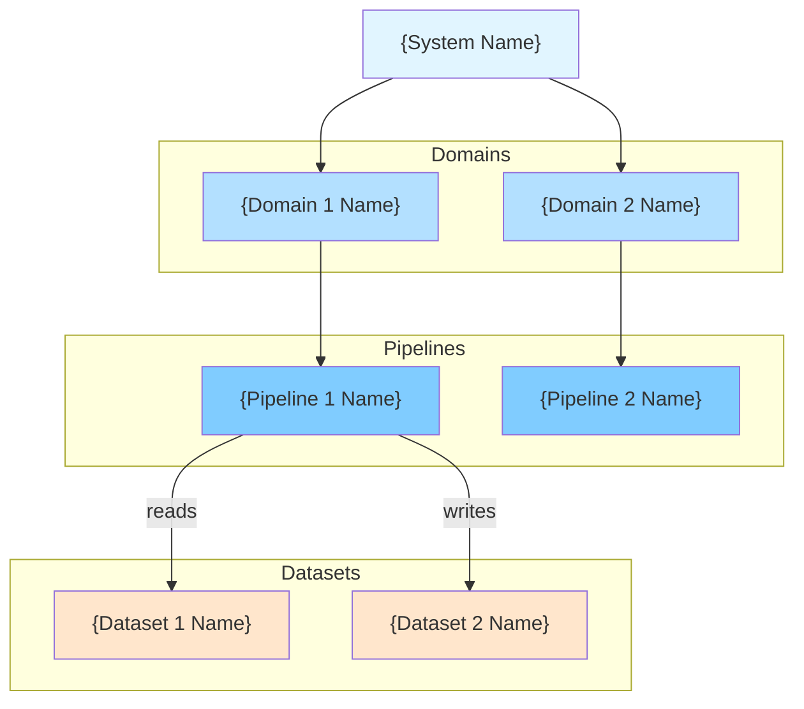

# Data Engineering YAML to Markdown Converter - Implementation Specification

## Overview

Create a Python converter that transforms Data Engineering YAML schemas (based on `schemas/data-eng.schema.yaml`) into comprehensive Markdown documentation. This converter should be integrated into the existing `s2doc` CLI tool and follow the same patterns as the domain stories, strategic, and tactical converters.

## Reference Files

- **Example YAML**: `/Users/igormusic/code/domain-stories-visual/examples/data-eng.yaml`
- **JSON Schema**: `/Users/igormusic/code/domain-stories-visual/schemas/data-eng.schema.yaml`
- **Hierarchy Documentation**: `/Users/igormusic/code/domain-stories-visual/data-eng-hierarchy.md`
- **Existing Converters**:
  - `s2doc/converters/domain_stories/`
  - `s2doc/converters/strategic/`
  - `s2doc/converters/tactical/`

## Integration Requirements

### 1. Schema Detection

Update `s2doc/detector.py` to detect data engineering schemas:

```python
# Check for data engineering schema
if '$schema' in data:
    schema_url = str(data['$schema']).lower()
    if 'data-eng' in schema_url or 'data-engineering' in schema_url:
        return SchemaType.DATA_ENGINEERING

# Check for system with domains and pipelines
if 'system' in data and 'pipelines' in data and 'datasets' in data:
    system = data['system']
    if isinstance(system, dict) and 'domains' in system:
        return SchemaType.DATA_ENGINEERING
```

Add `DATA_ENGINEERING` to the `SchemaType` enum.

### 2. CLI Integration

Update `s2doc/cli.py` to route data engineering schemas:

```python
elif schema_type == SchemaType.DATA_ENGINEERING:
    print(f"Detected schema: Data Engineering (pipeline and dataset modeling)")
    from s2doc.converters.data_eng.converter import DataEngConverter
    converter = DataEngConverter(data)
    # Generate single file named after input
    output_file = os.path.join(output_dir, f"{stem}.md")
    converter.convert_to_markdown(output_file)
    print(f"✓ Generated {output_file}")
```

### 3. Package Structure

Create new converter package:

```
s2doc/
└── converters/
    └── data_eng/
        ├── __init__.py
        ├── converter.py          # Main converter class
        └── diagram_generator.py  # Mermaid diagram generation
```

## Output Markdown Structure

### Document Layout

The generated Markdown should have the following structure:

```markdown
# {System Name}

> {System Description}

**Owners**: {team names and contacts}
**Tags**: {comma-separated tags}

---

## Table of Contents

- [System Overview](#system-overview)
- [Hierarchical Index](#hierarchical-index)
- [System Architecture](#system-architecture)
- [Domains](#domains)
  - [Domain: {Domain Name}](#domain-id)
    - [Pipeline: {Pipeline Name}](#pipeline-id)
- [Datasets](#datasets)
- [Data Contracts](#contracts)
- [Data Quality Checks](#checks)
- [Data Lineage](#lineage)
- [Governance](#governance)
- [Observability](#observability)

---

## System Overview

{Mermaid diagram showing system hierarchy}

---

## Hierarchical Index

### Domains

- **[{Domain Name}](#{domain-id})** - {domain description}
  - Pipelines:
    - **[{Pipeline Name}](#{pipeline-id})** - {pipeline description}
      - Stages: [{Stage Name}](#{stage-id}), ...
  - Datasets: [{Dataset Name}](#{dataset-id}), ...

{Repeat for all domains}

---

## System Architecture



---

## Domains

{For each domain in system.domains}

### <a id="{domain-id}"></a>{Domain Name}

**ID**: `{domain-id}`
**Description**: {domain description}
**Owners**: {team names and contacts}

#### Summary

| Metric | Count |
|--------|-------|
| Pipelines | {count} |
| Datasets Referenced | {count unique datasets from all pipelines} |

#### Pipelines

{Table of pipelines in this domain}

| Pipeline | Mode | Schedule Type | Stages | Input Datasets | Output Datasets |
|----------|------|---------------|--------|----------------|-----------------|
| [{Pipeline Name}](#{pipeline-id}) | {mode} | {schedule.type} | {stage count} | {input dataset count} | {output dataset count} |

---

{For each pipeline in this domain}

#### <a id="{pipeline-id}"></a>Pipeline: {Pipeline Name}

**ID**: `{pipeline-id}`
**Mode**: {mode} (batch/streaming/micro-batch/continuous)
**Description**: {pipeline description}
**Traits**: {comma-separated traits if present}
**Tags**: {comma-separated tags if present}

##### Schedule

- **Type**: {schedule.type}
- **Schedule ID**: `{schedule.id}`
{If cron_expression}
- **Cron Expression**: `{cron_expression}`
{If interval_minutes}
- **Interval**: {interval_minutes} minutes
{If triggers}
- **Triggers**:
  {For each trigger}
  - {trigger.type} (source: {trigger.source})

##### Pipeline Flow

```mermaid
graph LR
    {For each stage}
    STG{index}["{stage.name}"]

    {For each input dataset}
    DS_IN{index}["{dataset.name}"]
    DS_IN{index} --> STG{index}

    {For each output dataset}
    DS_OUT{index}["{dataset.name}"]
    STG{index} --> DS_OUT{index}

    {For each depends_on}
    STG{dep_index} --> STG{index}

    style STG{index} fill:#80ccff
    style DS_IN{index} fill:#ffe6cc
    style DS_OUT{index} fill:#ffe6cc
```

##### Stages

{For each stage}

###### <a id="{stage-id}"></a>Stage: {Stage Name}

**ID**: `{stage-id}`
**Description**: {stage description}

{If uses_patterns}
**Patterns Used**: {comma-separated pattern IDs}

{If depends_on}
**Depends On**: {comma-separated links to stage names and IDs}

**Input Datasets**:
{For each input dataset ID}
- [{humanized dataset name}](#{dataset-id}) (`{dataset-id}`)

**Output Datasets**:
{For each output dataset ID}
- [{humanized dataset name}](#{dataset-id}) (`{dataset-id}`)

{If transforms}
**Transforms**:

| Transform ID | Type | Description | Configuration |
|--------------|------|-------------|---------------|
| `{transform-id}` | {type} | {description} | {key config params} |

---

## Datasets

{Table of all datasets}

| Dataset | Type | Format | Location | Classification | Contains PII | Tags |
|---------|------|--------|----------|----------------|--------------|------|
| [{Dataset Name}](#{dataset-id}) | {type} | {format} | {location} | {classification} | {Yes/No} | {tags} |

---

{For each dataset}

### <a id="{dataset-id}"></a>{Dataset Name}

**ID**: `{dataset-id}`
**Type**: {type}
**Format**: {format}
**Location**: `{location}`
**Classification**: {classification}
**Contains PII**: {Yes/No}
{If pii_fields}
**PII Fields**: {comma-separated field names}
{If tags}
**Tags**: {comma-separated tags}

{If schema with fields}
#### Schema

| Field | Type | Nullable | PII | Description |
|-------|------|----------|-----|-------------|
{For each field}
| `{field.name}` | {field.type} | {Yes/No} | {Yes/No} | {field.description or "-"} |

{If partitioning}
#### Partitioning

- **Columns**: {comma-separated partition columns}
- **Strategy**: {partitioning.strategy}
{If strategy_ref}
- **Strategy Reference**: `{strategy_ref}`

{If quality_dimensions}
#### Quality Dimensions

{For each quality dimension reference}
- `{quality-dimension-id}`

---

## Data Contracts

{Table of all contracts}

| Contract | Dataset | Version | Owners | Consumers | SLA Freshness | SLA Completeness |
|----------|---------|---------|--------|-----------|---------------|------------------|
| [{Contract Name}](#{contract-id}) | [{Dataset Name}](#{dataset-id}) | {version} | {owner teams} | {consumer count} | {freshness_minutes}m | {completeness_percent}% |

---

{For each contract}

### <a id="{contract-id}"></a>{Contract Name}

**ID**: `{contract-id}`
**Dataset**: [{dataset name}](#{dataset-id})
**Version**: {version}
{If evolution_policy}
**Evolution Policy**: {evolution_policy}

{If schema.$ref}
**Schema Reference**: `{schema.$ref}`

#### SLA

{If sla}
- **Freshness**: {freshness_minutes} minutes
- **Completeness**: {completeness_percent}%
- **Availability**: {availability_percent}%

#### Owners

{For each owner}
- **{owner.team}** ({owner.contact})

#### Consumers

{For each consumer}
- **{consumer.team}** - {consumer.use_case}

---

## Data Quality Checks

{Table of all checks}

| Check | Type | Dataset | Severity | Alert Channel | Threshold |
|-------|------|---------|----------|---------------|-----------|
| [{Check Name}](#{check-id}) | {type} | [{Dataset Name}](#{dataset-id}) | {severity} | {alert.channel} | {threshold summary} |

---

{For each check}

### <a id="{check-id}"></a>{Check Name}

**ID**: `{check-id}`
**Type**: {type}
**Dataset**: [{dataset name}](#{dataset-id})
**Severity**: {severity}

{If threshold}
#### Threshold

{Render threshold object as key-value pairs}

{If assertions}
#### Assertions

{For each assertion}
- **{assertion.description}**: `{assertion.condition}`

#### Alert Configuration

- **Channel**: {alert.channel}
{If alert.escalation}
- **Escalation**: {alert.escalation}

---

## Data Lineage

{Mermaid diagram showing lineage relationships}

```mermaid
graph LR
    {For each lineage entry}
    UP{index}["{upstream dataset name}"]
    DOWN{index}["{downstream dataset name}"]
    UP{index} -->|{transform name}<br/>{relationship}| DOWN{index}

    style UP{index} fill:#ffe6cc
    style DOWN{index} fill:#ffe6cc
```

{Table of lineage entries}

| Upstream Dataset | Downstream Dataset | Transform | Relationship |
|------------------|-------------------|-----------|--------------|
| [{Upstream Name}](#{upstream-id}) | [{Downstream Name}](#{downstream-id}) | `{transform-id}` | {relationship} |

---

## Governance

{If governance.retention}
### Retention Policies

| Dataset | Policy | Duration |
|---------|--------|----------|
{For each retention policy}
| [{Dataset Name}](#{dataset-id}) | {policy} | {days/years} |

{If governance.access}
### Access Control

| Dataset | Tier | Roles |
|---------|------|-------|
{For each access policy}
| [{Dataset Name}](#{dataset-id}) | {tier} | {comma-separated roles} |

{If governance.pii_handling}
### PII Handling

| Dataset | Masked Fields | Masking Method |
|---------|---------------|----------------|
{For each pii_handling entry}
| [{Dataset Name}](#{dataset-id}) | {comma-separated masking fields} | {masking_method} |

---

## Observability

{If observability.metrics}
### Metrics

| Metric | Dataset | Type | Description |
|--------|---------|------|-------------|
{For each metric}
| {metric.name} | {[Dataset Name](#{dataset-id}) if dataset} | {type} | {description} |

{If observability.slos}
### Service Level Objectives (SLOs)

| SLO | Target | Unit | Window | Linked Check |
|-----|--------|------|--------|--------------|
{For each slo}
| {slo.name} | {target} | {unit} | {window} | {[Check Name](#{linked_check}) if linked_check} |

{If observability.alerts}
### Alerts

| Alert | Condition | Severity | Channel |
|-------|-----------|----------|---------|
{For each alert}
| {alert.name} | `{condition}` | {severity} | {channel} |

---

*Generated with [s2doc](https://github.com/FreeSideNomad/s2doc)*
```

## Implementation Specifications

### Class: DataEngConverter

**Location**: `s2doc/converters/data_eng/converter.py`

```python
class DataEngConverter:
    """Convert data engineering YAML to Markdown documentation."""

    def __init__(self, data: dict):
        """Initialize with parsed YAML data."""
        self.data = data
        self.system = data.get('system', {})
        self.domains = {d['id']: d for d in data.get('domains', [])}
        self.pipelines = {p['id']: p for p in data.get('pipelines', [])}
        self.datasets = {ds['id']: ds for ds in data.get('datasets', [])}
        self.contracts = data.get('contracts', [])
        self.checks = data.get('checks', [])
        self.lineage = data.get('lineage', [])
        self.governance = data.get('governance', {})
        self.observability = data.get('observability', {})

    def convert_to_markdown(self, output_path: str) -> None:
        """Generate markdown file."""

    def _generate_header(self) -> str:
        """Generate system header section."""

    def _generate_toc(self) -> str:
        """Generate table of contents."""

    def _generate_hierarchical_index(self) -> str:
        """Generate hierarchical index of all entities."""

    def _generate_system_architecture_diagram(self) -> str:
        """Generate Mermaid diagram of system architecture."""

    def _generate_domains_section(self) -> str:
        """Generate domains section with pipelines and stages."""

    def _generate_pipeline_section(self, pipeline: dict, domain_id: str) -> str:
        """Generate detailed pipeline documentation."""

    def _generate_pipeline_flow_diagram(self, pipeline: dict) -> str:
        """Generate Mermaid flow diagram for pipeline stages."""

    def _generate_stage_section(self, stage: dict) -> str:
        """Generate stage documentation."""

    def _generate_datasets_section(self) -> str:
        """Generate datasets section."""

    def _generate_dataset_detail(self, dataset: dict) -> str:
        """Generate detailed dataset documentation."""

    def _generate_contracts_section(self) -> str:
        """Generate data contracts section."""

    def _generate_checks_section(self) -> str:
        """Generate data quality checks section."""

    def _generate_lineage_section(self) -> str:
        """Generate lineage section with diagram and table."""

    def _generate_lineage_diagram(self) -> str:
        """Generate Mermaid lineage diagram."""

    def _generate_governance_section(self) -> str:
        """Generate governance section."""

    def _generate_observability_section(self) -> str:
        """Generate observability section."""

    def humanize_name(self, name: str) -> str:
        """Convert entity name to human-readable format."""
        # Reuse from tactical converter
```

### Class: DiagramGenerator

**Location**: `s2doc/converters/data_eng/diagram_generator.py`

```python
class DiagramGenerator:
    """Generate Mermaid diagrams for data engineering documentation."""

    @staticmethod
    def generate_system_architecture(system: dict, domains: dict,
                                     pipelines: dict, datasets: dict) -> str:
        """Generate system architecture diagram showing hierarchy."""

    @staticmethod
    def generate_pipeline_flow(pipeline: dict, datasets: dict) -> str:
        """Generate pipeline flow diagram with stages and data flows."""

    @staticmethod
    def generate_lineage_diagram(lineage: list, datasets: dict,
                                 transforms: dict) -> str:
        """Generate data lineage diagram."""
```

## Humanization Rules

Apply the same humanization function from the tactical converter:

- Convert PascalCase to space-separated: `UserEvents` → `User Events`
- Convert kebab-case to space-separated: `user-events` → `User Events`
- Preserve existing spaces: `User Event Features` → `User Event Features`
- Handle acronyms: `CDCEvents` → `CDC Events`

## Anchor ID Rules

- Use the entity's `id` field directly as anchor (e.g., `<a id="sys-ml-feature-store"></a>`)
- Links use `#{id}` format: `[System Name](#sys-ml-feature-store)`
- All entities should be linkable from the hierarchical index

## Entity Relationship Handling

Based on `data-eng-hierarchy.md`:

### Containment Relationships

1. **System → Domains** (references by domain IDs)
2. **Domain → Pipelines** (references by pipeline IDs)
3. **Pipeline → Stages** (nested objects)
4. **Stage → Transforms** (nested objects)

### Reference Relationships

1. **Stage → Datasets** (via inputs/outputs arrays)
2. **Pipeline → Schedule** (nested object)
3. **Contract → Dataset** (via dataset reference)
4. **Check → Dataset** (via dataset reference)
5. **Lineage → Datasets** (via upstream/downstream)
6. **Lineage → Transform** (via transform reference)

## Special Considerations

### 1. Dataset References

When rendering dataset references, always:
- Look up the dataset by ID from the datasets collection
- Display humanized dataset name
- Create hyperlink to dataset detail section
- Show ID in code format: `[User Events](#ds-user-events)` (`ds-user-events`)

### 2. Schedule Rendering

Different schedule types have different fields:
- **cron**: show `cron_expression`
- **interval**: show `interval_minutes`
- **event/continuous**: show `triggers` array
- **manual**: show "Manual execution only"

### 3. Transform Configuration

The `config` object is flexible. Render as a compact summary:
- Show 2-3 most important config keys
- For complex configs, use inline format: `window: 1h, group_by: user_id`

### 4. PII Handling

- Highlight PII datasets prominently
- Show which specific fields contain PII
- Reference governance PII handling policies

### 5. Lineage Visualization

- Group related lineage entries
- Use different colors for different dataset types
- Show transform names on edges
- Indicate relationship cardinality (one-to-one, one-to-many, etc.)

## Error Handling

1. **Missing References**: If a referenced entity (dataset, domain, pipeline) is not found:
   - Display the ID in code format
   - Add "(not found)" indicator
   - Log warning

2. **Missing Required Fields**: If required schema fields are missing:
   - Use default values where sensible
   - Display "N/A" for missing descriptions

3. **Empty Collections**: If sections have no items:
   - Display "*No {entity type} defined*" message
   - Or omit the section entirely

## Testing Requirements

Create unit tests in `tests/test_data_eng_converter.py`:

1. **Test schema detection**: Verify data engineering YAML is correctly detected
2. **Test conversion**: Verify markdown is generated without errors
3. **Test humanization**: Verify entity names are humanized
4. **Test anchors**: Verify all IDs create valid HTML anchors
5. **Test references**: Verify dataset/pipeline references are correctly linked
6. **Test diagrams**: Verify Mermaid syntax is valid
7. **Test missing data**: Verify graceful handling of optional fields
8. **Test empty sections**: Verify empty collections don't break generation

Use `examples/data-eng.yaml` as the test fixture.

## Success Criteria

1. ✅ Data engineering YAML files are auto-detected by s2doc CLI
2. ✅ Single markdown file generated named after input file
3. ✅ All entity relationships properly linked with anchors
4. ✅ Hierarchical index shows full structure
5. ✅ Mermaid diagrams are syntactically valid and render correctly
6. ✅ All entity names are humanized
7. ✅ PII information is prominently displayed
8. ✅ Lineage relationships are clearly visualized
9. ✅ Governance and observability sections are complete
10. ✅ All tests pass

## Implementation Phases

### Phase 1: Core Structure
- [ ] Create converter package structure
- [ ] Update schema detector
- [ ] Update CLI routing
- [ ] Implement basic DataEngConverter class
- [ ] Generate header and TOC

### Phase 2: Main Sections
- [ ] Implement domains section with pipelines
- [ ] Implement pipeline details with stages
- [ ] Implement datasets section
- [ ] Implement contracts section
- [ ] Implement checks section

### Phase 3: Advanced Sections
- [ ] Implement lineage section
- [ ] Implement governance section
- [ ] Implement observability section
- [ ] Add hierarchical index

### Phase 4: Diagrams
- [ ] Implement DiagramGenerator class
- [ ] Generate system architecture diagram
- [ ] Generate pipeline flow diagrams
- [ ] Generate lineage diagram

### Phase 5: Polish & Testing
- [ ] Apply humanization throughout
- [ ] Verify all anchor links work
- [ ] Create unit tests
- [ ] Test with example YAML
- [ ] Update README.md

## File Outputs

Given input `examples/data-eng.yaml`, generate:
- Output: `data-eng.md` (or `{filename}.md` based on input name)

## Notes

- Follow the same code quality standards as existing converters
- Reuse utilities from other converters where possible (especially humanization)
- Ensure generated markdown is GitHub-flavored markdown compatible
- All Mermaid diagrams must be valid and render in GitHub/GitLab
- Use consistent formatting and styling across all sections
