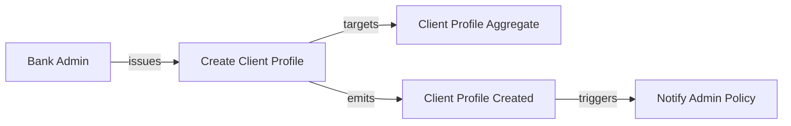

# Domain Stories Visualization Research Prompt

## Context

We have a comprehensive Domain Stories model defined in YAML format following the JSON Schema specification in `domain-stories-schema.yaml`. The model includes:

- **Domain Stories**: Narrative-driven business processes
- **Actors**: People, systems, and roles (prefix: `act_`)
- **Work Objects**: Domain entities and value objects (prefix: `wobj_`)
- **Aggregates**: DDD aggregate roots (prefix: `agg_`)
- **Commands**: Intent-based actions (prefix: `cmd_`)
- **Queries**: Information requests (prefix: `qry_`)
- **Events**: Domain events (prefix: `evt_`)
- **Policies**: Reactive rules (prefix: `pol_`)
- **Activities**: Business process steps (prefix: `actv_`)
- **Application Services**: Orchestration layer (prefix: `svc_app_`)
- **Domain Services**: Domain logic (prefix: `svc_dom_`)
- **Read Models**: Query projections (prefix: `rmdl_`)
- **Business Rules**: Constraints and invariants (prefix: `rle_`)

**Example**: `cb-domain-stories.yaml` contains 33 comprehensive domain stories for a Commercial Banking Platform with ~40,000+ tokens of structured data.

## Research Objective

Research and propose multiple options for **visualizing Domain Stories models** with the following requirements:

1. **Python-based conversion**: All conversion tools/scripts must be implemented in Python
2. **Multiple output formats**: Include at least one markdown (.md) option
3. **Scalability**: Handle large models (33+ stories, 700+ entities)
4. **Clarity**: Visualizations must clearly show relationships and flows
5. **Automation**: Conversion should be automated from YAML to visual format

## Visualization Options to Research

### Option 1: Markdown Documentation Format

**Description**: Convert YAML domain stories into structured, human-readable markdown documentation.

**Features to Include**:
- Table of contents with story index
- Each story as a separate section
- Actor listings with icons/badges
- Command → Event → Policy flow tables
- Work object attribute tables
- Aggregate relationship diagrams (nested bullets or tables)
- Cross-references between stories using markdown links

**Python Approach**:
- Use `PyYAML` or `ruamel.yaml` for YAML parsing
- Use `jinja2` templates for markdown generation
- Generate navigation structure with anchor links

**Pros**:
- Highly readable in GitHub/GitLab
- Version control friendly
- No external rendering dependencies
- Easy to search and navigate

**Cons**:
- No visual diagrams (unless embedded)
- Limited interactivity
- Can be verbose for large models

**Implementation Complexity**: Low

---

### Option 2: Mermaid Diagrams (Embedded in Markdown)

**Description**: Generate Mermaid.js diagram syntax embedded in markdown for rendering on GitHub, GitLab, or documentation sites.

**Diagram Types to Generate**:
1. **Flowcharts**: Actor → Command → Activity → Event flows
2. **Sequence Diagrams**: Actor interactions over time
3. **State Diagrams**: Aggregate lifecycle states
4. **Entity Relationship Diagrams**: Work objects and aggregates
5. **Graph Diagrams**: Policy → Command → Event chains

**Python Approach**:
- Parse YAML with `PyYAML`
- Generate Mermaid syntax strings
- Embed in markdown code blocks (```mermaid)
- Use templates for different diagram types

**Pros**:
- Native GitHub/GitLab rendering
- Multiple diagram types
- Interactive pan/zoom in modern viewers
- Version control friendly

**Cons**:
- Mermaid has complexity limits (can't render 33 stories in one diagram)
- Syntax can be verbose
- Limited styling options

**Implementation Complexity**: Medium

**Example Output**:


---

### Option 3: PlantUML Diagrams

**Description**: Generate PlantUML syntax for rendering high-quality UML diagrams.

**Diagram Types**:
1. **Component Diagrams**: Aggregates, services, repositories
2. **Sequence Diagrams**: Command/query flows
3. **Activity Diagrams**: Business process flows
4. **Class Diagrams**: Work objects with attributes

**Python Approach**:
- Parse YAML
- Generate `.puml` files
- Use `plantuml` Python wrapper or CLI for rendering to PNG/SVG
- Optionally embed SVG in markdown

**Pros**:
- Professional UML diagrams
- Wide tool support
- Multiple output formats (PNG, SVG, PDF)
- Better for print documentation

**Cons**:
- Requires PlantUML installation or external service
- Not natively rendered in GitHub markdown
- Steeper learning curve for syntax

**Implementation Complexity**: Medium-High

---

### Option 4: Graphviz DOT Format

**Description**: Generate DOT graph descriptions for rendering with Graphviz.

**Graph Types**:
1. **Directed Graphs**: Command → Event → Policy flows
2. **Hierarchical Layouts**: Aggregate compositions
3. **Network Graphs**: Actor relationships

**Python Approach**:
- Use `graphviz` Python library
- Parse YAML and build graph nodes/edges
- Render to PNG, SVG, or PDF
- Support different layout algorithms (dot, neato, fdp, circo)

**Pros**:
- Highly customizable layouts
- Excellent for large relationship graphs
- Multiple output formats
- Good for poster-size prints

**Cons**:
- Requires Graphviz installation
- Can become cluttered with large graphs
- Limited semantic UML support

**Implementation Complexity**: Medium

---

### Option 5: Interactive HTML with D3.js or Cytoscape.js

**Description**: Generate interactive HTML visualizations using JavaScript graph libraries.

**Features**:
- Pan, zoom, and click to explore
- Filter by story, actor, or aggregate
- Highlight connected nodes
- Tooltip with entity details
- Export to PNG/SVG

**Python Approach**:
- Parse YAML to JSON
- Use `jinja2` to generate HTML template
- Embed D3.js or Cytoscape.js for rendering
- Optionally use `pyvis` for network graphs

**Pros**:
- Highly interactive
- Excellent for exploration
- Can handle large, complex models
- Beautiful visualizations

**Cons**:
- Requires web browser
- Not version-control friendly (binary/large files)
- More complex to maintain

**Implementation Complexity**: High

---

### Option 6: Obsidian-Compatible Markdown Graph

**Description**: Generate markdown files optimized for Obsidian knowledge graph visualization.

**Features**:
- One markdown file per entity (actor, aggregate, command, etc.)
- Wiki-style links: `[[act_bank_admin]]`
- YAML frontmatter for metadata
- Auto-generated graph view in Obsidian

**Python Approach**:
- Parse YAML
- Generate one `.md` file per entity
- Use frontmatter for tags, type, relationships
- Create index file

**Pros**:
- Native graph visualization in Obsidian
- Bi-directional linking
- Great for knowledge management
- Supports backlinks and connections

**Cons**:
- Requires Obsidian (or compatible tool)
- Many files to manage
- Not ideal for single-document viewing

**Implementation Complexity**: Medium

---

### Option 7: Excel/CSV Tabular Export

**Description**: Export domain stories as structured tables for analysis in Excel or data tools.

**Tables to Generate**:
- Actors table
- Commands table
- Events table
- Aggregates table
- Relationships table (source, target, type)

**Python Approach**:
- Use `pandas` for DataFrame creation
- Use `openpyxl` for Excel export
- Create multiple sheets in one workbook

**Pros**:
- Business-friendly format
- Easy filtering and sorting
- Good for reporting
- Can import into BI tools

**Cons**:
- No visual diagrams
- Limited for understanding flows
- Not ideal for developers

**Implementation Complexity**: Low

---

### Option 8: Asciidoc/AsciiDoctor with Diagrams

**Description**: Generate AsciiDoc documentation with embedded PlantUML, Graphviz, or Mermaid.

**Features**:
- Professional documentation format
- Native diagram support
- PDF/HTML output
- Table of contents, cross-references

**Python Approach**:
- Generate `.adoc` files
- Embed diagram blocks
- Use `asciidoctor` CLI for rendering

**Pros**:
- Professional documentation quality
- Multi-format output
- Excellent for technical specs

**Cons**:
- Requires AsciiDoctor installation
- Less common than markdown
- Learning curve for syntax

**Implementation Complexity**: Medium

---

### Option 9: C4 Model Diagrams (Context, Container, Component, Code)

**Description**: Generate C4 architecture diagrams using PlantUML C4 extension or Structurizr.

**Diagram Levels**:
1. **Context**: Actors and systems
2. **Container**: Services and aggregates
3. **Component**: Commands, queries, repositories
4. **Code**: Class diagrams for work objects

**Python Approach**:
- Parse YAML to C4 model
- Generate PlantUML with C4 syntax
- Use Structurizr DSL or PlantUML C4 extension

**Pros**:
- Industry-standard architecture visualization
- Multiple abstraction levels
- Great for stakeholder communication

**Cons**:
- Requires understanding of C4 model
- Best for architecture, not detailed flows

**Implementation Complexity**: Medium-High

---

### Option 10: Narrative Markdown with Embedded Flow Tables

**Description**: Generate storytelling-style markdown with ASCII flow tables and decision trees.

**Features**:
- Narrative descriptions for each story
- ASCII art flow diagrams
- Tabular actor-action-outcome flows
- Decision tree tables

**Example Flow Table**:
```
| Step | Actor        | Action               | Work Object      | Event Emitted           |
|------|--------------|----------------------|------------------|-------------------------|
| 1    | Bank Admin   | Create Client Profile| Client Profile   | Client Profile Created  |
| 2    | System       | Validate ID          | -                | Validation Completed    |
| 3    | System       | Enroll Accounts      | Account Enrollment| Accounts Enrolled      |
```

**Python Approach**:
- Use `tabulate` for table generation
- Template-based narrative generation

**Pros**:
- Extremely readable
- No rendering dependencies
- Story-focused format

**Cons**:
- Limited visual appeal
- Hard to show complex relationships

**Implementation Complexity**: Low

---

## Recommended Hybrid Approach

**Combine Option 1 (Markdown) + Option 2 (Mermaid) for best results:**

1. **Generate structured markdown documentation** with:
   - Story index
   - Actor catalog
   - Work object reference
   - Command/query/event listings

2. **Embed Mermaid diagrams** for:
   - Per-story sequence diagrams
   - Aggregate relationship graphs
   - Event flow chains

3. **Use Python script** to:
   - Parse `cb-domain-stories.yaml`
   - Generate one markdown file per story
   - Generate master index file
   - Embed Mermaid diagrams programmatically

**Benefits**:
- GitHub-native rendering
- No external dependencies
- Both narrative and visual representations
- Scalable for 33+ stories
- Version control friendly

---

## Implementation Plan

### Phase 1: Core Markdown Generator (Python)
- [x] Parse YAML with `PyYAML`
- [ ] Create Jinja2 templates for markdown
- [ ] Generate story sections
- [ ] Generate actor/aggregate/command catalogs
- [ ] Generate table of contents

### Phase 2: Mermaid Integration
- [ ] Create Mermaid sequence diagram generator
- [ ] Create Mermaid flowchart generator
- [ ] Embed diagrams in markdown
- [ ] Test rendering on GitHub

### Phase 3: Advanced Visualizations (Optional)
- [ ] Add PlantUML export option
- [ ] Add Graphviz export option
- [ ] Add interactive HTML option

---

## Research Questions to Answer

1. **What is the primary audience for these visualizations?**
   - Developers (detailed flows)
   - Business stakeholders (high-level narratives)
   - Architects (system structure)

2. **What is the most important relationship to visualize?**
   - Actor → Command flows
   - Event → Policy chains
   - Aggregate compositions

3. **How will visualizations be consumed?**
   - GitHub repository
   - Confluence/wiki
   - Printed documentation
   - Interactive exploration

4. **What level of detail is needed?**
   - High-level overviews only
   - Full attribute/parameter details
   - Both (with collapsible sections)

5. **Should visualizations be per-story or cross-story?**
   - One diagram per domain story
   - Unified model showing all stories
   - Both approaches

---

## Next Steps

1. **Review this research prompt** and select preferred visualization options
2. **Implement Python converter** for chosen formats
3. **Test on `cb-domain-stories.yaml`** to validate scalability
4. **Iterate on templates** based on readability feedback
5. **Document conversion process** for team use

---

## References

- Domain Stories Schema: `domain-stories-schema.yaml`
- Domain Stories Context: `domain-stories-context.md`
- Example Model: `cb-domain-stories.yaml` (33 stories, 40K+ tokens)
- Mermaid Documentation: https://mermaid.js.org/
- PlantUML: https://plantuml.com/
- Graphviz: https://graphviz.org/
- C4 Model: https://c4model.com/
