# Domain Stories - Complete Documentation

**Total Stories**: 33  
**Version**: 2.0.0  

---

## 📑 Table of Contents

### Quick Navigation
- [Stories by Tag](#stories-by-tag)
- [All Stories](#all-stories)
- [Actor Catalog](#actor-catalog)
- [Aggregate Catalog](#aggregate-catalog)
- [Command Catalog](#command-catalog)

### Stories by Tag

#### Access Control (1)
- [Administrators Define Permission Policies (Subject, Action, Resource)](#dst_permission_policy_management)

#### Account Management (1)
- [Accounts Are Enrolled to Client Profiles (Manual or Automatic)](#dst_account_enrollment)

#### Anti Corruption Layer (3)
- [Platform Consumes User Add Event from Express via Anti-Corruption Layer](#dst_express_user_sync_add)
- [Platform Consumes User Update Event from Express via Anti-Corruption Layer](#dst_express_user_sync_update)
- [Anti-Corruption Layer Translates Express User Model to Platform Domain Model](#dst_express_acl_translation)

#### Approval Management (3)
- [Administrators Define Approval Rules with Number of Approvers](#dst_approval_policy_management)
- [Critical Functions Requiring Two Administrators](#dst_dual_admin_operations)
- [Payor Configures Approval Rules via Self-Service Portal](#dst_payor_self_service_approval_config)

#### Approval Workflow (5)
- [Payor Submits Invoice for Approval via Receivable-Approval Service](#dst_approval_workflow_submit)
- [Single Approver Approves Invoice Below Threshold](#dst_approval_workflow_single_approve)
- [Multiple Approvers Approve Invoice Above Threshold (Parallel Approval)](#dst_approval_workflow_parallel_approve)
- [Approver Rejects Invoice in Approval Workflow](#dst_approval_workflow_reject)
- [Approval Workflow Expires Due to Timeout](#dst_approval_workflow_expire)

#### Business Structure (1)
- [Platform Onboards Business Payor with Related Persons in Roles](#dst_payor_business_onboarding)

#### Client Enrollment (1)
- [Bank Employee Enrolls Large Canadian Client to Online Profile via Employee Portal](#dst_employee_portal_client_enrollment)

#### Client Management (1)
- [Client Manages Indirect Clients (Persons or Businesses)](#dst_indirect_client_management)

#### Domain Translation (1)
- [Anti-Corruption Layer Translates Express User Model to Platform Domain Model](#dst_express_acl_translation)

#### Employee Portal (3)
- [Bank Employee Enrolls Large Canadian Client to Online Profile via Employee Portal](#dst_employee_portal_client_enrollment)
- [Bank Employee Onboards 700 Business Payors via Employee Portal](#dst_employee_portal_payor_onboarding)
- [Bank Employee Monitors Three-Tier Relationships via Employee Portal Dashboard](#dst_employee_portal_relationship_monitoring)

#### Enrollment (1)
- [Client Enrolls in Standalone, Online, or Indirect Services](#dst_service_enrollment)

#### Express Integration (3)
- [Platform Consumes User Add Event from Express via Anti-Corruption Layer](#dst_express_user_sync_add)
- [Platform Consumes User Update Event from Express via Anti-Corruption Layer](#dst_express_user_sync_update)
- [Anti-Corruption Layer Translates Express User Model to Platform Domain Model](#dst_express_acl_translation)

#### Identity Management (1)
- [User Completes First-Time Registration with Identity Provider](#dst_user_registration)

#### Indirect Client Management (3)
- [Client Manages Indirect Clients (Persons or Businesses)](#dst_indirect_client_management)
- [Indirect Clients Manage Their Own Users and Permissions](#dst_indirect_client_user_management)
- [Indirect Clients Act as Payors for Receivables](#dst_receivable_service_with_payors)

#### Integration (1)
- [Accounts Are Enrolled to Client Profiles (Manual or Automatic)](#dst_account_enrollment)

#### Mvp (20)
- [Bank Employee Enrolls Large Canadian Client to Online Profile via Employee Portal](#dst_employee_portal_client_enrollment)
- [Bank Employee Onboards 700 Business Payors via Employee Portal](#dst_employee_portal_payor_onboarding)
- [Bank Employee Monitors Three-Tier Relationships via Employee Portal Dashboard](#dst_employee_portal_relationship_monitoring)
- [Payor Manages Users via Self-Service Portal with Okta Integration](#dst_payor_self_service_user_management)
- [Payor Configures Permissions for Users via Self-Service Portal](#dst_payor_self_service_permission_config)
- [Payor Configures Approval Rules via Self-Service Portal](#dst_payor_self_service_approval_config)
- [Platform Creates Indirect Client User in Okta](#dst_okta_user_lifecycle_create)
- [Platform Deactivates Indirect Client User in Okta](#dst_okta_user_lifecycle_deactivate)
- [Platform Locks and Unlocks Indirect Client Users in Okta](#dst_okta_user_lifecycle_lock_unlock)
- [Platform Consumes User Add Event from Express via Anti-Corruption Layer](#dst_express_user_sync_add)
- [Platform Consumes User Update Event from Express via Anti-Corruption Layer](#dst_express_user_sync_update)
- [Anti-Corruption Layer Translates Express User Model to Platform Domain Model](#dst_express_acl_translation)
- [Payor Submits Invoice for Approval via Receivable-Approval Service](#dst_approval_workflow_submit)
- [Single Approver Approves Invoice Below Threshold](#dst_approval_workflow_single_approve)
- [Multiple Approvers Approve Invoice Above Threshold (Parallel Approval)](#dst_approval_workflow_parallel_approve)
- [Approver Rejects Invoice in Approval Workflow](#dst_approval_workflow_reject)
- [Approval Workflow Expires Due to Timeout](#dst_approval_workflow_expire)
- [Platform Establishes Three-Tier Bank → Client → Payors Relationships](#dst_three_tier_relationship_setup)
- [Platform Onboards Business Payor with Related Persons in Roles](#dst_payor_business_onboarding)
- [Platform Assigns Roles to Related Persons in Business Payor](#dst_related_person_role_assignment)

#### Okta Integration (4)
- [Payor Manages Users via Self-Service Portal with Okta Integration](#dst_payor_self_service_user_management)
- [Platform Creates Indirect Client User in Okta](#dst_okta_user_lifecycle_create)
- [Platform Deactivates Indirect Client User in Okta](#dst_okta_user_lifecycle_deactivate)
- [Platform Locks and Unlocks Indirect Client Users in Okta](#dst_okta_user_lifecycle_lock_unlock)

#### Parallel Approval (1)
- [Multiple Approvers Approve Invoice Above Threshold (Parallel Approval)](#dst_approval_workflow_parallel_approve)

#### Payor Onboarding (3)
- [Bank Employee Onboards 700 Business Payors via Employee Portal](#dst_employee_portal_payor_onboarding)
- [Platform Onboards Business Payor with Related Persons in Roles](#dst_payor_business_onboarding)
- [Platform Assigns Roles to Related Persons in Business Payor](#dst_related_person_role_assignment)

#### Permission Management (2)
- [Administrators Define Permission Policies (Subject, Action, Resource)](#dst_permission_policy_management)
- [Payor Configures Permissions for Users via Self-Service Portal](#dst_payor_self_service_permission_config)

#### Phase 1 (7)
- [Bank Creates Client Profile with Identification and Account Enrollment](#dst_client_profile_creation)
- [User Completes First-Time Registration with Identity Provider](#dst_user_registration)
- [Client Administrator Manages Users Within Their Profile](#dst_user_management_by_admin)
- [Bank or Administrator Locks and Unlocks User Accounts](#dst_user_lock_unlock)
- [Client Enrolls in Standalone, Online, or Indirect Services](#dst_service_enrollment)
- [Accounts Are Enrolled to Client Profiles (Manual or Automatic)](#dst_account_enrollment)
- [Client Sets Up BTR Service with Delivery Preferences](#dst_btr_setup)

#### Phase 2 (3)
- [Administrators Define Permission Policies (Subject, Action, Resource)](#dst_permission_policy_management)
- [Administrators Define Approval Rules with Number of Approvers](#dst_approval_policy_management)
- [Critical Functions Requiring Two Administrators](#dst_dual_admin_operations)

#### Phase 3 (3)
- [Client Manages Indirect Clients (Persons or Businesses)](#dst_indirect_client_management)
- [Indirect Clients Manage Their Own Users and Permissions](#dst_indirect_client_user_management)
- [Indirect Clients Act as Payors for Receivables](#dst_receivable_service_with_payors)

#### Priority 1 (4)
- [Bank Creates Client Profile with Identification and Account Enrollment](#dst_client_profile_creation)
- [User Completes First-Time Registration with Identity Provider](#dst_user_registration)
- [Client Administrator Manages Users Within Their Profile](#dst_user_management_by_admin)
- [Bank or Administrator Locks and Unlocks User Accounts](#dst_user_lock_unlock)

#### Priority 2 (3)
- [Client Enrolls in Standalone, Online, or Indirect Services](#dst_service_enrollment)
- [Accounts Are Enrolled to Client Profiles (Manual or Automatic)](#dst_account_enrollment)
- [Client Sets Up BTR Service with Delivery Preferences](#dst_btr_setup)

#### Priority 3 (3)
- [Administrators Define Permission Policies (Subject, Action, Resource)](#dst_permission_policy_management)
- [Administrators Define Approval Rules with Number of Approvers](#dst_approval_policy_management)
- [Critical Functions Requiring Two Administrators](#dst_dual_admin_operations)

#### Priority 4 (3)
- [Client Manages Indirect Clients (Persons or Businesses)](#dst_indirect_client_management)
- [Indirect Clients Manage Their Own Users and Permissions](#dst_indirect_client_user_management)
- [Indirect Clients Act as Payors for Receivables](#dst_receivable_service_with_payors)

#### Priority Mvp (20)
- [Bank Employee Enrolls Large Canadian Client to Online Profile via Employee Portal](#dst_employee_portal_client_enrollment)
- [Bank Employee Onboards 700 Business Payors via Employee Portal](#dst_employee_portal_payor_onboarding)
- [Bank Employee Monitors Three-Tier Relationships via Employee Portal Dashboard](#dst_employee_portal_relationship_monitoring)
- [Payor Manages Users via Self-Service Portal with Okta Integration](#dst_payor_self_service_user_management)
- [Payor Configures Permissions for Users via Self-Service Portal](#dst_payor_self_service_permission_config)
- [Payor Configures Approval Rules via Self-Service Portal](#dst_payor_self_service_approval_config)
- [Platform Creates Indirect Client User in Okta](#dst_okta_user_lifecycle_create)
- [Platform Deactivates Indirect Client User in Okta](#dst_okta_user_lifecycle_deactivate)
- [Platform Locks and Unlocks Indirect Client Users in Okta](#dst_okta_user_lifecycle_lock_unlock)
- [Platform Consumes User Add Event from Express via Anti-Corruption Layer](#dst_express_user_sync_add)
- [Platform Consumes User Update Event from Express via Anti-Corruption Layer](#dst_express_user_sync_update)
- [Anti-Corruption Layer Translates Express User Model to Platform Domain Model](#dst_express_acl_translation)
- [Payor Submits Invoice for Approval via Receivable-Approval Service](#dst_approval_workflow_submit)
- [Single Approver Approves Invoice Below Threshold](#dst_approval_workflow_single_approve)
- [Multiple Approvers Approve Invoice Above Threshold (Parallel Approval)](#dst_approval_workflow_parallel_approve)
- [Approver Rejects Invoice in Approval Workflow](#dst_approval_workflow_reject)
- [Approval Workflow Expires Due to Timeout](#dst_approval_workflow_expire)
- [Platform Establishes Three-Tier Bank → Client → Payors Relationships](#dst_three_tier_relationship_setup)
- [Platform Onboards Business Payor with Related Persons in Roles](#dst_payor_business_onboarding)
- [Platform Assigns Roles to Related Persons in Business Payor](#dst_related_person_role_assignment)

#### Profile Management (1)
- [Bank Creates Client Profile with Identification and Account Enrollment](#dst_client_profile_creation)

#### Receivable Service (5)
- [Payor Submits Invoice for Approval via Receivable-Approval Service](#dst_approval_workflow_submit)
- [Single Approver Approves Invoice Below Threshold](#dst_approval_workflow_single_approve)
- [Multiple Approvers Approve Invoice Above Threshold (Parallel Approval)](#dst_approval_workflow_parallel_approve)
- [Approver Rejects Invoice in Approval Workflow](#dst_approval_workflow_reject)
- [Approval Workflow Expires Due to Timeout](#dst_approval_workflow_expire)

#### Receivables (1)
- [Indirect Clients Act as Payors for Receivables](#dst_receivable_service_with_payors)

#### Relationship Management (1)
- [Platform Establishes Three-Tier Bank → Client → Payors Relationships](#dst_three_tier_relationship_setup)

#### Relationship Monitoring (1)
- [Bank Employee Monitors Three-Tier Relationships via Employee Portal Dashboard](#dst_employee_portal_relationship_monitoring)

#### Reporting (1)
- [Client Sets Up BTR Service with Delivery Preferences](#dst_btr_setup)

#### Role Management (1)
- [Platform Assigns Roles to Related Persons in Business Payor](#dst_related_person_role_assignment)

#### Security (3)
- [Bank or Administrator Locks and Unlocks User Accounts](#dst_user_lock_unlock)
- [Critical Functions Requiring Two Administrators](#dst_dual_admin_operations)
- [Platform Locks and Unlocks Indirect Client Users in Okta](#dst_okta_user_lifecycle_lock_unlock)

#### Self Service (2)
- [Client Administrator Manages Users Within Their Profile](#dst_user_management_by_admin)
- [Indirect Clients Manage Their Own Users and Permissions](#dst_indirect_client_user_management)

#### Self Service Portal (3)
- [Payor Manages Users via Self-Service Portal with Okta Integration](#dst_payor_self_service_user_management)
- [Payor Configures Permissions for Users via Self-Service Portal](#dst_payor_self_service_permission_config)
- [Payor Configures Approval Rules via Self-Service Portal](#dst_payor_self_service_approval_config)

#### Service Management (3)
- [Client Enrolls in Standalone, Online, or Indirect Services](#dst_service_enrollment)
- [Client Sets Up BTR Service with Delivery Preferences](#dst_btr_setup)
- [Indirect Clients Act as Payors for Receivables](#dst_receivable_service_with_payors)

#### Three Tier Relationship (1)
- [Platform Establishes Three-Tier Bank → Client → Payors Relationships](#dst_three_tier_relationship_setup)

#### User Lifecycle (3)
- [Platform Creates Indirect Client User in Okta](#dst_okta_user_lifecycle_create)
- [Platform Deactivates Indirect Client User in Okta](#dst_okta_user_lifecycle_deactivate)
- [Platform Locks and Unlocks Indirect Client Users in Okta](#dst_okta_user_lifecycle_lock_unlock)

#### User Management (6)
- [Bank Creates Client Profile with Identification and Account Enrollment](#dst_client_profile_creation)
- [User Completes First-Time Registration with Identity Provider](#dst_user_registration)
- [Client Administrator Manages Users Within Their Profile](#dst_user_management_by_admin)
- [Bank or Administrator Locks and Unlocks User Accounts](#dst_user_lock_unlock)
- [Indirect Clients Manage Their Own Users and Permissions](#dst_indirect_client_user_management)
- [Payor Manages Users via Self-Service Portal with Okta Integration](#dst_payor_self_service_user_management)

#### User Replication (2)
- [Platform Consumes User Add Event from Express via Anti-Corruption Layer](#dst_express_user_sync_add)
- [Platform Consumes User Update Event from Express via Anti-Corruption Layer](#dst_express_user_sync_update)

#### Workflow (1)
- [Administrators Define Approval Rules with Number of Approvers](#dst_approval_policy_management)


---

## All Stories

| # | Story ID | Title | Tags |
|---|----------|-------|------|
| 1 | [dst_client_profile_creation](#dst_client_profile_creation) | Bank Creates Client Profile with Identification and Account Enrollment | user_management, profile_management, priority_1, phase_1 |
| 2 | [dst_user_registration](#dst_user_registration) | User Completes First-Time Registration with Identity Provider | user_management, identity_management, priority_1, phase_1 |
| 3 | [dst_user_management_by_admin](#dst_user_management_by_admin) | Client Administrator Manages Users Within Their Profile | user_management, self_service, priority_1, phase_1 |
| 4 | [dst_user_lock_unlock](#dst_user_lock_unlock) | Bank or Administrator Locks and Unlocks User Accounts | user_management, security, priority_1, phase_1 |
| 5 | [dst_service_enrollment](#dst_service_enrollment) | Client Enrolls in Standalone, Online, or Indirect Services | service_management, enrollment, priority_2, phase_1 |
| 6 | [dst_account_enrollment](#dst_account_enrollment) | Accounts Are Enrolled to Client Profiles (Manual or Automatic) | account_management, integration, priority_2, phase_1 |
| 7 | [dst_btr_setup](#dst_btr_setup) | Client Sets Up BTR Service with Delivery Preferences | service_management, reporting, priority_2, phase_1 |
| 8 | [dst_permission_policy_management](#dst_permission_policy_management) | Administrators Define Permission Policies (Subject, Action, Resource) | permission_management, access_control, priority_3, phase_2 |
| 9 | [dst_approval_policy_management](#dst_approval_policy_management) | Administrators Define Approval Rules with Number of Approvers | approval_management, workflow, priority_3, phase_2 |
| 10 | [dst_dual_admin_operations](#dst_dual_admin_operations) | Critical Functions Requiring Two Administrators | approval_management, security, priority_3, phase_2 |
| 11 | [dst_indirect_client_management](#dst_indirect_client_management) | Client Manages Indirect Clients (Persons or Businesses) | indirect_client_management, client_management, priority_4, phase_3 |
| 12 | [dst_indirect_client_user_management](#dst_indirect_client_user_management) | Indirect Clients Manage Their Own Users and Permissions | indirect_client_management, user_management, self_service, priority_4, phase_3 |
| 13 | [dst_receivable_service_with_payors](#dst_receivable_service_with_payors) | Indirect Clients Act as Payors for Receivables | service_management, indirect_client_management, receivables, priority_4, phase_3 |
| 14 | [dst_employee_portal_client_enrollment](#dst_employee_portal_client_enrollment) | Bank Employee Enrolls Large Canadian Client to Online Profile via Employee Portal | employee_portal, client_enrollment, mvp, priority_mvp |
| 15 | [dst_employee_portal_payor_onboarding](#dst_employee_portal_payor_onboarding) | Bank Employee Onboards 700 Business Payors via Employee Portal | employee_portal, payor_onboarding, mvp, priority_mvp |
| 16 | [dst_employee_portal_relationship_monitoring](#dst_employee_portal_relationship_monitoring) | Bank Employee Monitors Three-Tier Relationships via Employee Portal Dashboard | employee_portal, relationship_monitoring, mvp, priority_mvp |
| 17 | [dst_payor_self_service_user_management](#dst_payor_self_service_user_management) | Payor Manages Users via Self-Service Portal with Okta Integration | self_service_portal, user_management, okta_integration, mvp, priority_mvp |
| 18 | [dst_payor_self_service_permission_config](#dst_payor_self_service_permission_config) | Payor Configures Permissions for Users via Self-Service Portal | self_service_portal, permission_management, mvp, priority_mvp |
| 19 | [dst_payor_self_service_approval_config](#dst_payor_self_service_approval_config) | Payor Configures Approval Rules via Self-Service Portal | self_service_portal, approval_management, mvp, priority_mvp |
| 20 | [dst_okta_user_lifecycle_create](#dst_okta_user_lifecycle_create) | Platform Creates Indirect Client User in Okta | okta_integration, user_lifecycle, mvp, priority_mvp |
| 21 | [dst_okta_user_lifecycle_deactivate](#dst_okta_user_lifecycle_deactivate) | Platform Deactivates Indirect Client User in Okta | okta_integration, user_lifecycle, mvp, priority_mvp |
| 22 | [dst_okta_user_lifecycle_lock_unlock](#dst_okta_user_lifecycle_lock_unlock) | Platform Locks and Unlocks Indirect Client Users in Okta | okta_integration, user_lifecycle, security, mvp, priority_mvp |
| 23 | [dst_express_user_sync_add](#dst_express_user_sync_add) | Platform Consumes User Add Event from Express via Anti-Corruption Layer | express_integration, anti_corruption_layer, user_replication, mvp, priority_mvp |
| 24 | [dst_express_user_sync_update](#dst_express_user_sync_update) | Platform Consumes User Update Event from Express via Anti-Corruption Layer | express_integration, anti_corruption_layer, user_replication, mvp, priority_mvp |
| 25 | [dst_express_acl_translation](#dst_express_acl_translation) | Anti-Corruption Layer Translates Express User Model to Platform Domain Model | express_integration, anti_corruption_layer, domain_translation, mvp, priority_mvp |
| 26 | [dst_approval_workflow_submit](#dst_approval_workflow_submit) | Payor Submits Invoice for Approval via Receivable-Approval Service | approval_workflow, receivable_service, mvp, priority_mvp |
| 27 | [dst_approval_workflow_single_approve](#dst_approval_workflow_single_approve) | Single Approver Approves Invoice Below Threshold | approval_workflow, receivable_service, mvp, priority_mvp |
| 28 | [dst_approval_workflow_parallel_approve](#dst_approval_workflow_parallel_approve) | Multiple Approvers Approve Invoice Above Threshold (Parallel Approval) | approval_workflow, receivable_service, parallel_approval, mvp, priority_mvp |
| 29 | [dst_approval_workflow_reject](#dst_approval_workflow_reject) | Approver Rejects Invoice in Approval Workflow | approval_workflow, receivable_service, mvp, priority_mvp |
| 30 | [dst_approval_workflow_expire](#dst_approval_workflow_expire) | Approval Workflow Expires Due to Timeout | approval_workflow, receivable_service, mvp, priority_mvp |
| 31 | [dst_three_tier_relationship_setup](#dst_three_tier_relationship_setup) | Platform Establishes Three-Tier Bank → Client → Payors Relationships | three_tier_relationship, relationship_management, mvp, priority_mvp |
| 32 | [dst_payor_business_onboarding](#dst_payor_business_onboarding) | Platform Onboards Business Payor with Related Persons in Roles | payor_onboarding, business_structure, mvp, priority_mvp |
| 33 | [dst_related_person_role_assignment](#dst_related_person_role_assignment) | Platform Assigns Roles to Related Persons in Business Payor | payor_onboarding, role_management, mvp, priority_mvp |

---

## Bank Creates Client Profile with Identification and Account Enrollment

<a id="dst_client_profile_creation"></a>

[↑ Back to Top](#-table-of-contents)

**Story ID**: `dst_client_profile_creation`  
**Tags**: user_management, profile_management, priority_1, phase_1  

### Description

A bank administrator creates a new client profile in the commercial banking platform.
The profile is identified by client ID type (SRF for Canadian banking platform, GID for
Capital Markets global ID, or IND for indirect clients). The bank admin can choose to
enroll all current accounts, and optionally configure auto-enrollment for future accounts.
The profile type (servicing or online) determines whether user management is required.
Supports multi-jurisdiction: Canada (CA), US (East/West), UK.

### Actors

| Actor ID | Name | Kind | Description |
|----------|------|------|-------------|
| `act_bank_admin` | Bank Administrator | person | Bank employee who creates and manages client profiles and services |
| `act_account_system` | Account System | system | External banking systems (DDA, RIBS, OLB, MTG, GIC, TSYS, COMCARD, GSAN) managing client accounts |

### Domain Model

#### Aggregates

##### ClientProfile (`agg_client_profile`)

Aggregate root for client profile with identification, accounts, and configuration

**Invariants**:
- Client ID type and value combination must be unique across all profiles
- Online profiles must have at least 2 administrator users (dual admin requirement)

##### AccountEnrollment (`agg_account_enrollment`)

Account linked to a profile with status tracking

**Invariants**:
- Cannot enroll closed accounts from source systems

#### Work Objects

##### Client Profile (`wobj_client_profile`)

Container for client identification, accounts, users, services, and configuration

**Attributes**:

| Name | Type | Required | Description |
|------|------|----------|-------------|
| profile_id | uuid | ✓ |  |
| client_id_type | enum | ✓ | SRF, GID, or IND |
| client_id_value | string | ✓ |  |
| profile_type | enum | ✓ | servicing or online |
| jurisdiction | enum | ✓ | CA, US_EAST, US_WEST, UK |
| auto_enroll_mode | enum |  | manual, auto_enroll_all_current, auto_enroll_current_and_future |

##### Account Enrollment (`wobj_account_enrollment`)

Links an account from an external system to a client profile

**Attributes**:

| Name | Type | Required | Description |
|------|------|----------|-------------|
| enrollment_id | uuid | ✓ |  |
| account_type | enum | ✓ | ca:dda, us:dda, ca:fca, ca:olb, ca:mtg, ca:gic, ca:tsys, ca:comcard, ca:ach |
| account_identifier | string | ✓ |  |
| status | enum | ✓ | active, inactive, closed |

### Commands

#### CreateClientProfile (`cmd_create_client_profile`)

Creates a new client profile with identification and optional account enrollment

**Actors**: `act_bank_admin`  
**Target Aggregate**: `agg_client_profile`  
**Emits Events**: `evt_client_profile_created`  

#### EnrollAccount (`cmd_enroll_account`)

Enrolls an account to a client profile

**Actors**: `act_bank_admin`  
**Target Aggregate**: `agg_account_enrollment`  
**Emits Events**: `evt_account_enrolled`  

#### RemoveAccount (`cmd_remove_account`)

Removes an account from a client profile

**Actors**: `act_bank_admin`  
**Target Aggregate**: `agg_account_enrollment`  
**Emits Events**: `evt_account_removed`  

### Events

| Event ID | Name | Description | Caused By |
|----------|------|-------------|----------|
| `evt_client_profile_created` | ClientProfileCreated | A new client profile has been created in the system | `cmd_create_client_profile` |
| `evt_account_enrolled` | AccountEnrolled | An account has been enrolled to a client profile | `cmd_enroll_account` |
| `evt_account_removed` | AccountRemoved | An account has been removed from a client profile | `cmd_remove_account` |

### Policies

| Policy ID | Name | When Event | Issues Command |
|-----------|------|------------|----------------|
| `pol_enroll_existing_accounts` | Enroll Existing Accounts on Profile Creation | `evt_client_profile_created` | `cmd_enroll_account` |

### Visualizations

#### Sequence Diagram

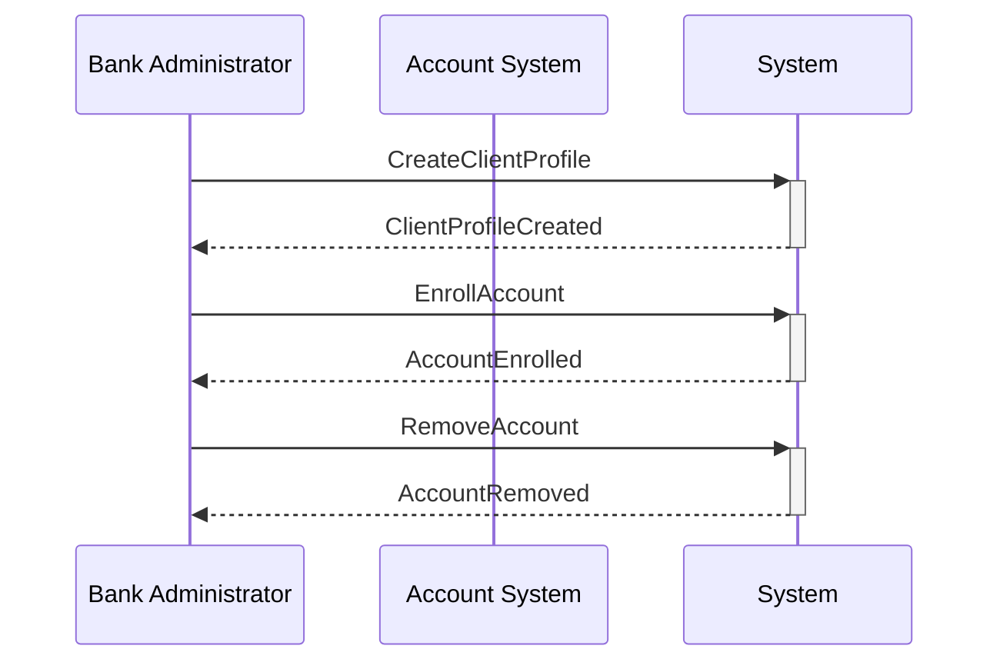

#### Command-Event-Policy Flow

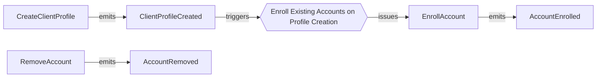


---

## User Completes First-Time Registration with Identity Provider

<a id="dst_user_registration"></a>

[↑ Back to Top](#-table-of-contents)

**Story ID**: `dst_user_registration`  
**Tags**: user_management, identity_management, priority_1, phase_1  

### Description

A user receives an invitation to access an online client profile. Using their email
and phone number, they initiate registration flow with the identity provider (currently
A&P, migrating to Okta). The user creates their password and completes MFA onboarding.
Upon completion, the identity provider sends an event that updates the user status
from pending_registration to active. Users are identified by logon-id (email format)
and can have the same logon-id across different profiles.

### Actors

| Actor ID | Name | Kind | Description |
|----------|------|------|-------------|
| `act_regular_user` | Regular User | person | End user who accesses the commercial banking platform |
| `act_identity_provider` | Identity Provider | system | External identity management system (A&P or Okta) that handles authentication and MFA |

### Domain Model

#### Aggregates

##### User (`agg_user`)

User aggregate with identity provider integration and lifecycle management

**Invariants**:
- Logon-id must be unique within a profile (but can repeat across profiles)
- Active users must have completed registration with identity provider

#### Work Objects

##### User (`wobj_user`)

User account with identity provider integration and status tracking

**Attributes**:

| Name | Type | Required | Description |
|------|------|----------|-------------|
| user_id | uuid | ✓ |  |
| profile_id | uuid | ✓ |  |
| logon_id | string | ✓ | Email-format identifier for login |
| identity_provider | enum | ✓ | anp or okta |
| user_status | enum | ✓ | pending_registration, active, locked_by_admin, locked_by_bank |
| user_role | enum | ✓ | administrator or regular_user |

### Commands

#### RegisterUser (`cmd_register_user`)

Initiates user registration with identity provider

**Actors**: `act_bank_admin`  
**Target Aggregate**: `agg_user`  
**Emits Events**: `evt_user_registered`  

#### ActivateUser (`cmd_activate_user`)

Activates user after successful identity provider onboarding

**Actors**: `act_identity_provider`  
**Target Aggregate**: `agg_user`  
**Emits Events**: `evt_user_activated`  

#### LockUser (`cmd_lock_user`)

Locks a user account due to administrator action or bank security concerns

**Actors**: `act_bank_admin`, `act_client_administrator`  
**Target Aggregate**: `agg_user`  
**Emits Events**: `evt_user_locked`  

#### UnlockUser (`cmd_unlock_user`)

Unlocks a user account

**Actors**: `act_bank_admin`, `act_client_administrator`  
**Target Aggregate**: `agg_user`  
**Emits Events**: `evt_user_unlocked`  

### Events

| Event ID | Name | Description | Caused By |
|----------|------|-------------|----------|
| `evt_user_registered` | UserRegistered | User has been created and invited to complete registration with identity provider | `cmd_register_user` |
| `evt_user_activated` | UserActivated | User has completed identity provider onboarding and is now active | `cmd_activate_user` |
| `evt_user_locked` | UserLocked | User account has been locked by administrator or bank | `cmd_lock_user` |
| `evt_user_unlocked` | UserUnlocked | User account has been unlocked | `cmd_unlock_user` |

### Policies

| Policy ID | Name | When Event | Issues Command |
|-----------|------|------------|----------------|
| `pol_notify_identity_provider` | Notify Identity Provider of New User Registration | `evt_user_registered` | `cmd_send_idp_registration` |

### Visualizations

#### Sequence Diagram

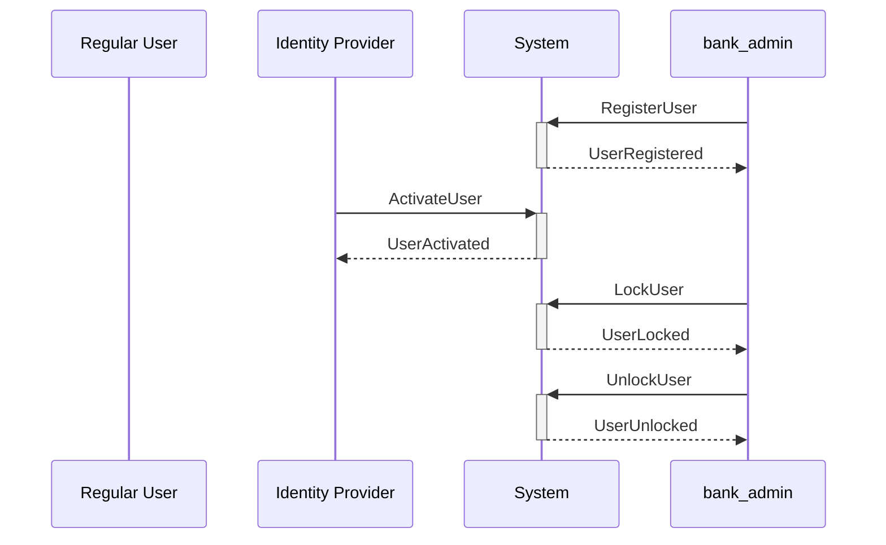

#### Command-Event-Policy Flow

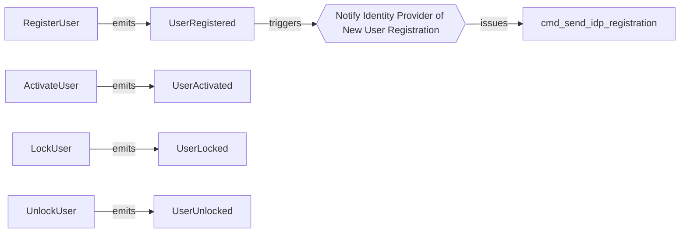


---

## Client Administrator Manages Users Within Their Profile

<a id="dst_user_management_by_admin"></a>

[↑ Back to Top](#-table-of-contents)

**Story ID**: `dst_user_management_by_admin`  
**Tags**: user_management, self_service, priority_1, phase_1  

### Description

A client administrator manages users within their online profile. They can create new
users, assign roles (administrator or regular_user), lock/unlock user accounts (except
those locked by bank), and view user details. All operations must maintain the dual
admin requirement ensuring at least 2 administrator users exist at all times.

### Actors

| Actor ID | Name | Kind | Description |
|----------|------|------|-------------|
| `act_client_administrator` | Client Administrator | person | Client user with administrator role who manages other users and profile configuration |

### Commands

#### ChangeUserRole (`cmd_change_user_role`)

Administrator changes a user's role between administrator and regular_user

**Actors**: `act_client_administrator`  
**Target Aggregate**: `agg_user`  
**Emits Events**: `evt_user_role_changed`  

### Events

| Event ID | Name | Description | Caused By |
|----------|------|-------------|----------|
| `evt_user_role_changed` | UserRoleChanged | User's role has been changed between administrator and regular_user | `cmd_change_user_role` |

### Visualizations

#### Sequence Diagram

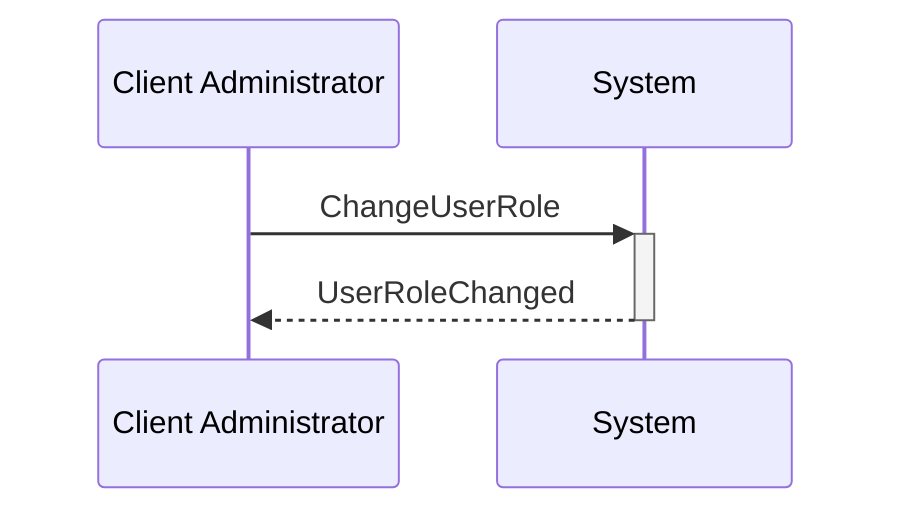

#### Command-Event-Policy Flow


---

## Bank or Administrator Locks and Unlocks User Accounts

<a id="dst_user_lock_unlock"></a>

[↑ Back to Top](#-table-of-contents)

**Story ID**: `dst_user_lock_unlock`  
**Tags**: user_management, security, priority_1, phase_1  

### Description

Users can be locked by either client administrators or bank administrators. When locked
by an administrator, the user cannot access the system but can be unlocked by any
administrator. When locked by the bank (due to suspicious activity), only bank
administrators can unlock the user. All lock operations must maintain dual admin rules.

### Visualizations


---

## Client Enrolls in Standalone, Online, or Indirect Services

<a id="dst_service_enrollment"></a>

[↑ Back to Top](#-table-of-contents)

**Story ID**: `dst_service_enrollment`  
**Tags**: service_management, enrollment, priority_2, phase_1  

### Description

A client profile enrolls in various types of services: standalone services (no online
access required like Additional Deposit Narrative or ACH Debit Block), online services
(require online profile and user access like Interac Send, Receivable Service, BTR),
or indirect services (for indirect client management like Receivable Approval Service).
Services can be linked to specific accounts or configured to auto-enroll all current
and future accounts.

### Actors

| Actor ID | Name | Kind | Description |
|----------|------|------|-------------|
| `act_service_manager` | Service Manager | role | Role for managing service enrollments (bank admin or client admin) |

### Domain Model

#### Aggregates

##### ServiceEnrollment (`agg_service_enrollment`)

Service enrollment with account associations and configuration

**Invariants**:
- Online services can only be enrolled for online profiles
- Cannot enroll same service type multiple times for a profile

#### Work Objects

##### Service Enrollment (`wobj_service_enrollment`)

Links a service to a client profile with configuration and account associations

**Attributes**:

| Name | Type | Required | Description |
|------|------|----------|-------------|
| enrollment_id | uuid | ✓ |  |
| profile_id | uuid | ✓ |  |
| service_type | enum | ✓ | standalone, online, or indirect |
| service_code | string | ✓ |  |
| enrollment_status | enum | ✓ | active, suspended, terminated |
| account_enrollment_mode | enum |  | manual, auto_enroll_all_current, auto_enroll_current_and_future |

### Commands

#### EnrollService (`cmd_enroll_service`)

Enrolls a client profile in a service with initial configuration

**Actors**: `act_bank_admin`, `act_client_administrator`  
**Target Aggregate**: `agg_service_enrollment`  
**Emits Events**: `evt_service_enrolled`  

#### ConfigureService (`cmd_configure_service`)

Updates service-specific configuration

**Actors**: `act_bank_admin`, `act_client_administrator`  
**Target Aggregate**: `agg_service_enrollment`  
**Emits Events**: `evt_service_configured`  

#### SuspendService (`cmd_suspend_service`)

Temporarily suspends a service enrollment

**Actors**: `act_bank_admin`  
**Target Aggregate**: `agg_service_enrollment`  
**Emits Events**: `evt_service_suspended`  

#### AddAccountToService (`cmd_add_account_to_service`)

Links an additional account to a service enrollment

**Actors**: `act_bank_admin`, `act_client_administrator`  
**Target Aggregate**: `agg_service_enrollment`  
**Emits Events**: `evt_account_added_to_service`  

### Events

| Event ID | Name | Description | Caused By |
|----------|------|-------------|----------|
| `evt_service_enrolled` | ServiceEnrolled | A service has been enrolled for a client profile | `cmd_enroll_service` |
| `evt_service_configured` | ServiceConfigured | Service configuration has been updated | `cmd_configure_service` |
| `evt_service_suspended` | ServiceSuspended | Service enrollment has been suspended | `cmd_suspend_service` |
| `evt_account_added_to_service` | AccountAddedToService | An account has been linked to a service enrollment | `cmd_add_account_to_service` |

### Policies

| Policy ID | Name | When Event | Issues Command |
|-----------|------|------------|----------------|
| `pol_auto_enroll_accounts_to_service` | Auto-Enroll Accounts to Service | `evt_service_enrolled` | `cmd_add_account_to_service` |

### Visualizations

#### Sequence Diagram

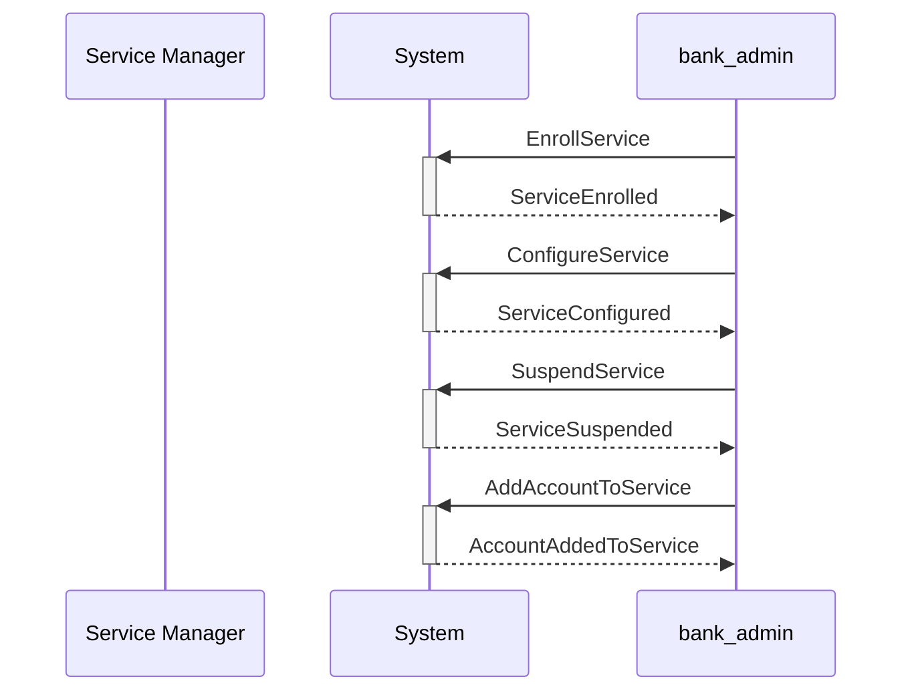

#### Command-Event-Policy Flow

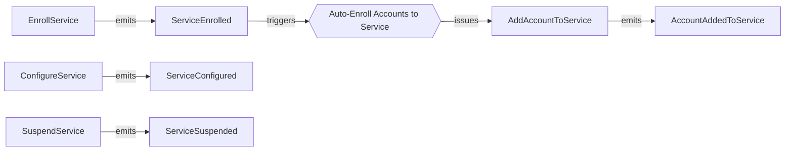


---

## Accounts Are Enrolled to Client Profiles (Manual or Automatic)

<a id="dst_account_enrollment"></a>

[↑ Back to Top](#-table-of-contents)

**Story ID**: `dst_account_enrollment`  
**Tags**: account_management, integration, priority_2, phase_1  

### Description

Accounts from various banking systems (DDA, RIBS, OLB, MTG, GIC, TSYS, COMCARD, GSAN)
are enrolled to client profiles either manually by bank administrators or automatically
based on the profile's auto-enrollment configuration. The system receives daily batch
feeds to detect new accounts and closed accounts, triggering appropriate enrollment
or status updates.

### Actors

| Actor ID | Name | Kind | Description |
|----------|------|------|-------------|
| `act_batch_processor` | Batch Processor | system | Daily batch process that detects new and closed accounts from source systems |

### Commands

#### DetectNewAccount (`cmd_detect_new_account`)

Batch process detects a new account in source system for a client

**Actors**: `act_batch_processor`  
**Target Aggregate**: `agg_account_enrollment`  
**Emits Events**: `evt_new_account_detected`  

#### DetectClosedAccount (`cmd_detect_closed_account`)

Batch process detects an account has been closed in source system

**Actors**: `act_batch_processor`  
**Target Aggregate**: `agg_account_enrollment`  
**Emits Events**: `evt_account_closed_in_source`  

#### MarkAccountInactive (`cmd_mark_account_inactive`)

Marks an enrolled account as inactive due to closure in source system

**Actors**: `act_batch_processor`  
**Target Aggregate**: `agg_account_enrollment`  
**Emits Events**: `evt_account_marked_inactive`  

### Events

| Event ID | Name | Description | Caused By |
|----------|------|-------------|----------|
| `evt_new_account_detected` | NewAccountDetected | A new account has been detected in source system for a client | `cmd_detect_new_account` |
| `evt_account_closed_in_source` | AccountClosedInSourceSystem | An account has been closed in the source banking system | `cmd_detect_closed_account` |
| `evt_account_marked_inactive` | AccountMarkedInactive | An enrolled account has been marked as inactive | `cmd_mark_account_inactive` |

### Policies

| Policy ID | Name | When Event | Issues Command |
|-----------|------|------------|----------------|
| `pol_auto_enroll_new_account` | Auto-Enroll New Account to Profile | `evt_new_account_detected` | `cmd_enroll_account` |
| `pol_mark_account_inactive` | Mark Closed Account as Inactive | `evt_account_closed_in_source` | `cmd_mark_account_inactive` |

### Visualizations

#### Sequence Diagram

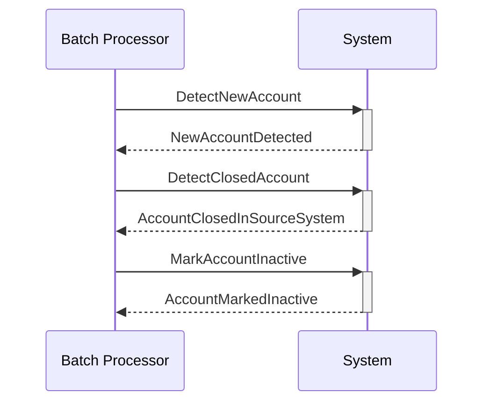

#### Command-Event-Policy Flow

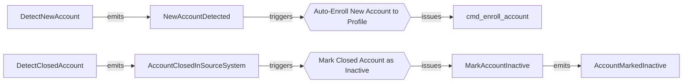


---

## Client Sets Up BTR Service with Delivery Preferences

<a id="dst_btr_setup"></a>

[↑ Back to Top](#-table-of-contents)

**Story ID**: `dst_btr_setup`  
**Tags**: service_management, reporting, priority_2, phase_1  

### Description

A client enrolls in Balance and Transaction Reporting (BTR) service. They configure
which DDA accounts to include, select file format (BAI, CAMT, MT), set frequency
(intraday or end-of-day), and choose delivery method (FTP or SWIFT). SWIFT delivery
is only available for CAMT and MT formats. End-of-day reports are generated every
business day.

### Commands

#### ConfigureBTRService (`cmd_configure_btr_service`)

Configures BTR service with file format, frequency, and delivery preferences

**Actors**: `act_bank_admin`, `act_client_administrator`  
**Target Aggregate**: `agg_service_enrollment`  
**Emits Events**: `evt_btr_configured`  

### Events

| Event ID | Name | Description | Caused By |
|----------|------|-------------|----------|
| `evt_btr_configured` | BTRConfigured | Balance and Transaction Reporting service has been configured | `cmd_configure_btr_service` |

### Visualizations

#### Command-Event-Policy Flow


---

## Administrators Define Permission Policies (Subject, Action, Resource)

<a id="dst_permission_policy_management"></a>

[↑ Back to Top](#-table-of-contents)

**Story ID**: `dst_permission_policy_management`  
**Tags**: permission_management, access_control, priority_3, phase_2  

### Description

Client administrators define permission policies using an AWS IAM-like model where
subject is user_id, action is a URN (e.g., urn:cb:service:btr:view), and resource
is account_id or profile_id. Permission policies control what users can do with
specific resources.

### Domain Model

#### Aggregates

##### PermissionPolicy (`agg_permission_policy`)

Permission policy aggregate managing subject-action-resource rules

**Invariants**:
- Subject user must belong to the same profile as the policy

#### Work Objects

##### Permission Policy (`wobj_permission_policy`)

IAM-style permission policy defining subject-action-resource rules

**Attributes**:

| Name | Type | Required | Description |
|------|------|----------|-------------|
| policy_id | uuid | ✓ |  |
| profile_id | uuid | ✓ |  |
| subject_user_id | uuid | ✓ |  |
| action_urn | string | ✓ |  |
| resource_id | uuid | ✓ |  |
| effect | enum | ✓ | allow or deny |

### Commands

#### CreatePermissionPolicy (`cmd_create_permission_policy`)

Creates a new permission policy for a user

**Actors**: `act_client_administrator`  
**Target Aggregate**: `agg_permission_policy`  
**Emits Events**: `evt_permission_policy_created`  

#### DeletePermissionPolicy (`cmd_delete_permission_policy`)

Deletes a permission policy

**Actors**: `act_client_administrator`  
**Target Aggregate**: `agg_permission_policy`  
**Emits Events**: `evt_permission_policy_deleted`  

### Events

| Event ID | Name | Description | Caused By |
|----------|------|-------------|----------|
| `evt_permission_policy_created` | PermissionPolicyCreated | A new permission policy has been created | `cmd_create_permission_policy` |
| `evt_permission_policy_deleted` | PermissionPolicyDeleted | A permission policy has been deleted | `cmd_delete_permission_policy` |

### Visualizations

#### Command-Event-Policy Flow

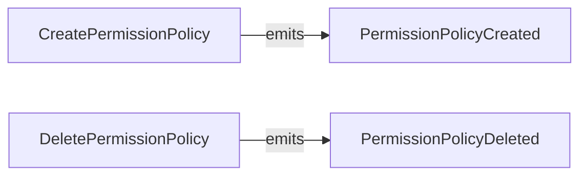


---

## Administrators Define Approval Rules with Number of Approvers

<a id="dst_approval_policy_management"></a>

[↑ Back to Top](#-table-of-contents)

**Story ID**: `dst_approval_policy_management`  
**Tags**: approval_management, workflow, priority_3, phase_2  

### Description

Client administrators define approval policies that extend the permission model with
approval workflow requirements. Approval policies specify number_of_approvers and
optionally an approval_chain (ordered list of approvers). These policies govern
critical operations that require multiple approvers before execution.

### Domain Model

#### Aggregates

##### ApprovalPolicy (`agg_approval_policy`)

Approval policy aggregate managing approval workflow rules

**Invariants**:
- Number of approvers must be at least 1

#### Work Objects

##### Approval Policy (`wobj_approval_policy`)

Approval policy extending permission model with approval requirements

**Attributes**:

| Name | Type | Required | Description |
|------|------|----------|-------------|
| policy_id | uuid | ✓ |  |
| profile_id | uuid | ✓ |  |
| action_urn | string | ✓ |  |
| number_of_approvers | integer | ✓ |  |
| approval_chain | json |  |  |

### Commands

#### CreateApprovalPolicy (`cmd_create_approval_policy`)

Creates a new approval policy with approval requirements

**Actors**: `act_client_administrator`  
**Target Aggregate**: `agg_approval_policy`  
**Emits Events**: `evt_approval_policy_created`  

#### DeleteApprovalPolicy (`cmd_delete_approval_policy`)

Deletes an approval policy

**Actors**: `act_client_administrator`  
**Target Aggregate**: `agg_approval_policy`  
**Emits Events**: `evt_approval_policy_deleted`  

### Events

| Event ID | Name | Description | Caused By |
|----------|------|-------------|----------|
| `evt_approval_policy_created` | ApprovalPolicyCreated | A new approval policy has been created | `cmd_create_approval_policy` |
| `evt_approval_policy_deleted` | ApprovalPolicyDeleted | An approval policy has been deleted | `cmd_delete_approval_policy` |

### Visualizations

#### Command-Event-Policy Flow

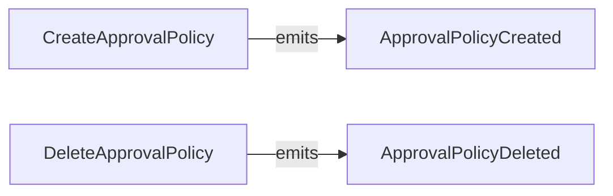


---

## Critical Functions Requiring Two Administrators

<a id="dst_dual_admin_operations"></a>

[↑ Back to Top](#-table-of-contents)

**Story ID**: `dst_dual_admin_operations`  
**Tags**: approval_management, security, priority_3, phase_2  

### Description

Critical functions in the commercial banking platform require dual admin approval
to execute. This ensures that no single administrator can perform sensitive operations
alone. The system validates that at least 2 administrator users exist in the profile
before allowing critical functions to proceed.

### Commands

#### ExecuteCriticalFunction (`cmd_execute_critical_function`)

Executes a critical function requiring dual admin approval

**Actors**: `act_client_administrator`  
**Emits Events**: `evt_critical_function_executed`  

#### SendIDPRegistration (`cmd_send_idp_registration`)

Sends registration request to identity provider

**Actors**: `act_identity_provider`  

### Events

| Event ID | Name | Description | Caused By |
|----------|------|-------------|----------|
| `evt_critical_function_executed` | CriticalFunctionExecuted | A critical function has been executed with dual admin approval | `cmd_execute_critical_function` |

### Visualizations

#### Command-Event-Policy Flow

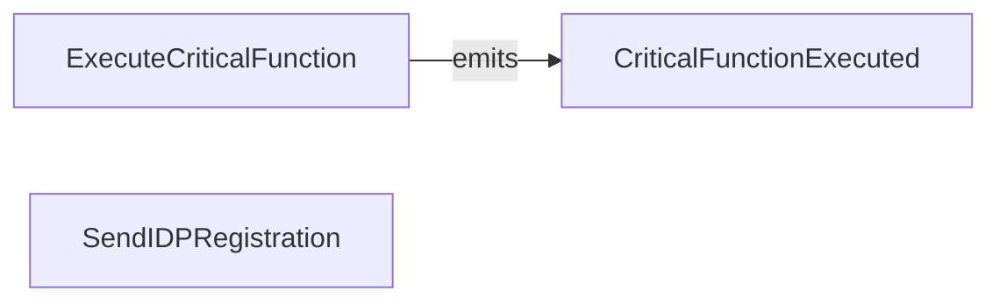


---

## Client Manages Indirect Clients (Persons or Businesses)

<a id="dst_indirect_client_management"></a>

[↑ Back to Top](#-table-of-contents)

**Story ID**: `dst_indirect_client_management`  
**Tags**: indirect_client_management, client_management, priority_4, phase_3  

### Description

A client with indirect client management capability manages indirect clients on behalf
of their customers. Indirect clients can be persons (with person name) or businesses
(with business name, address, and related persons performing roles such as signing
officer, administrator, or director). The same person can perform multiple roles.
Indirect clients are identified with IND client ID type.

### Domain Model

#### Aggregates

##### IndirectClient (`agg_indirect_client`)

Indirect client aggregate managing persons or businesses with related persons

**Invariants**:
- If client_type is person, person_name must be set
- If client_type is business, business_name must be set

#### Work Objects

##### Indirect Client (`wobj_indirect_client`)

Person or business managed on behalf of a client

**Attributes**:

| Name | Type | Required | Description |
|------|------|----------|-------------|
| indirect_client_id | uuid | ✓ |  |
| parent_profile_id | uuid | ✓ |  |
| client_id_value | string | ✓ |  |
| client_type | enum | ✓ | person or business |
| person_name | string |  |  |
| business_name | string |  |  |

##### Related Person (`wobj_related_person`)

Person associated with a business indirect client in a specific role

**Attributes**:

| Name | Type | Required | Description |
|------|------|----------|-------------|
| person_id | uuid | ✓ |  |
| person_name | string | ✓ |  |
| roles | json | ✓ |  |

### Commands

#### CreateIndirectClient (`cmd_create_indirect_client`)

Creates a new indirect client (person or business)

**Actors**: `act_client_administrator`  
**Target Aggregate**: `agg_indirect_client`  
**Emits Events**: `evt_indirect_client_created`  

#### AddRelatedPerson (`cmd_add_related_person`)

Adds a related person to a business indirect client

**Actors**: `act_client_administrator`  
**Target Aggregate**: `agg_indirect_client`  
**Emits Events**: `evt_related_person_added`  

### Events

| Event ID | Name | Description | Caused By |
|----------|------|-------------|----------|
| `evt_indirect_client_created` | IndirectClientCreated | A new indirect client has been created | `cmd_create_indirect_client` |
| `evt_related_person_added` | RelatedPersonAdded | A related person has been added to a business indirect client | `cmd_add_related_person` |

### Visualizations

#### Command-Event-Policy Flow

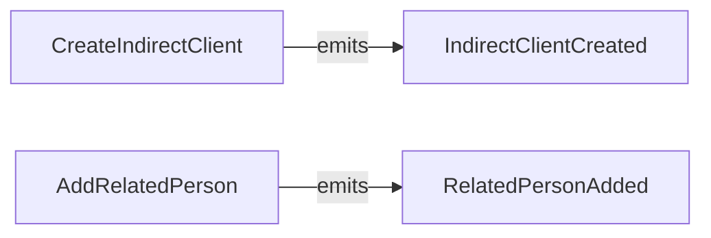


---

## Indirect Clients Manage Their Own Users and Permissions

<a id="dst_indirect_client_user_management"></a>

[↑ Back to Top](#-table-of-contents)

**Story ID**: `dst_indirect_client_user_management`  
**Tags**: indirect_client_management, user_management, self_service, priority_4, phase_3  

### Description

Indirect clients that have online access can manage their own users, permissions, and
approval rules. They operate within an indirect service profile that provides them
with limited capabilities scoped to their own operations.

### Actors

| Actor ID | Name | Kind | Description |
|----------|------|------|-------------|
| `act_indirect_client_admin` | Indirect Client Administrator | person | Administrator user for an indirect client managing their users and permissions |

### Commands

#### RegisterIndirectClientUser (`cmd_register_indirect_client_user`)

Registers a new user for an indirect client

**Actors**: `act_indirect_client_admin`  
**Target Aggregate**: `agg_user`  
**Emits Events**: `evt_user_registered`  

### Visualizations

#### Sequence Diagram

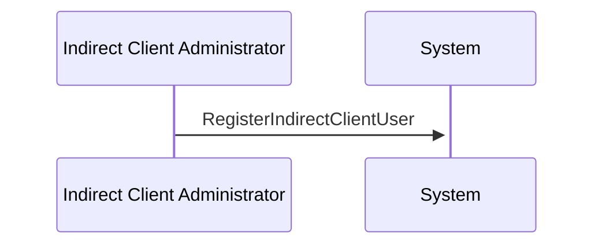

#### Command-Event-Policy Flow

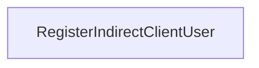


---

## Indirect Clients Act as Payors for Receivables

<a id="dst_receivable_service_with_payors"></a>

[↑ Back to Top](#-table-of-contents)

**Story ID**: `dst_receivable_service_with_payors`  
**Tags**: service_management, indirect_client_management, receivables, priority_4, phase_3  

### Description

A client enrolls in the Receivable Service, which enables them to manage receivables
from indirect clients (payors). The service links to GSAN accounts enrolled in the
service. Indirect clients in the role of payor can view invoices and make payments
from their Canadian bank accounts through the Receivable Approval Service.

### Actors

| Actor ID | Name | Kind | Description |
|----------|------|------|-------------|
| `act_indirect_client_payor` | Indirect Client Payor | person | Indirect client user acting as payor for receivables |

### Domain Model

#### Work Objects

##### Invoice (`wobj_invoice`)

Receivable invoice for payment by payor

**Attributes**:

| Name | Type | Required | Description |
|------|------|----------|-------------|
| invoice_id | uuid | ✓ |  |
| payor_indirect_client_id | uuid | ✓ |  |
| amount | money | ✓ |  |
| status | enum | ✓ | pending, paid, overdue |

### Commands

#### ConfigureReceivableService (`cmd_configure_receivable_service`)

Configures receivable service with GSAN accounts and payors

**Actors**: `act_client_administrator`  
**Target Aggregate**: `agg_service_enrollment`  
**Emits Events**: `evt_receivable_service_configured`  

#### PayInvoice (`cmd_pay_invoice`)

Payor pays an invoice using their Canadian bank account

**Actors**: `act_indirect_client_payor`  
**Emits Events**: `evt_invoice_paid`  

### Events

| Event ID | Name | Description | Caused By |
|----------|------|-------------|----------|
| `evt_receivable_service_configured` | ReceivableServiceConfigured | Receivable service has been configured with GSAN accounts and payors | `cmd_configure_receivable_service` |
| `evt_invoice_paid` | InvoicePaid | A receivable invoice has been paid by the payor | `cmd_pay_invoice` |

### Visualizations

#### Sequence Diagram

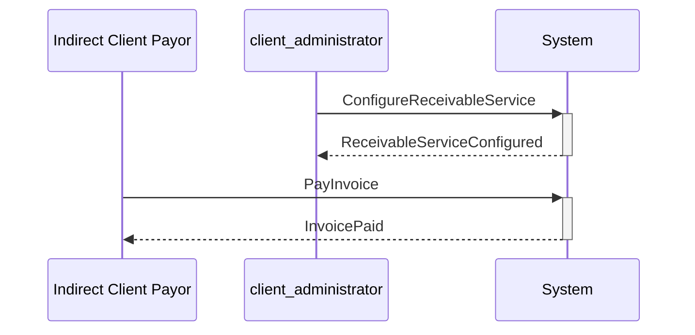

#### Command-Event-Policy Flow

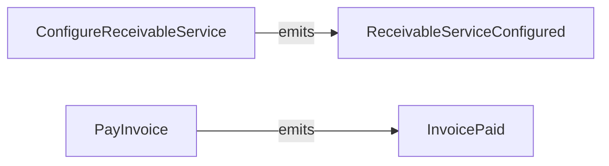


---

## Bank Employee Enrolls Large Canadian Client to Online Profile via Employee Portal

<a id="dst_employee_portal_client_enrollment"></a>

[↑ Back to Top](#-table-of-contents)

**Story ID**: `dst_employee_portal_client_enrollment`  
**Tags**: employee_portal, client_enrollment, mvp, priority_mvp  

### Description

A bank employee uses the employee portal to enroll a large Canadian commercial client to
an online profile with site-id linking to Express for user synchronization. The employee
configures the profile for receivable service with 700 business payors, establishes the
three-tier relationship (Bank → Client → Payors), and initiates user replication from
Express via event streaming. This is the primary workflow for the MVP launch supporting
Payedge Receivables initiative with one large client by June 2026.

### Actors

| Actor ID | Name | Kind | Description |
|----------|------|------|-------------|
| `act_bank_employee_portal_user` | Bank Employee Portal User | person | Bank employee managing client enrollments and monitoring indirect client relationships via employee portal |

### Domain Model

#### Aggregates

##### EnrollmentWorkflow (`agg_enrollment_workflow`)

Enrollment workflow aggregate managing multi-step client onboarding process

**Invariants**:
- Site-id must be unique and valid in Express system
- Enrollment cannot complete until initial user synchronization succeeds

##### EmployeePortalSession (`agg_employee_portal_session`)

Employee portal session aggregate tracking bank employee operations

**Invariants**:
- Employee must have portal access permissions
- Session must be authenticated via bank identity provider

#### Work Objects

##### Enrollment Workflow (`wobj_enrollment_workflow`)

Multi-step workflow for enrolling client to online profile with Express integration

**Attributes**:

| Name | Type | Required | Description |
|------|------|----------|-------------|
| workflow_id | uuid | ✓ |  |
| client_profile_id | uuid | ✓ |  |
| site_id | string | ✓ | Linking key to Express profile for user synchronization |
| enrollment_status | enum | ✓ | initiated, express_linked, users_syncing, completed, failed |

### Commands

#### EnrollClientOnlineProfile (`cmd_enroll_client_online_profile`)

Enrolls large Canadian client to online profile with site-id linking to Express

**Actors**: `act_bank_employee_portal_user`  
**Target Aggregate**: `agg_enrollment_workflow`  
**Emits Events**: `evt_client_online_profile_enrolled`, `evt_express_linking_initiated`  

#### LinkExpressProfile (`cmd_link_express_profile`)

Links online profile to Express profile via site-id for user event synchronization

**Actors**: `act_bank_employee_portal_user`  
**Target Aggregate**: `agg_enrollment_workflow`  
**Emits Events**: `evt_express_profile_linked`  

### Events

| Event ID | Name | Description | Caused By |
|----------|------|-------------|----------|
| `evt_client_online_profile_enrolled` | ClientOnlineProfileEnrolled | Large Canadian client has been enrolled to online profile via employee portal | `cmd_enroll_client_online_profile` |
| `evt_express_linking_initiated` | ExpressLinkingInitiated | Linking to Express profile has been initiated for user synchronization | `cmd_enroll_client_online_profile` |
| `evt_express_profile_linked` | ExpressProfileLinked | Online profile successfully linked to Express profile via site-id | `cmd_link_express_profile` |

### Policies

| Policy ID | Name | When Event | Issues Command |
|-----------|------|------------|----------------|
| `pol_validate_express_site_id` | Validate Express Site-ID on Linking Initiation | `evt_express_linking_initiated` | `cmd_validate_site_id` |
| `pol_initiate_user_synchronization` | Initiate User Synchronization After Express Linking | `evt_express_profile_linked` | `cmd_start_user_sync_stream` |

### Visualizations

#### Sequence Diagram

```mermaid
sequenceDiagram
    participant bank_employee_portal_user as Bank Employee Portal User
    participant System
    bank_employee_portal_user->>+System: EnrollClientOnlineProfile
    System-->>-bank_employee_portal_user: ClientOnlineProfileEnrolled
    System-->>-bank_employee_portal_user: ExpressLinkingInitiated
    bank_employee_portal_user->>+System: LinkExpressProfile
    System-->>-bank_employee_portal_user: ExpressProfileLinked
```

#### Command-Event-Policy Flow

```mermaid
graph LR
    cmd_enroll_client_online_profile[EnrollClientOnlineProfile]
    evt_client_online_profile_enrolled[ClientOnlineProfileEnrolled]
    cmd_enroll_client_online_profile -->|emits| evt_client_online_profile_enrolled
    evt_express_linking_initiated[ExpressLinkingInitiated]
    cmd_enroll_client_online_profile -->|emits| evt_express_linking_initiated
    pol_validate_express_site_id{{Validate Express Site-ID on Linking Initiation}}
    evt_express_linking_initiated -->|triggers| pol_validate_express_site_id
    pol_validate_express_site_id -->|issues| cmd_validate_site_id
    cmd_link_express_profile[LinkExpressProfile]
    evt_express_profile_linked[ExpressProfileLinked]
    cmd_link_express_profile -->|emits| evt_express_profile_linked
    pol_initiate_user_synchronization{{Initiate User Synchronization After Express Linking}}
    evt_express_profile_linked -->|triggers| pol_initiate_user_synchronization
    pol_initiate_user_synchronization -->|issues| cmd_start_user_sync_stream
```


---

## Bank Employee Onboards 700 Business Payors via Employee Portal

<a id="dst_employee_portal_payor_onboarding"></a>

[↑ Back to Top](#-table-of-contents)

**Story ID**: `dst_employee_portal_payor_onboarding`  
**Tags**: employee_portal, payor_onboarding, mvp, priority_mvp  

### Description

A bank employee uses the employee portal to onboard 700 business payors (indirect clients)
for the large Canadian client enrolled in receivable service. Each payor is a business
entity with business name, address, and related persons performing roles (signing officer,
administrator, director). The employee can perform bulk onboarding via batch upload or
individual payor creation. NO individual person payors are supported in MVP - only
businesses. This establishes the three-tier relationship: Bank → Direct Client → 700 Payors.

### Domain Model

#### Aggregates

##### PayorOnboardingBatch (`agg_payor_onboarding_batch`)

Batch onboarding aggregate managing bulk payor creation for large client

**Invariants**:
- Batch must complete within acceptable time window (< 24 hours)
- Failed payor onboarding must not block batch completion

##### BusinessPayor (`agg_business_payor`)

Business payor aggregate with related persons performing roles

**Invariants**:
- Business payor must have at least one related person with administrator role
- Business name must be unique within parent client profile

#### Work Objects

##### Payor Onboarding Batch (`wobj_payor_onboarding_batch`)

Batch container for bulk onboarding of 700 business payors

**Attributes**:

| Name | Type | Required | Description |
|------|------|----------|-------------|
| batch_id | uuid | ✓ |  |
| parent_profile_id | uuid | ✓ | Large client profile ID |
| total_payors | integer | ✓ | Total payors in batch (target: 700) |
| payors_onboarded | integer | ✓ |  |
| batch_status | enum | ✓ | pending, processing, completed, failed |

##### Business Payor (`wobj_business_payor`)

Business indirect client with related persons in various roles

**Attributes**:

| Name | Type | Required | Description |
|------|------|----------|-------------|
| payor_id | uuid | ✓ |  |
| parent_profile_id | uuid | ✓ |  |
| business_name | string | ✓ |  |
| business_address | string | ✓ |  |
| related_persons | json | ✓ | Array of related persons with roles |

### Commands

#### CreatePayorOnboardingBatch (`cmd_create_payor_onboarding_batch`)

Creates batch for onboarding 700 business payors via employee portal

**Actors**: `act_bank_employee_portal_user`  
**Target Aggregate**: `agg_payor_onboarding_batch`  
**Emits Events**: `evt_payor_onboarding_batch_created`  

#### OnboardBusinessPayor (`cmd_onboard_business_payor`)

Onboards individual business payor with related persons

**Actors**: `act_bank_employee_portal_user`  
**Target Aggregate**: `agg_business_payor`  
**Emits Events**: `evt_business_payor_onboarded`  

#### AssignPayorRole (`cmd_assign_payor_role`)

Assigns role to related person in business payor (signing_officer, administrator, director)

**Actors**: `act_bank_employee_portal_user`  
**Target Aggregate**: `agg_business_payor`  
**Emits Events**: `evt_payor_role_assigned`  

### Events

| Event ID | Name | Description | Caused By |
|----------|------|-------------|----------|
| `evt_payor_onboarding_batch_created` | PayorOnboardingBatchCreated | Batch for onboarding 700 business payors has been created | `cmd_create_payor_onboarding_batch` |
| `evt_business_payor_onboarded` | BusinessPayorOnboarded | Business payor has been onboarded with related persons | `cmd_onboard_business_payor` |
| `evt_payor_role_assigned` | PayorRoleAssigned | Role has been assigned to related person in business payor | `cmd_assign_payor_role` |

### Policies

| Policy ID | Name | When Event | Issues Command |
|-----------|------|------------|----------------|
| `pol_process_payor_batch` | Process Payor Batch on Batch Creation | `evt_payor_onboarding_batch_created` | `cmd_onboard_business_payor` |
| `pol_create_payor_profile` | Create Payor Profile on Business Payor Onboarded | `evt_business_payor_onboarded` | `cmd_create_indirect_client` |

### Visualizations

#### Command-Event-Policy Flow

```mermaid
graph LR
    cmd_create_payor_onboarding_batch[CreatePayorOnboardingBatch]
    evt_payor_onboarding_batch_created[PayorOnboardingBatchCreated]
    cmd_create_payor_onboarding_batch -->|emits| evt_payor_onboarding_batch_created
    pol_process_payor_batch{{Process Payor Batch on Batch Creation}}
    evt_payor_onboarding_batch_created -->|triggers| pol_process_payor_batch
    pol_process_payor_batch -->|issues| cmd_onboard_business_payor
    cmd_onboard_business_payor[OnboardBusinessPayor]
    evt_business_payor_onboarded[BusinessPayorOnboarded]
    cmd_onboard_business_payor -->|emits| evt_business_payor_onboarded
    pol_create_payor_profile{{Create Payor Profile on Business Payor Onboarded}}
    evt_business_payor_onboarded -->|triggers| pol_create_payor_profile
    pol_create_payor_profile -->|issues| cmd_create_indirect_client
    cmd_assign_payor_role[AssignPayorRole]
    evt_payor_role_assigned[PayorRoleAssigned]
    cmd_assign_payor_role -->|emits| evt_payor_role_assigned
```


---

## Bank Employee Monitors Three-Tier Relationships via Employee Portal Dashboard

<a id="dst_employee_portal_relationship_monitoring"></a>

[↑ Back to Top](#-table-of-contents)

**Story ID**: `dst_employee_portal_relationship_monitoring`  
**Tags**: employee_portal, relationship_monitoring, mvp, priority_mvp  

### Description

A bank employee uses the employee portal dashboard to monitor three-tier relationships:
Bank → Direct Client (large Canadian commercial client) → Indirect Clients (700 business
payors). The dashboard provides unified view into client enrollment status, payor onboarding
progress, user counts (direct client users replicated from Express + 1050 indirect client
users in Okta), approval rule configurations, and receivable service activity. This enables
proactive relationship management and operational oversight for the MVP launch.

### Domain Model

#### Work Objects

##### Relationship Dashboard (`wobj_relationship_dashboard`)

Unified view into three-tier Bank → Client → Payors relationships

**Attributes**:

| Name | Type | Required | Description |
|------|------|----------|-------------|
| parent_client_profile_id | uuid | ✓ |  |
| total_payors | integer | ✓ | Total business payors onboarded (target: 700) |
| total_indirect_users | integer | ✓ | Total indirect client users in Okta (target: 1050) |
| total_direct_users | integer | ✓ | Total direct client users replicated from Express |
| total_approval_rules | integer | ✓ | Total approval rules configured (target: 700) |
| receivable_service_status | enum | ✓ | active, suspended, pending_activation |

### Visualizations


---

## Payor Manages Users via Self-Service Portal with Okta Integration

<a id="dst_payor_self_service_user_management"></a>

[↑ Back to Top](#-table-of-contents)

**Story ID**: `dst_payor_self_service_user_management`  
**Tags**: self_service_portal, user_management, okta_integration, mvp, priority_mvp  

### Description

A business payor administrator uses the self-service portal to independently manage their
users in Okta. The payor can create new users (avg 1.5 users per business across 700
payors = 1050 total users), assign roles, activate/deactivate users, lock/unlock accounts,
and update user profiles. All user lifecycle operations are performed via platform → Okta
integration with <2 second latency. The platform creates and fully manages indirect client
users in Okta (platform owns lifecycle), providing self-service independence without
requiring bank employee intervention for routine user management tasks.

### Actors

| Actor ID | Name | Kind | Description |
|----------|------|------|-------------|
| `act_payor_portal_user` | Payor Portal User | person | Business payor administrator accessing self-service portal to manage users, permissions, and approval rules |
| `act_okta_system` | Okta System | system | Okta identity provider managing indirect client user authentication and lifecycle |

### Domain Model

#### Aggregates

##### UserSelfService (`agg_user_self_service`)

Self-service user management aggregate enabling payors to manage their Okta users independently

**Invariants**:
- Payor can only manage users within their own indirect client profile
- User creation must complete in Okta within 2 seconds

##### PayorPortalSession (`agg_payor_portal_session`)

Payor self-service portal session aggregate with Okta authentication

**Invariants**:
- Payor must authenticate via Okta to access self-service portal
- Session must have valid Okta token

### Commands

#### PayorCreateUserInOkta (`cmd_payor_create_user_in_okta`)

Payor creates new user via self-service portal, platform provisions user in Okta

**Actors**: `act_payor_portal_user`  
**Target Aggregate**: `agg_user_self_service`  
**Emits Events**: `evt_payor_user_creation_requested`, `evt_okta_user_provisioning_initiated`  

#### PayorUpdateUserInOkta (`cmd_payor_update_user_in_okta`)

Payor updates user profile via self-service portal, platform updates user in Okta

**Actors**: `act_payor_portal_user`  
**Target Aggregate**: `agg_user_self_service`  
**Emits Events**: `evt_payor_user_update_requested`, `evt_okta_user_update_initiated`  

#### PayorDeactivateUserInOkta (`cmd_payor_deactivate_user_in_okta`)

Payor deactivates user via self-service portal, platform deactivates user in Okta

**Actors**: `act_payor_portal_user`  
**Target Aggregate**: `agg_user_self_service`  
**Emits Events**: `evt_payor_user_deactivation_requested`, `evt_okta_user_deactivation_initiated`  

### Events

| Event ID | Name | Description | Caused By |
|----------|------|-------------|----------|
| `evt_payor_user_creation_requested` | PayorUserCreationRequested | Payor has requested user creation via self-service portal | `cmd_payor_create_user_in_okta` |
| `evt_okta_user_provisioning_initiated` | OktaUserProvisioningInitiated | Platform has initiated user provisioning in Okta | `cmd_payor_create_user_in_okta` |
| `evt_payor_user_update_requested` | PayorUserUpdateRequested | Payor has requested user update via self-service portal | `cmd_payor_update_user_in_okta` |
| `evt_okta_user_update_initiated` | OktaUserUpdateInitiated | Platform has initiated user update in Okta | `cmd_payor_update_user_in_okta` |
| `evt_payor_user_deactivation_requested` | PayorUserDeactivationRequested | Payor has requested user deactivation via self-service portal | `cmd_payor_deactivate_user_in_okta` |
| `evt_okta_user_deactivation_initiated` | OktaUserDeactivationInitiated | Platform has initiated user deactivation in Okta | `cmd_payor_deactivate_user_in_okta` |

### Policies

| Policy ID | Name | When Event | Issues Command |
|-----------|------|------------|----------------|
| `pol_auto_create_okta_user_on_payor_user_creation` | Auto-Create Okta User on Payor User Creation Request | `evt_payor_user_creation_requested` | `cmd_create_okta_user` |
| `pol_auto_update_okta_user_on_payor_update` | Auto-Update Okta User on Payor User Update Request | `evt_payor_user_update_requested` | `cmd_update_okta_user` |
| `pol_auto_deactivate_okta_user_on_payor_deactivation` | Auto-Deactivate Okta User on Payor Deactivation Request | `evt_payor_user_deactivation_requested` | `cmd_deactivate_okta_user` |

### Visualizations

#### Sequence Diagram

```mermaid
sequenceDiagram
    participant payor_portal_user as Payor Portal User
    participant okta_system as Okta System
    participant System
    payor_portal_user->>+System: PayorCreateUserInOkta
    System-->>-payor_portal_user: PayorUserCreationRequested
    System-->>-payor_portal_user: OktaUserProvisioningInitiated
    payor_portal_user->>+System: PayorUpdateUserInOkta
    System-->>-payor_portal_user: PayorUserUpdateRequested
    System-->>-payor_portal_user: OktaUserUpdateInitiated
    payor_portal_user->>+System: PayorDeactivateUserInOkta
    System-->>-payor_portal_user: PayorUserDeactivationRequested
    System-->>-payor_portal_user: OktaUserDeactivationInitiated
```

#### Command-Event-Policy Flow

```mermaid
graph LR
    cmd_payor_create_user_in_okta[PayorCreateUserInOkta]
    evt_payor_user_creation_requested[PayorUserCreationRequested]
    cmd_payor_create_user_in_okta -->|emits| evt_payor_user_creation_requested
    pol_auto_create_okta_user_on_payor_user_creation{{Auto-Create Okta User on Payor User Creation Request}}
    evt_payor_user_creation_requested -->|triggers| pol_auto_create_okta_user_on_payor_user_creation
    pol_auto_create_okta_user_on_payor_user_creation -->|issues| cmd_create_okta_user
    evt_okta_user_provisioning_initiated[OktaUserProvisioningInitiated]
    cmd_payor_create_user_in_okta -->|emits| evt_okta_user_provisioning_initiated
    cmd_payor_update_user_in_okta[PayorUpdateUserInOkta]
    evt_payor_user_update_requested[PayorUserUpdateRequested]
    cmd_payor_update_user_in_okta -->|emits| evt_payor_user_update_requested
    pol_auto_update_okta_user_on_payor_update{{Auto-Update Okta User on Payor User Update Request}}
    evt_payor_user_update_requested -->|triggers| pol_auto_update_okta_user_on_payor_update
    pol_auto_update_okta_user_on_payor_update -->|issues| cmd_update_okta_user
    evt_okta_user_update_initiated[OktaUserUpdateInitiated]
    cmd_payor_update_user_in_okta -->|emits| evt_okta_user_update_initiated
    cmd_payor_deactivate_user_in_okta[PayorDeactivateUserInOkta]
    evt_payor_user_deactivation_requested[PayorUserDeactivationRequested]
    cmd_payor_deactivate_user_in_okta -->|emits| evt_payor_user_deactivation_requested
    pol_auto_deactivate_okta_user_on_payor_deactivation{{Auto-Deactivate Okta User on Payor Deactivation Request}}
    evt_payor_user_deactivation_requested -->|triggers| pol_auto_deactivate_okta_user_on_payor_deactivation
    pol_auto_deactivate_okta_user_on_payor_deactivation -->|issues| cmd_deactivate_okta_user
    evt_okta_user_deactivation_initiated[OktaUserDeactivationInitiated]
    cmd_payor_deactivate_user_in_okta -->|emits| evt_okta_user_deactivation_initiated
```


---

## Payor Configures Permissions for Users via Self-Service Portal

<a id="dst_payor_self_service_permission_config"></a>

[↑ Back to Top](#-table-of-contents)

**Story ID**: `dst_payor_self_service_permission_config`  
**Tags**: self_service_portal, permission_management, mvp, priority_mvp  

### Description

A business payor administrator uses the self-service portal to configure permission policies
for their users. The payor defines subject (user_id), action (URN like urn:cb:receivable:approve),
and resource (account_id or invoice_id) rules following AWS IAM-like model. Permission
policies control what users can do with receivable approval workflows, invoice viewing,
payment submission, and approval rule configuration. This enables payors to independently
manage access control without bank employee intervention, supporting self-service independence
for 700 business payors in MVP.

### Domain Model

#### Aggregates

##### PermissionSelfService (`agg_permission_self_service`)

Self-service permission management aggregate enabling payors to configure permission policies

**Invariants**:
- Permission policies scoped to payor's indirect client profile
- Payor cannot create permissions for users outside their profile

### Commands

#### PayorConfigurePermissions (`cmd_payor_configure_permissions`)

Payor configures permission policies for their users via self-service portal

**Actors**: `act_payor_portal_user`  
**Target Aggregate**: `agg_permission_self_service`  
**Emits Events**: `evt_payor_permission_configured`  

### Events

| Event ID | Name | Description | Caused By |
|----------|------|-------------|----------|
| `evt_payor_permission_configured` | PayorPermissionConfigured | Payor has configured permission policy via self-service portal | `cmd_payor_configure_permissions` |

### Visualizations

#### Command-Event-Policy Flow

```mermaid
graph LR
    cmd_payor_configure_permissions[PayorConfigurePermissions]
    evt_payor_permission_configured[PayorPermissionConfigured]
    cmd_payor_configure_permissions -->|emits| evt_payor_permission_configured
```


---

## Payor Configures Approval Rules via Self-Service Portal

<a id="dst_payor_self_service_approval_config"></a>

[↑ Back to Top](#-table-of-contents)

**Story ID**: `dst_payor_self_service_approval_config`  
**Tags**: self_service_portal, approval_management, mvp, priority_mvp  

### Description

A business payor administrator uses the self-service portal to configure approval rules for
receivable invoice workflows. The payor sets approval thresholds (amount-based), approver
count (single or multiple), and approver identities. For invoices below threshold, single
approver is required. For invoices above threshold, multiple approvers are required (parallel
approval - all must approve). MVP supports ONLY parallel approval (no sequential approval).
Each of 700 business payors configures their own approval rules independently, with total
target of 700 approval rules configured across all payors.

### Domain Model

#### Aggregates

##### ApprovalSelfService (`agg_approval_self_service`)

Self-service approval rule management aggregate enabling payors to configure approval workflows

**Invariants**:
- Approval rules scoped to payor's indirect client profile
- Parallel approval only in MVP - all required approvers must approve

### Commands

#### PayorConfigureApprovalRule (`cmd_payor_configure_approval_rule`)

Payor configures approval rule with threshold and approver count via self-service portal

**Actors**: `act_payor_portal_user`  
**Target Aggregate**: `agg_approval_self_service`  
**Emits Events**: `evt_payor_approval_rule_configured`  

### Events

| Event ID | Name | Description | Caused By |
|----------|------|-------------|----------|
| `evt_payor_approval_rule_configured` | PayorApprovalRuleConfigured | Payor has configured approval rule for receivable invoice workflows via self-service portal | `cmd_payor_configure_approval_rule` |

### Visualizations

#### Command-Event-Policy Flow

```mermaid
graph LR
    cmd_payor_configure_approval_rule[PayorConfigureApprovalRule]
    evt_payor_approval_rule_configured[PayorApprovalRuleConfigured]
    cmd_payor_configure_approval_rule -->|emits| evt_payor_approval_rule_configured
```


---

## Platform Creates Indirect Client User in Okta

<a id="dst_okta_user_lifecycle_create"></a>

[↑ Back to Top](#-table-of-contents)

**Story ID**: `dst_okta_user_lifecycle_create`  
**Tags**: okta_integration, user_lifecycle, mvp, priority_mvp  

### Description

The platform creates a new indirect client user in Okta via API integration. This occurs
when a payor administrator creates a user via self-service portal, or when a bank employee
onboards a payor with initial users via employee portal. The platform sends user profile
data to Okta, receives confirmation with Okta user ID, and updates platform user record
with Okta linking. Provisioning must complete within 2 seconds. Platform owns full lifecycle
management for 1050 indirect client users across 700 business payors in MVP.

### Domain Model

#### Aggregates

##### OktaUserLifecycle (`agg_okta_user_lifecycle`)

Okta user lifecycle management aggregate handling create, update, activate, deactivate, lock, unlock operations

**Invariants**:
- Okta user ID must be stored after successful creation
- User provisioning must complete within 2 seconds

### Commands

#### CreateOktaUser (`cmd_create_okta_user`)

Creates user in Okta via API integration with <2 second latency

**Actors**: `act_okta_system`  
**Target Aggregate**: `agg_okta_user_lifecycle`  
**Emits Events**: `evt_okta_user_created`  

#### UpdateOktaUser (`cmd_update_okta_user`)

Updates user profile in Okta via API integration

**Actors**: `act_okta_system`  
**Target Aggregate**: `agg_okta_user_lifecycle`  
**Emits Events**: `evt_okta_user_updated`  

#### ActivateOktaUser (`cmd_activate_okta_user`)

Activates user in Okta via API integration

**Actors**: `act_okta_system`  
**Target Aggregate**: `agg_okta_user_lifecycle`  
**Emits Events**: `evt_okta_user_activated`  

### Events

| Event ID | Name | Description | Caused By |
|----------|------|-------------|----------|
| `evt_okta_user_created` | OktaUserCreated | User has been successfully created in Okta via platform API integration | `cmd_create_okta_user` |
| `evt_okta_user_updated` | OktaUserUpdated | User profile has been successfully updated in Okta | `cmd_update_okta_user` |
| `evt_okta_user_activated` | OktaUserActivated | User has been successfully activated in Okta | `cmd_activate_okta_user` |

### Policies

| Policy ID | Name | When Event | Issues Command |
|-----------|------|------------|----------------|
| `pol_update_user_with_okta_id` | Update Platform User with Okta ID After Creation | `evt_okta_user_created` | `cmd_link_user_to_okta` |

### Visualizations

#### Command-Event-Policy Flow

```mermaid
graph LR
    cmd_create_okta_user[CreateOktaUser]
    evt_okta_user_created[OktaUserCreated]
    cmd_create_okta_user -->|emits| evt_okta_user_created
    pol_update_user_with_okta_id{{Update Platform User with Okta ID After Creation}}
    evt_okta_user_created -->|triggers| pol_update_user_with_okta_id
    pol_update_user_with_okta_id -->|issues| cmd_link_user_to_okta
    cmd_update_okta_user[UpdateOktaUser]
    evt_okta_user_updated[OktaUserUpdated]
    cmd_update_okta_user -->|emits| evt_okta_user_updated
    cmd_activate_okta_user[ActivateOktaUser]
    evt_okta_user_activated[OktaUserActivated]
    cmd_activate_okta_user -->|emits| evt_okta_user_activated
```


---

## Platform Deactivates Indirect Client User in Okta

<a id="dst_okta_user_lifecycle_deactivate"></a>

[↑ Back to Top](#-table-of-contents)

**Story ID**: `dst_okta_user_lifecycle_deactivate`  
**Tags**: okta_integration, user_lifecycle, mvp, priority_mvp  

### Description

The platform deactivates an indirect client user in Okta via API integration. This occurs
when a payor administrator deactivates a user via self-service portal, or when a bank
employee deactivates a user via employee portal. Deactivation prevents user from authenticating
to self-service portal but preserves user profile for potential reactivation. Platform sends
deactivation request to Okta, receives confirmation, and updates platform user status.

### Commands

#### DeactivateOktaUser (`cmd_deactivate_okta_user`)

Deactivates user in Okta via API integration

**Actors**: `act_okta_system`  
**Target Aggregate**: `agg_okta_user_lifecycle`  
**Emits Events**: `evt_okta_user_deactivated`  

### Events

| Event ID | Name | Description | Caused By |
|----------|------|-------------|----------|
| `evt_okta_user_deactivated` | OktaUserDeactivated | User has been successfully deactivated in Okta | `cmd_deactivate_okta_user` |

### Visualizations

#### Command-Event-Policy Flow

```mermaid
graph LR
    cmd_deactivate_okta_user[DeactivateOktaUser]
    evt_okta_user_deactivated[OktaUserDeactivated]
    cmd_deactivate_okta_user -->|emits| evt_okta_user_deactivated
```


---

## Platform Locks and Unlocks Indirect Client Users in Okta

<a id="dst_okta_user_lifecycle_lock_unlock"></a>

[↑ Back to Top](#-table-of-contents)

**Story ID**: `dst_okta_user_lifecycle_lock_unlock`  
**Tags**: okta_integration, user_lifecycle, security, mvp, priority_mvp  

### Description

The platform locks and unlocks indirect client users in Okta via API integration. Lock
operations occur when security issues are detected or when payor administrators temporarily
suspend access. Unlock operations restore access after security clearance or administrator
authorization. Platform sends lock/unlock requests to Okta, receives confirmation, and
updates platform user status accordingly.

### Commands

#### LockOktaUser (`cmd_lock_okta_user`)

Locks user in Okta due to security concern or administrator action

**Actors**: `act_okta_system`  
**Target Aggregate**: `agg_okta_user_lifecycle`  
**Emits Events**: `evt_okta_user_locked`  

#### UnlockOktaUser (`cmd_unlock_okta_user`)

Unlocks user in Okta after security clearance or administrator authorization

**Actors**: `act_okta_system`  
**Target Aggregate**: `agg_okta_user_lifecycle`  
**Emits Events**: `evt_okta_user_unlocked`  

### Events

| Event ID | Name | Description | Caused By |
|----------|------|-------------|----------|
| `evt_okta_user_locked` | OktaUserLocked | User has been successfully locked in Okta | `cmd_lock_okta_user` |
| `evt_okta_user_unlocked` | OktaUserUnlocked | User has been successfully unlocked in Okta | `cmd_unlock_okta_user` |

### Visualizations

#### Command-Event-Policy Flow

```mermaid
graph LR
    cmd_lock_okta_user[LockOktaUser]
    evt_okta_user_locked[OktaUserLocked]
    cmd_lock_okta_user -->|emits| evt_okta_user_locked
    cmd_unlock_okta_user[UnlockOktaUser]
    evt_okta_user_unlocked[OktaUserUnlocked]
    cmd_unlock_okta_user -->|emits| evt_okta_user_unlocked
```


---

## Platform Consumes User Add Event from Express via Anti-Corruption Layer

<a id="dst_express_user_sync_add"></a>

[↑ Back to Top](#-table-of-contents)

**Story ID**: `dst_express_user_sync_add`  
**Tags**: express_integration, anti_corruption_layer, user_replication, mvp, priority_mvp  

### Description

The platform consumes user add event from legacy Express system via event streaming
integration (anti-corruption layer pattern). When Express publishes user add event (direct
client user created in Express self-service), platform receives event, validates payload,
translates Express user model to platform domain model, and creates replicated user record.
Site-id serves as linking key between platform online profile and Express profile. User
replication must complete within 5 minutes from Express event publication. Platform
replicates direct client users for permission/approval enforcement but does NOT manage
their lifecycle (Express owns lifecycle with A-and-P authentication).

### Actors

| Actor ID | Name | Kind | Description |
|----------|------|------|-------------|
| `act_express_system` | Express System | system | Legacy Express platform managing direct client users with A-and-P authentication and publishing user events |

### Domain Model

#### Aggregates

##### ExpressACL (`agg_express_acl`)

Anti-corruption layer aggregate translating Express user model to platform domain model

**Invariants**:
- Site-id must map to valid online profile in platform
- Express user model must be translated without polluting platform domain

##### ReplicatedUser (`agg_replicated_user`)

Replicated direct client user from Express for permission/approval enforcement (Express owns lifecycle)

**Invariants**:
- Replicated user references Express user via site-id and Express user ID
- Platform does NOT modify replicated user lifecycle (read-only for platform, write-only for Express)

#### Work Objects

##### Express User Event (`wobj_express_user_event`)

User event from Express system (add or update) requiring translation to domain model

**Attributes**:

| Name | Type | Required | Description |
|------|------|----------|-------------|
| event_id | string | ✓ |  |
| event_type | enum | ✓ | user_add or user_update |
| site_id | string | ✓ | Linking key to platform online profile |
| express_user_payload | json | ✓ | Express user model (big ball of mud) |
| received_at | datetime | ✓ |  |

### Commands

#### ConsumeExpressUserAddEvent (`cmd_consume_express_user_add_event`)

Consumes user add event from Express event stream and replicates user to platform

**Actors**: `act_express_system`  
**Target Aggregate**: `agg_express_acl`  
**Emits Events**: `evt_express_user_add_event_received`, `evt_express_user_replicated`  

#### TranslateExpressUserModel (`cmd_translate_express_user_model`)

Translates Express user model (big ball of mud) to platform domain model via anti-corruption layer

**Actors**: `act_express_system`  
**Target Aggregate**: `agg_express_acl`  
**Emits Events**: `evt_express_user_model_translated`  

### Events

| Event ID | Name | Description | Caused By |
|----------|------|-------------|----------|
| `evt_express_user_add_event_received` | ExpressUserAddEventReceived | User add event has been received from Express event stream | `cmd_consume_express_user_add_event` |
| `evt_express_user_replicated` | ExpressUserReplicated | Direct client user has been replicated from Express to platform domain | `cmd_consume_express_user_add_event` |
| `evt_express_user_model_translated` | ExpressUserModelTranslated | Express user model has been translated to platform domain model via anti-corruption layer | `cmd_translate_express_user_model` |

### Policies

| Policy ID | Name | When Event | Issues Command |
|-----------|------|------------|----------------|
| `pol_replicate_express_user_on_add_event` | Replicate Express User on Add Event Received | `evt_express_user_add_event_received` | `cmd_translate_express_user_model` |

### Visualizations

#### Sequence Diagram

```mermaid
sequenceDiagram
    participant express_system as Express System
    participant System
    express_system->>+System: ConsumeExpressUserAddEvent
    System-->>-express_system: ExpressUserAddEventReceived
    System-->>-express_system: ExpressUserReplicated
    express_system->>+System: TranslateExpressUserModel
    System-->>-express_system: ExpressUserModelTranslated
```

#### Command-Event-Policy Flow

```mermaid
graph LR
    cmd_consume_express_user_add_event[ConsumeExpressUserAddEvent]
    evt_express_user_add_event_received[ExpressUserAddEventReceived]
    cmd_consume_express_user_add_event -->|emits| evt_express_user_add_event_received
    pol_replicate_express_user_on_add_event{{Replicate Express User on Add Event Received}}
    evt_express_user_add_event_received -->|triggers| pol_replicate_express_user_on_add_event
    pol_replicate_express_user_on_add_event -->|issues| cmd_translate_express_user_model
    evt_express_user_replicated[ExpressUserReplicated]
    cmd_consume_express_user_add_event -->|emits| evt_express_user_replicated
    cmd_translate_express_user_model[TranslateExpressUserModel]
    evt_express_user_model_translated[ExpressUserModelTranslated]
    cmd_translate_express_user_model -->|emits| evt_express_user_model_translated
```


---

## Platform Consumes User Update Event from Express via Anti-Corruption Layer

<a id="dst_express_user_sync_update"></a>

[↑ Back to Top](#-table-of-contents)

**Story ID**: `dst_express_user_sync_update`  
**Tags**: express_integration, anti_corruption_layer, user_replication, mvp, priority_mvp  

### Description

The platform consumes user update event from legacy Express system via event streaming
integration. When Express publishes user update event (direct client user modified in
Express self-service), platform receives event, validates payload, translates Express
user model to platform domain model, and updates replicated user record. Platform maintains
consistency with Express user state for permission/approval enforcement while Express
continues to own user lifecycle with A-and-P authentication.

### Commands

#### ConsumeExpressUserUpdateEvent (`cmd_consume_express_user_update_event`)

Consumes user update event from Express event stream and updates replicated user in platform

**Actors**: `act_express_system`  
**Target Aggregate**: `agg_express_acl`  
**Emits Events**: `evt_express_user_update_event_received`, `evt_replicated_user_updated`  

### Events

| Event ID | Name | Description | Caused By |
|----------|------|-------------|----------|
| `evt_express_user_update_event_received` | ExpressUserUpdateEventReceived | User update event has been received from Express event stream | `cmd_consume_express_user_update_event` |
| `evt_replicated_user_updated` | ReplicatedUserUpdated | Replicated direct client user has been updated from Express event | `cmd_consume_express_user_update_event` |

### Policies

| Policy ID | Name | When Event | Issues Command |
|-----------|------|------------|----------------|
| `pol_update_replicated_user_on_express_update` | Update Replicated User on Express Update Event Received | `evt_express_user_update_event_received` | `cmd_translate_express_user_model` |

### Visualizations

#### Command-Event-Policy Flow

```mermaid
graph LR
    cmd_consume_express_user_update_event[ConsumeExpressUserUpdateEvent]
    evt_express_user_update_event_received[ExpressUserUpdateEventReceived]
    cmd_consume_express_user_update_event -->|emits| evt_express_user_update_event_received
    pol_update_replicated_user_on_express_update{{Update Replicated User on Express Update Event Received}}
    evt_express_user_update_event_received -->|triggers| pol_update_replicated_user_on_express_update
    pol_update_replicated_user_on_express_update -->|issues| cmd_translate_express_user_model
    evt_replicated_user_updated[ReplicatedUserUpdated]
    cmd_consume_express_user_update_event -->|emits| evt_replicated_user_updated
```


---

## Anti-Corruption Layer Translates Express User Model to Platform Domain Model

<a id="dst_express_acl_translation"></a>

[↑ Back to Top](#-table-of-contents)

**Story ID**: `dst_express_acl_translation`  
**Tags**: express_integration, anti_corruption_layer, domain_translation, mvp, priority_mvp  

### Description

The anti-corruption layer translates Express user model (big ball of mud with legacy data
structures) to clean platform domain model. Translation extracts relevant user attributes
(logon ID, email, user role, status), maps Express-specific fields to domain concepts,
and validates data quality. This protects platform domain from Express complexity and
enables eventual migration to Okta for direct client users (post-MVP) without polluting
domain model with Express-specific concerns.

### Visualizations


---

## Payor Submits Invoice for Approval via Receivable-Approval Service

<a id="dst_approval_workflow_submit"></a>

[↑ Back to Top](#-table-of-contents)

**Story ID**: `dst_approval_workflow_submit`  
**Tags**: approval_workflow, receivable_service, mvp, priority_mvp  

### Description

A business payor user submits an invoice for approval via receivable-approval service in
self-service portal. The platform creates approval workflow instance based on payor's
configured approval rules. If invoice amount is below threshold, single approver workflow
is created. If invoice amount is above threshold, multiple approver workflow is created
with parallel approval requirement (all required approvers must approve). Workflow enters
pending state awaiting approver decisions. Average approval processing time target is
<24 hours.

### Domain Model

#### Aggregates

##### ApprovalWorkflowInstance (`agg_approval_workflow_instance`)

Specific approval workflow instance for invoice with configured rules and approver decisions

**Invariants**:
- Workflow must reference valid approval rule configured by payor
- Parallel approval: all required approvers must approve for workflow to complete

#### Work Objects

##### Approval Request (`wobj_approval_request`)

Invoice requiring approval based on payor's configured rules

**Attributes**:

| Name | Type | Required | Description |
|------|------|----------|-------------|
| request_id | uuid | ✓ |  |
| invoice_id | uuid | ✓ |  |
| payor_indirect_client_id | uuid | ✓ |  |
| invoice_amount | money | ✓ |  |
| submitted_by_user_id | uuid | ✓ |  |
| workflow_status | enum | ✓ | pending, approved, rejected, expired |

### Commands

#### SubmitInvoiceForApproval (`cmd_submit_invoice_for_approval`)

Submits invoice for approval, creates workflow instance based on payor's approval rules

**Actors**: `act_payor_portal_user`  
**Target Aggregate**: `agg_approval_workflow_instance`  
**Emits Events**: `evt_invoice_submitted_for_approval`, `evt_approval_workflow_created`  

### Events

| Event ID | Name | Description | Caused By |
|----------|------|-------------|----------|
| `evt_invoice_submitted_for_approval` | InvoiceSubmittedForApproval | Invoice has been submitted for approval via receivable-approval service | `cmd_submit_invoice_for_approval` |
| `evt_approval_workflow_created` | ApprovalWorkflowCreated | Approval workflow instance has been created based on payor's configured rules | `cmd_submit_invoice_for_approval` |

### Policies

| Policy ID | Name | When Event | Issues Command |
|-----------|------|------------|----------------|
| `pol_create_approval_workflow_on_submission` | Create Approval Workflow on Invoice Submission | `evt_invoice_submitted_for_approval` | `cmd_create_workflow_instance` |

### Visualizations

#### Command-Event-Policy Flow

```mermaid
graph LR
    cmd_submit_invoice_for_approval[SubmitInvoiceForApproval]
    evt_invoice_submitted_for_approval[InvoiceSubmittedForApproval]
    cmd_submit_invoice_for_approval -->|emits| evt_invoice_submitted_for_approval
    pol_create_approval_workflow_on_submission{{Create Approval Workflow on Invoice Submission}}
    evt_invoice_submitted_for_approval -->|triggers| pol_create_approval_workflow_on_submission
    pol_create_approval_workflow_on_submission -->|issues| cmd_create_workflow_instance
    evt_approval_workflow_created[ApprovalWorkflowCreated]
    cmd_submit_invoice_for_approval -->|emits| evt_approval_workflow_created
```


---

## Single Approver Approves Invoice Below Threshold

<a id="dst_approval_workflow_single_approve"></a>

[↑ Back to Top](#-table-of-contents)

**Story ID**: `dst_approval_workflow_single_approve`  
**Tags**: approval_workflow, receivable_service, mvp, priority_mvp  

### Description

A business payor approver approves an invoice via receivable-approval service where invoice
amount is below configured threshold (single approver required). The approver views invoice
details, makes approval decision, and workflow completes immediately upon single approval.
Invoice proceeds to payment processing. This represents the simple approval path for
lower-value invoices.

### Commands

#### ApproveInvoice (`cmd_approve_invoice`)

Approver approves invoice in approval workflow

**Actors**: `act_payor_portal_user`  
**Target Aggregate**: `agg_approval_workflow_instance`  
**Emits Events**: `evt_invoice_approved`, `evt_approval_workflow_completed`  

### Events

| Event ID | Name | Description | Caused By |
|----------|------|-------------|----------|
| `evt_invoice_approved` | InvoiceApproved | Invoice has been approved by approver in workflow | `cmd_approve_invoice` |
| `evt_approval_workflow_completed` | ApprovalWorkflowCompleted | Approval workflow has completed successfully (all required approvals received) | `cmd_approve_invoice` |

### Policies

| Policy ID | Name | When Event | Issues Command |
|-----------|------|------------|----------------|
| `pol_complete_workflow_on_single_approval` | Complete Workflow on Single Approval for Below-Threshold Invoices | `evt_invoice_approved` | `cmd_complete_workflow` |
| `pol_process_payment_on_workflow_complete` | Process Payment on Workflow Completion | `evt_approval_workflow_completed` | `cmd_process_invoice_payment` |

### Visualizations

#### Command-Event-Policy Flow

```mermaid
graph LR
    cmd_approve_invoice[ApproveInvoice]
    evt_invoice_approved[InvoiceApproved]
    cmd_approve_invoice -->|emits| evt_invoice_approved
    pol_complete_workflow_on_single_approval{{Complete Workflow on Single Approval for Below-Threshold Invoices}}
    evt_invoice_approved -->|triggers| pol_complete_workflow_on_single_approval
    pol_complete_workflow_on_single_approval -->|issues| cmd_complete_workflow
    evt_approval_workflow_completed[ApprovalWorkflowCompleted]
    cmd_approve_invoice -->|emits| evt_approval_workflow_completed
    pol_process_payment_on_workflow_complete{{Process Payment on Workflow Completion}}
    evt_approval_workflow_completed -->|triggers| pol_process_payment_on_workflow_complete
    pol_process_payment_on_workflow_complete -->|issues| cmd_process_invoice_payment
```


---

## Multiple Approvers Approve Invoice Above Threshold (Parallel Approval)

<a id="dst_approval_workflow_parallel_approve"></a>

[↑ Back to Top](#-table-of-contents)

**Story ID**: `dst_approval_workflow_parallel_approve`  
**Tags**: approval_workflow, receivable_service, parallel_approval, mvp, priority_mvp  

### Description

Multiple business payor approvers approve an invoice via receivable-approval service where
invoice amount is above configured threshold (multiple approvers required). Each approver
independently views invoice details and makes approval decision. Workflow requires ALL
required approvers to approve (parallel approval - no sequential). When all approvers
have approved, workflow completes and invoice proceeds to payment processing. This
represents the complex approval path for higher-value invoices. MVP supports ONLY parallel
approval (no sequential approval).

### Events

| Event ID | Name | Description | Caused By |
|----------|------|-------------|----------|
| `evt_all_approvers_approved` | AllApproversApproved | All required approvers have approved invoice in parallel approval workflow | `cmd_approve_invoice` |

### Policies

| Policy ID | Name | When Event | Issues Command |
|-----------|------|------------|----------------|
| `pol_complete_workflow_on_all_approvals` | Complete Workflow When All Required Approvers Have Approved | `evt_all_approvers_approved` | `cmd_complete_workflow` |

### Visualizations

#### Command-Event-Policy Flow

```mermaid
graph LR
    Note[No command-event-policy flows in this story]
```


---

## Approver Rejects Invoice in Approval Workflow

<a id="dst_approval_workflow_reject"></a>

[↑ Back to Top](#-table-of-contents)

**Story ID**: `dst_approval_workflow_reject`  
**Tags**: approval_workflow, receivable_service, mvp, priority_mvp  

### Description

A business payor approver rejects an invoice via receivable-approval service. The approver
views invoice details, determines invoice is invalid or incorrect, and makes rejection
decision with reason. Workflow terminates immediately upon rejection (single rejection
terminates workflow regardless of approval rule). Invoice returns to submitter for
correction or cancellation. No payment processing occurs for rejected invoices.

### Commands

#### RejectInvoice (`cmd_reject_invoice`)

Approver rejects invoice in approval workflow with reason

**Actors**: `act_payor_portal_user`  
**Target Aggregate**: `agg_approval_workflow_instance`  
**Emits Events**: `evt_invoice_rejected`, `evt_approval_workflow_terminated`  

### Events

| Event ID | Name | Description | Caused By |
|----------|------|-------------|----------|
| `evt_invoice_rejected` | InvoiceRejected | Invoice has been rejected by approver with reason | `cmd_reject_invoice` |
| `evt_approval_workflow_terminated` | ApprovalWorkflowTerminated | Approval workflow has been terminated due to rejection | `cmd_reject_invoice` |

### Policies

| Policy ID | Name | When Event | Issues Command |
|-----------|------|------------|----------------|
| `pol_terminate_workflow_on_rejection` | Terminate Workflow Immediately on Invoice Rejection | `evt_invoice_rejected` | `cmd_terminate_workflow` |
| `pol_notify_submitter_on_rejection` | Notify Submitter on Invoice Rejection | `evt_approval_workflow_terminated` | `cmd_send_rejection_notification` |

### Visualizations

#### Command-Event-Policy Flow

```mermaid
graph LR
    cmd_reject_invoice[RejectInvoice]
    evt_invoice_rejected[InvoiceRejected]
    cmd_reject_invoice -->|emits| evt_invoice_rejected
    pol_terminate_workflow_on_rejection{{Terminate Workflow Immediately on Invoice Rejection}}
    evt_invoice_rejected -->|triggers| pol_terminate_workflow_on_rejection
    pol_terminate_workflow_on_rejection -->|issues| cmd_terminate_workflow
    evt_approval_workflow_terminated[ApprovalWorkflowTerminated]
    cmd_reject_invoice -->|emits| evt_approval_workflow_terminated
    pol_notify_submitter_on_rejection{{Notify Submitter on Invoice Rejection}}
    evt_approval_workflow_terminated -->|triggers| pol_notify_submitter_on_rejection
    pol_notify_submitter_on_rejection -->|issues| cmd_send_rejection_notification
```


---

## Approval Workflow Expires Due to Timeout

<a id="dst_approval_workflow_expire"></a>

[↑ Back to Top](#-table-of-contents)

**Story ID**: `dst_approval_workflow_expire`  
**Tags**: approval_workflow, receivable_service, mvp, priority_mvp  

### Description

An approval workflow expires when approvers fail to make decisions within configured
timeout period. The platform monitors pending workflows, detects timeout condition,
and expires workflow automatically. Invoice returns to submitter for resubmission.
Workflow expiration prevents indefinite pending state and enforces timely decision-making
for receivable invoice approvals.

### Commands

#### ExpireApprovalWorkflow (`cmd_expire_approval_workflow`)

Expires approval workflow due to timeout without approver decisions

**Actors**: `act_okta_system`  
**Target Aggregate**: `agg_approval_workflow_instance`  
**Emits Events**: `evt_approval_workflow_expired`  

### Events

| Event ID | Name | Description | Caused By |
|----------|------|-------------|----------|
| `evt_approval_workflow_expired` | ApprovalWorkflowExpired | Approval workflow has expired due to timeout without approver decisions | `cmd_expire_approval_workflow` |

### Policies

| Policy ID | Name | When Event | Issues Command |
|-----------|------|------------|----------------|
| `pol_expire_workflow_on_timeout` | Expire Workflow When Timeout Period Exceeded | `evt_approval_workflow_expired` | `cmd_expire_approval_workflow` |
| `pol_notify_submitter_on_expiration` | Notify Submitter on Workflow Expiration | `evt_approval_workflow_expired` | `cmd_send_expiration_notification` |

### Visualizations

#### Command-Event-Policy Flow

```mermaid
graph LR
    cmd_expire_approval_workflow[ExpireApprovalWorkflow]
    evt_approval_workflow_expired[ApprovalWorkflowExpired]
    cmd_expire_approval_workflow -->|emits| evt_approval_workflow_expired
    pol_notify_submitter_on_expiration{{Notify Submitter on Workflow Expiration}}
    evt_approval_workflow_expired -->|triggers| pol_notify_submitter_on_expiration
    pol_notify_submitter_on_expiration -->|issues| cmd_send_expiration_notification
```


---

## Platform Establishes Three-Tier Bank → Client → Payors Relationships

<a id="dst_three_tier_relationship_setup"></a>

[↑ Back to Top](#-table-of-contents)

**Story ID**: `dst_three_tier_relationship_setup`  
**Tags**: three_tier_relationship, relationship_management, mvp, priority_mvp  

### Description

The platform establishes three-tier relationships: Bank → Direct Client (large Canadian
commercial client) → Indirect Clients (700 business payors). This relationship model
enables large client to extend receivables services to their business partners (payors)
while bank maintains oversight and governance. Platform tracks relationship hierarchy,
manages permissions scoped to relationship tiers, and enforces relationship-specific
business rules. This three-tier model is the foundation for MVP's new business model
where clients can offer services to their partners.

### Domain Model

#### Aggregates

##### BankClientRelationship (`agg_bank_client_relationship`)

Bank-to-direct-client relationship aggregate with governance and oversight

**Invariants**:
- Bank retains ultimate governance and security authority over all tiers
- Direct client can only manage indirect clients within their relationship scope

##### ClientPayorRelationship (`agg_client_payor_relationship`)

Direct-client-to-indirect-client (payor) relationship aggregate

**Invariants**:
- Payor can only access services extended by their parent direct client
- Payor permissions scoped to relationship with parent client

##### ThreeTierRelationship (`agg_three_tier_relationship`)

Complete three-tier Bank → Client → Payors relationship aggregate

**Invariants**:
- MVP supports single primary client (no secondary client in MVP)
- Three-tier hierarchy: Bank → 1 Direct Client → 700 Indirect Clients (payors)

### Commands

#### EstablishBankClientRelationship (`cmd_establish_bank_client_relationship`)

Establishes relationship between bank and large commercial client (tier 1 → tier 2)

**Actors**: `act_bank_employee_portal_user`  
**Target Aggregate**: `agg_bank_client_relationship`  
**Emits Events**: `evt_bank_client_relationship_established`  

#### EstablishClientPayorRelationship (`cmd_establish_client_payor_relationship`)

Establishes relationship between direct client and indirect client payor (tier 2 → tier 3)

**Actors**: `act_bank_employee_portal_user`  
**Target Aggregate**: `agg_client_payor_relationship`  
**Emits Events**: `evt_client_payor_relationship_established`  

### Events

| Event ID | Name | Description | Caused By |
|----------|------|-------------|----------|
| `evt_bank_client_relationship_established` | BankClientRelationshipEstablished | Relationship between bank and direct client has been established (tier 1 → tier 2) | `cmd_establish_bank_client_relationship` |
| `evt_client_payor_relationship_established` | ClientPayorRelationshipEstablished | Relationship between direct client and indirect client payor has been established (tier 2 → tier 3) | `cmd_establish_client_payor_relationship` |

### Visualizations

#### Command-Event-Policy Flow

```mermaid
graph LR
    cmd_establish_bank_client_relationship[EstablishBankClientRelationship]
    evt_bank_client_relationship_established[BankClientRelationshipEstablished]
    cmd_establish_bank_client_relationship -->|emits| evt_bank_client_relationship_established
    cmd_establish_client_payor_relationship[EstablishClientPayorRelationship]
    evt_client_payor_relationship_established[ClientPayorRelationshipEstablished]
    cmd_establish_client_payor_relationship -->|emits| evt_client_payor_relationship_established
```


---

## Platform Onboards Business Payor with Related Persons in Roles

<a id="dst_payor_business_onboarding"></a>

[↑ Back to Top](#-table-of-contents)

**Story ID**: `dst_payor_business_onboarding`  
**Tags**: payor_onboarding, business_structure, mvp, priority_mvp  

### Description

The platform onboards a business payor (indirect client) with related persons performing
various roles (signing officer, administrator, director). Each business payor has business
name, address, and one or more related persons. The same person can perform multiple roles
within the business. Related persons with administrator role can access self-service portal
to manage users, permissions, and approval rules for the business payor. This structure
supports the complex organizational hierarchies of business payors onboarded via employee
portal for MVP's 700 business payor target.

### Domain Model

#### Work Objects

##### Related Person (`wobj_related_person`)

Person associated with business payor performing one or more roles

**Attributes**:

| Name | Type | Required | Description |
|------|------|----------|-------------|
| person_id | uuid | ✓ |  |
| person_name | string | ✓ |  |
| person_email | string | ✓ |  |
| roles | json | ✓ | Array of roles: signing_officer, administrator, director |

### Visualizations


---

## Platform Assigns Roles to Related Persons in Business Payor

<a id="dst_related_person_role_assignment"></a>

[↑ Back to Top](#-table-of-contents)

**Story ID**: `dst_related_person_role_assignment`  
**Tags**: payor_onboarding, role_management, mvp, priority_mvp  

### Description

The platform assigns roles to related persons within business payor: signing_officer,
administrator, or director. Role assignment determines person's access to self-service
portal and authorization for various business payor operations. Administrators can manage
users and approve invoices. Signing officers have authorization for legal documents.
Directors have oversight capabilities. Same person can hold multiple roles simultaneously
to support flexible business structures. Role assignments are managed via employee portal
during payor onboarding and can be updated as business relationships evolve.

### Visualizations


---

## Actor Catalog

[↑ Back to Top](#-table-of-contents)

**Total Unique Actors**: 13

| Actor ID | Name | Kind | Used in Stories |
|----------|------|------|----------------|
| `act_account_system` | Account System | system | [Bank Creates Client Profile with Identification and Account Enrollment](#dst_client_profile_creation) |
| `act_bank_admin` | Bank Administrator | person | [Bank Creates Client Profile with Identification and Account Enrollment](#dst_client_profile_creation) |
| `act_bank_employee_portal_user` | Bank Employee Portal User | person | [Bank Employee Enrolls Large Canadian Client to Online Profile via Employee Portal](#dst_employee_portal_client_enrollment) |
| `act_batch_processor` | Batch Processor | system | [Accounts Are Enrolled to Client Profiles (Manual or Automatic)](#dst_account_enrollment) |
| `act_client_administrator` | Client Administrator | person | [Client Administrator Manages Users Within Their Profile](#dst_user_management_by_admin) |
| `act_express_system` | Express System | system | [Platform Consumes User Add Event from Express via Anti-Corruption Layer](#dst_express_user_sync_add) |
| `act_identity_provider` | Identity Provider | system | [User Completes First-Time Registration with Identity Provider](#dst_user_registration) |
| `act_indirect_client_admin` | Indirect Client Administrator | person | [Indirect Clients Manage Their Own Users and Permissions](#dst_indirect_client_user_management) |
| `act_indirect_client_payor` | Indirect Client Payor | person | [Indirect Clients Act as Payors for Receivables](#dst_receivable_service_with_payors) |
| `act_okta_system` | Okta System | system | [Payor Manages Users via Self-Service Portal with Okta Integration](#dst_payor_self_service_user_management) |
| `act_payor_portal_user` | Payor Portal User | person | [Payor Manages Users via Self-Service Portal with Okta Integration](#dst_payor_self_service_user_management) |
| `act_regular_user` | Regular User | person | [User Completes First-Time Registration with Identity Provider](#dst_user_registration) |
| `act_service_manager` | Service Manager | role | [Client Enrolls in Standalone, Online, or Indirect Services](#dst_service_enrollment) |

---

## Aggregate Catalog

[↑ Back to Top](#-table-of-contents)

**Total Unique Aggregates**: 22

| Aggregate ID | Name | Used in Stories |
|--------------|------|----------------|
| `agg_account_enrollment` | AccountEnrollment | [Bank Creates Client Profile with Identification and Account Enrollment](#dst_client_profile_creation) |
| `agg_approval_policy` | ApprovalPolicy | [Administrators Define Approval Rules with Number of Approvers](#dst_approval_policy_management) |
| `agg_approval_self_service` | ApprovalSelfService | [Payor Configures Approval Rules via Self-Service Portal](#dst_payor_self_service_approval_config) |
| `agg_approval_workflow_instance` | ApprovalWorkflowInstance | [Payor Submits Invoice for Approval via Receivable-Approval Service](#dst_approval_workflow_submit) |
| `agg_bank_client_relationship` | BankClientRelationship | [Platform Establishes Three-Tier Bank → Client → Payors Relationships](#dst_three_tier_relationship_setup) |
| `agg_business_payor` | BusinessPayor | [Bank Employee Onboards 700 Business Payors via Employee Portal](#dst_employee_portal_payor_onboarding) |
| `agg_client_payor_relationship` | ClientPayorRelationship | [Platform Establishes Three-Tier Bank → Client → Payors Relationships](#dst_three_tier_relationship_setup) |
| `agg_client_profile` | ClientProfile | [Bank Creates Client Profile with Identification and Account Enrollment](#dst_client_profile_creation) |
| `agg_employee_portal_session` | EmployeePortalSession | [Bank Employee Enrolls Large Canadian Client to Online Profile via Employee Portal](#dst_employee_portal_client_enrollment) |
| `agg_enrollment_workflow` | EnrollmentWorkflow | [Bank Employee Enrolls Large Canadian Client to Online Profile via Employee Portal](#dst_employee_portal_client_enrollment) |
| `agg_express_acl` | ExpressACL | [Platform Consumes User Add Event from Express via Anti-Corruption Layer](#dst_express_user_sync_add) |
| `agg_indirect_client` | IndirectClient | [Client Manages Indirect Clients (Persons or Businesses)](#dst_indirect_client_management) |
| `agg_okta_user_lifecycle` | OktaUserLifecycle | [Platform Creates Indirect Client User in Okta](#dst_okta_user_lifecycle_create) |
| `agg_payor_onboarding_batch` | PayorOnboardingBatch | [Bank Employee Onboards 700 Business Payors via Employee Portal](#dst_employee_portal_payor_onboarding) |
| `agg_payor_portal_session` | PayorPortalSession | [Payor Manages Users via Self-Service Portal with Okta Integration](#dst_payor_self_service_user_management) |
| `agg_permission_policy` | PermissionPolicy | [Administrators Define Permission Policies (Subject, Action, Resource)](#dst_permission_policy_management) |
| `agg_permission_self_service` | PermissionSelfService | [Payor Configures Permissions for Users via Self-Service Portal](#dst_payor_self_service_permission_config) |
| `agg_replicated_user` | ReplicatedUser | [Platform Consumes User Add Event from Express via Anti-Corruption Layer](#dst_express_user_sync_add) |
| `agg_service_enrollment` | ServiceEnrollment | [Client Enrolls in Standalone, Online, or Indirect Services](#dst_service_enrollment) |
| `agg_three_tier_relationship` | ThreeTierRelationship | [Platform Establishes Three-Tier Bank → Client → Payors Relationships](#dst_three_tier_relationship_setup) |
| `agg_user` | User | [User Completes First-Time Registration with Identity Provider](#dst_user_registration) |
| `agg_user_self_service` | UserSelfService | [Payor Manages Users via Self-Service Portal with Okta Integration](#dst_payor_self_service_user_management) |

---

## Command Catalog

[↑ Back to Top](#-table-of-contents)

**Total Unique Commands**: 52

| Command ID | Name | Used in Stories |
|------------|------|----------------|
| `cmd_activate_okta_user` | ActivateOktaUser | [Platform Creates Indirect Client User in Okta](#dst_okta_user_lifecycle_create) |
| `cmd_activate_user` | ActivateUser | [User Completes First-Time Registration with Identity Provider](#dst_user_registration) |
| `cmd_add_account_to_service` | AddAccountToService | [Client Enrolls in Standalone, Online, or Indirect Services](#dst_service_enrollment) |
| `cmd_add_related_person` | AddRelatedPerson | [Client Manages Indirect Clients (Persons or Businesses)](#dst_indirect_client_management) |
| `cmd_approve_invoice` | ApproveInvoice | [Single Approver Approves Invoice Below Threshold](#dst_approval_workflow_single_approve) |
| `cmd_assign_payor_role` | AssignPayorRole | [Bank Employee Onboards 700 Business Payors via Employee Portal](#dst_employee_portal_payor_onboarding) |
| `cmd_change_user_role` | ChangeUserRole | [Client Administrator Manages Users Within Their Profile](#dst_user_management_by_admin) |
| `cmd_configure_btr_service` | ConfigureBTRService | [Client Sets Up BTR Service with Delivery Preferences](#dst_btr_setup) |
| `cmd_configure_receivable_service` | ConfigureReceivableService | [Indirect Clients Act as Payors for Receivables](#dst_receivable_service_with_payors) |
| `cmd_configure_service` | ConfigureService | [Client Enrolls in Standalone, Online, or Indirect Services](#dst_service_enrollment) |
| `cmd_consume_express_user_add_event` | ConsumeExpressUserAddEvent | [Platform Consumes User Add Event from Express via Anti-Corruption Layer](#dst_express_user_sync_add) |
| `cmd_consume_express_user_update_event` | ConsumeExpressUserUpdateEvent | [Platform Consumes User Update Event from Express via Anti-Corruption Layer](#dst_express_user_sync_update) |
| `cmd_create_approval_policy` | CreateApprovalPolicy | [Administrators Define Approval Rules with Number of Approvers](#dst_approval_policy_management) |
| `cmd_create_client_profile` | CreateClientProfile | [Bank Creates Client Profile with Identification and Account Enrollment](#dst_client_profile_creation) |
| `cmd_create_indirect_client` | CreateIndirectClient | [Client Manages Indirect Clients (Persons or Businesses)](#dst_indirect_client_management) |
| `cmd_create_okta_user` | CreateOktaUser | [Platform Creates Indirect Client User in Okta](#dst_okta_user_lifecycle_create) |
| `cmd_create_payor_onboarding_batch` | CreatePayorOnboardingBatch | [Bank Employee Onboards 700 Business Payors via Employee Portal](#dst_employee_portal_payor_onboarding) |
| `cmd_create_permission_policy` | CreatePermissionPolicy | [Administrators Define Permission Policies (Subject, Action, Resource)](#dst_permission_policy_management) |
| `cmd_deactivate_okta_user` | DeactivateOktaUser | [Platform Deactivates Indirect Client User in Okta](#dst_okta_user_lifecycle_deactivate) |
| `cmd_delete_approval_policy` | DeleteApprovalPolicy | [Administrators Define Approval Rules with Number of Approvers](#dst_approval_policy_management) |
| `cmd_delete_permission_policy` | DeletePermissionPolicy | [Administrators Define Permission Policies (Subject, Action, Resource)](#dst_permission_policy_management) |
| `cmd_detect_closed_account` | DetectClosedAccount | [Accounts Are Enrolled to Client Profiles (Manual or Automatic)](#dst_account_enrollment) |
| `cmd_detect_new_account` | DetectNewAccount | [Accounts Are Enrolled to Client Profiles (Manual or Automatic)](#dst_account_enrollment) |
| `cmd_enroll_account` | EnrollAccount | [Bank Creates Client Profile with Identification and Account Enrollment](#dst_client_profile_creation) |
| `cmd_enroll_client_online_profile` | EnrollClientOnlineProfile | [Bank Employee Enrolls Large Canadian Client to Online Profile via Employee Portal](#dst_employee_portal_client_enrollment) |
| `cmd_enroll_service` | EnrollService | [Client Enrolls in Standalone, Online, or Indirect Services](#dst_service_enrollment) |
| `cmd_establish_bank_client_relationship` | EstablishBankClientRelationship | [Platform Establishes Three-Tier Bank → Client → Payors Relationships](#dst_three_tier_relationship_setup) |
| `cmd_establish_client_payor_relationship` | EstablishClientPayorRelationship | [Platform Establishes Three-Tier Bank → Client → Payors Relationships](#dst_three_tier_relationship_setup) |
| `cmd_execute_critical_function` | ExecuteCriticalFunction | [Critical Functions Requiring Two Administrators](#dst_dual_admin_operations) |
| `cmd_expire_approval_workflow` | ExpireApprovalWorkflow | [Approval Workflow Expires Due to Timeout](#dst_approval_workflow_expire) |
| `cmd_link_express_profile` | LinkExpressProfile | [Bank Employee Enrolls Large Canadian Client to Online Profile via Employee Portal](#dst_employee_portal_client_enrollment) |
| `cmd_lock_okta_user` | LockOktaUser | [Platform Locks and Unlocks Indirect Client Users in Okta](#dst_okta_user_lifecycle_lock_unlock) |
| `cmd_lock_user` | LockUser | [User Completes First-Time Registration with Identity Provider](#dst_user_registration) |
| `cmd_mark_account_inactive` | MarkAccountInactive | [Accounts Are Enrolled to Client Profiles (Manual or Automatic)](#dst_account_enrollment) |
| `cmd_onboard_business_payor` | OnboardBusinessPayor | [Bank Employee Onboards 700 Business Payors via Employee Portal](#dst_employee_portal_payor_onboarding) |
| `cmd_pay_invoice` | PayInvoice | [Indirect Clients Act as Payors for Receivables](#dst_receivable_service_with_payors) |
| `cmd_payor_configure_approval_rule` | PayorConfigureApprovalRule | [Payor Configures Approval Rules via Self-Service Portal](#dst_payor_self_service_approval_config) |
| `cmd_payor_configure_permissions` | PayorConfigurePermissions | [Payor Configures Permissions for Users via Self-Service Portal](#dst_payor_self_service_permission_config) |
| `cmd_payor_create_user_in_okta` | PayorCreateUserInOkta | [Payor Manages Users via Self-Service Portal with Okta Integration](#dst_payor_self_service_user_management) |
| `cmd_payor_deactivate_user_in_okta` | PayorDeactivateUserInOkta | [Payor Manages Users via Self-Service Portal with Okta Integration](#dst_payor_self_service_user_management) |
| `cmd_payor_update_user_in_okta` | PayorUpdateUserInOkta | [Payor Manages Users via Self-Service Portal with Okta Integration](#dst_payor_self_service_user_management) |
| `cmd_register_indirect_client_user` | RegisterIndirectClientUser | [Indirect Clients Manage Their Own Users and Permissions](#dst_indirect_client_user_management) |
| `cmd_register_user` | RegisterUser | [User Completes First-Time Registration with Identity Provider](#dst_user_registration) |
| `cmd_reject_invoice` | RejectInvoice | [Approver Rejects Invoice in Approval Workflow](#dst_approval_workflow_reject) |
| `cmd_remove_account` | RemoveAccount | [Bank Creates Client Profile with Identification and Account Enrollment](#dst_client_profile_creation) |
| `cmd_send_idp_registration` | SendIDPRegistration | [Critical Functions Requiring Two Administrators](#dst_dual_admin_operations) |
| `cmd_submit_invoice_for_approval` | SubmitInvoiceForApproval | [Payor Submits Invoice for Approval via Receivable-Approval Service](#dst_approval_workflow_submit) |
| `cmd_suspend_service` | SuspendService | [Client Enrolls in Standalone, Online, or Indirect Services](#dst_service_enrollment) |
| `cmd_translate_express_user_model` | TranslateExpressUserModel | [Platform Consumes User Add Event from Express via Anti-Corruption Layer](#dst_express_user_sync_add) |
| `cmd_unlock_okta_user` | UnlockOktaUser | [Platform Locks and Unlocks Indirect Client Users in Okta](#dst_okta_user_lifecycle_lock_unlock) |
| `cmd_unlock_user` | UnlockUser | [User Completes First-Time Registration with Identity Provider](#dst_user_registration) |
| `cmd_update_okta_user` | UpdateOktaUser | [Platform Creates Indirect Client User in Okta](#dst_okta_user_lifecycle_create) |
