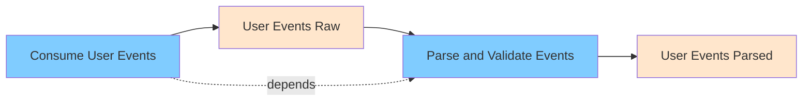
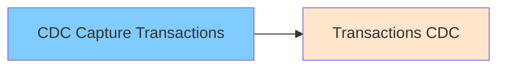
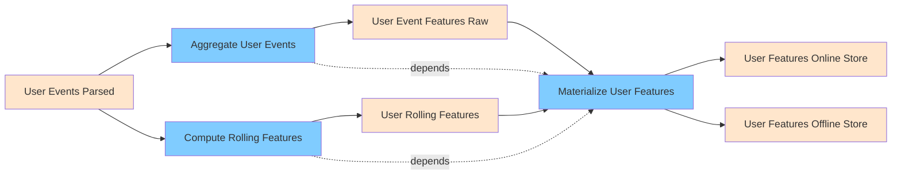
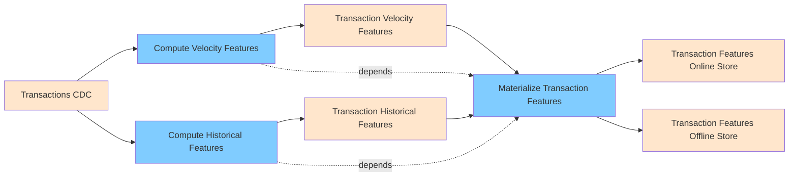
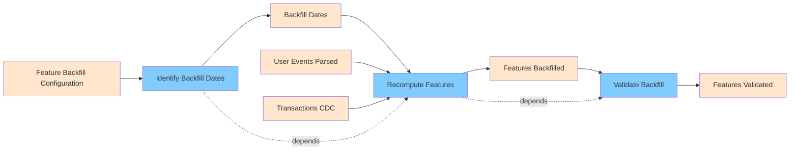
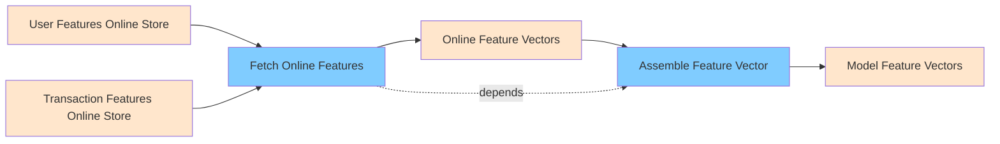
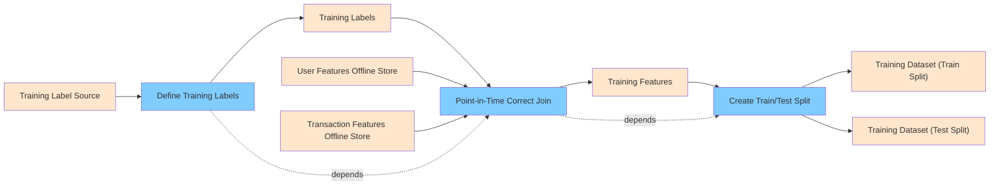
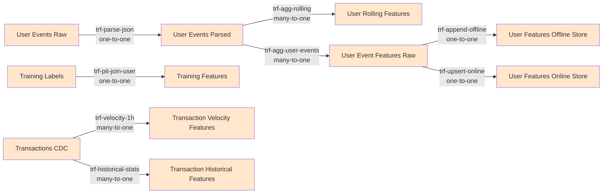

# ML Feature Store Platform

> Centralized feature store for ML model training and serving with point-in-time correctness

**Owners**: ml-platform (ml-platform@mlcompany.com)
**Tags**: ml, feature-store, point-in-time-correct

## Table of Contents

- [Hierarchical Index](#hierarchical-index)
- [System Architecture](#system-architecture)
- [Domains](#domains)
  - [Domain: Feature Ingestion Domain](#dom-feature-ingestion)
  - [Domain: Feature Materialization Domain](#dom-feature-materialization)
  - [Domain: Feature Serving Domain](#dom-feature-serving)
- [Datasets](#datasets)
- [Data Contracts](#contracts)
- [Data Quality Checks](#checks)
- [Data Lineage](#lineage)
- [Governance](#governance)
- [Observability](#observability)

---

## Hierarchical Index

### Domains

- **[Feature Ingestion Domain](#dom-feature-ingestion)** - Ingest raw data sources for feature computation
  - Pipelines:
    - **[Ingest User Events Pipeline](#pip-ingest-user-events)** - Ingest user behavioral events for feature computation
      - Stages: [Consume User Events](#stg-consume-events), [Parse and Validate Events](#stg-parse-events)
    - **[Ingest Transactions Pipeline](#pip-ingest-transactions)** - CDC-based ingestion of transaction data
      - Stages: [CDC Capture Transactions](#stg-cdc-transactions)

- **[Feature Materialization Domain](#dom-feature-materialization)** - Compute and materialize features with point-in-time correctness
  - Pipelines:
    - **[Compute User Features Pipeline](#pip-compute-user-features)** - Compute user behavioral features with windowed aggregations
      - Stages: [Aggregate User Events](#stg-aggregate-user-events), [Compute Rolling Features](#stg-compute-rolling-features), [Materialize User Features](#stg-materialize-user-features)
    - **[Compute Transaction Features Pipeline](#pip-compute-transaction-features)** - Compute transaction-based features for fraud detection and credit scoring
      - Stages: [Compute Velocity Features](#stg-compute-velocity-features), [Compute Historical Features](#stg-compute-historical-features), [Materialize Transaction Features](#stg-materialize-transaction-features)
    - **[Backfill Features Pipeline](#pip-backfill-features)** - Backfill historical features for model retraining
      - Stages: [Identify Backfill Dates](#stg-identify-backfill-dates), [Recompute Features](#stg-recompute-features), [Validate Backfill](#stg-validate-backfill)

- **[Feature Serving Domain](#dom-feature-serving)** - Serve features for online and offline ML workloads
  - Pipelines:
    - **[Serve Online Features Pipeline](#pip-serve-online-features)** - Serve features for real-time inference
      - Stages: [Fetch Online Features](#stg-fetch-online-features), [Assemble Feature Vector](#stg-assemble-feature-vector)
    - **[Create Training Datasets Pipeline](#pip-create-training-datasets)** - Create point-in-time correct training datasets
      - Stages: [Define Training Labels](#stg-define-training-labels), [Point-in-Time Correct Join](#stg-point-in-time-join), [Create Train/Test Split](#stg-create-train-test-split)

---

## System Architecture

```mermaid
graph TB
    sys_ml_feature_store["ML Feature Store Platform"]

    subgraph Domains
        dom_feature_ingestion["Feature Ingestion Domain"]
        dom_feature_materialization["Feature Materialization Domain"]
        dom_feature_serving["Feature Serving Domain"]
    end

    subgraph Pipelines
        pip_ingest_user_events["Ingest User Events Pipeline"]
        pip_ingest_transactions["Ingest Transactions Pipeline"]
        pip_compute_user_features["Compute User Features Pipeline"]
        pip_compute_transaction_features["Compute Transaction Features Pipeline"]
        pip_backfill_features["Backfill Features Pipeline"]
        pip_serve_online_features["Serve Online Features Pipeline"]
        pip_create_training_datasets["Create Training Datasets Pipeline"]
    end

    subgraph Datasets
        ds_user_events_parsed["User Events Parsed"]
        ds_transactions_cdc["Transactions CDC"]
        ds_user_events_raw["User Events Raw"]
        ds_user_event_features_raw["User Event Features Raw"]
        ds_user_rolling_features["User Rolling Features"]
        ds_user_features_online["User Features Online Store"]
        ds_user_features_offline["User Features Offline Store"]
        ds_transaction_velocity_features["Transaction Velocity Features"]
        ds_transaction_historical_features["Transaction Historical Features"]
        ds_transaction_features_online["Transaction Features Online Store"]
    end

    sys_ml_feature_store --> dom_feature_ingestion
    sys_ml_feature_store --> dom_feature_materialization
    sys_ml_feature_store --> dom_feature_serving
    dom_feature_ingestion --> pip_ingest_user_events
    dom_feature_ingestion --> pip_ingest_transactions
    dom_feature_materialization --> pip_compute_user_features
    dom_feature_materialization --> pip_compute_transaction_features
    dom_feature_materialization --> pip_backfill_features
    dom_feature_serving --> pip_serve_online_features
    dom_feature_serving --> pip_create_training_datasets
    pip_ingest_user_events -->|writes| ds_user_events_raw
    pip_ingest_user_events -->|reads| ds_user_events_raw
    pip_ingest_user_events -->|writes| ds_user_events_parsed
    pip_ingest_transactions -->|writes| ds_transactions_cdc
    pip_compute_user_features -->|reads| ds_user_events_parsed
    pip_compute_user_features -->|writes| ds_user_event_features_raw
    pip_compute_transaction_features -->|reads| ds_transactions_cdc
    pip_compute_transaction_features -->|writes| ds_transaction_velocity_features

    style sys_ml_feature_store fill:#e1f5ff
    style dom_feature_ingestion fill:#b3e0ff
    style dom_feature_materialization fill:#b3e0ff
    style dom_feature_serving fill:#b3e0ff
    style pip_ingest_user_events fill:#80ccff
    style pip_ingest_transactions fill:#80ccff
    style pip_compute_user_features fill:#80ccff
    style pip_compute_transaction_features fill:#80ccff
    style pip_backfill_features fill:#80ccff
    style pip_serve_online_features fill:#80ccff
    style pip_create_training_datasets fill:#80ccff
    style ds_user_events_parsed fill:#ffe6cc
    style ds_transactions_cdc fill:#ffe6cc
    style ds_user_events_raw fill:#ffe6cc
    style ds_user_event_features_raw fill:#ffe6cc
    style ds_user_rolling_features fill:#ffe6cc
    style ds_user_features_online fill:#ffe6cc
    style ds_user_features_offline fill:#ffe6cc
    style ds_transaction_velocity_features fill:#ffe6cc
    style ds_transaction_historical_features fill:#ffe6cc
    style ds_transaction_features_online fill:#ffe6cc
```

---

## Domains

### Feature Ingestion Domain

**ID**: `dom-feature-ingestion`
**Description**: Ingest raw data sources for feature computation
**Owners**: ml-engineering (ml-eng@mlcompany.com)

#### Summary

| Metric | Count |
|--------|-------|
| Pipelines | 2 |
| Datasets Referenced | 3 |

#### Pipelines

| Pipeline | Mode | Schedule Type | Stages | Input Datasets | Output Datasets |
|----------|------|---------------|--------|----------------|-----------------|
| [Ingest User Events Pipeline](#pip-ingest-user-events) | streaming | continuous | 2 | 1 | 2 |
| [Ingest Transactions Pipeline](#pip-ingest-transactions) | streaming | continuous | 1 | 0 | 1 |

#### Pipeline: Ingest User Events Pipeline

**ID**: `pip-ingest-user-events`
**Mode**: streaming
**Description**: Ingest user behavioral events for feature computation
**Traits**: streaming, event-driven

##### Schedule

- **Type**: continuous
- **Schedule ID**: `sch-user-events-continuous`
- **Triggers**:
  - message (source: kafka-user-events)

##### Pipeline Flow

##### Stages

###### Stage: Consume User Events

**ID**: `stg-consume-events`
**Description**: Consume user events from Kafka
**Patterns Used**: pat-event-streaming

**Output Datasets**:
- [User Events Raw](#ds-user-events-raw) (`ds-user-events-raw`)

**Transforms**:

| Transform ID | Type | Description | Configuration |
|--------------|------|-------------|---------------|
| `trf-kafka-consume` | custom | Consume from Kafka topic | topic: user-events, consumer_group: feature-store-consumers, offset_reset: earliest |

###### Stage: Parse and Validate Events

**ID**: `stg-parse-events`
**Description**: Parse JSON events and validate schema
**Patterns Used**: pat-validation
**Depends On**: `stg-consume-events`

**Input Datasets**:
- [User Events Raw](#ds-user-events-raw) (`ds-user-events-raw`)

**Output Datasets**:
- [User Events Parsed](#ds-user-events-parsed) (`ds-user-events-parsed`)

**Transforms**:

| Transform ID | Type | Description | Configuration |
|--------------|------|-------------|---------------|
| `trf-parse-json` | custom | Parse JSON and validate schema | schema_validation: True, drop_invalid: True |

#### Pipeline: Ingest Transactions Pipeline

**ID**: `pip-ingest-transactions`
**Mode**: streaming
**Description**: CDC-based ingestion of transaction data

##### Schedule

- **Type**: continuous
- **Schedule ID**: `sch-transactions-cdc`
- **Triggers**:
  - cdc-event (source: postgresql-transactions)

##### Pipeline Flow

##### Stages

###### Stage: CDC Capture Transactions

**ID**: `stg-cdc-transactions`
**Description**: Capture transaction changes via CDC
**Patterns Used**: pat-cdc-log-based

**Output Datasets**:
- [Transactions CDC](#ds-transactions-cdc) (`ds-transactions-cdc`)

**Transforms**:

| Transform ID | Type | Description | Configuration |
|--------------|------|-------------|---------------|
| `trf-cdc-extract` | cdc-extract | Extract from PostgreSQL via Debezium | connector: debezium, database: transactions_db, table: transactions |

### Feature Materialization Domain

**ID**: `dom-feature-materialization`
**Description**: Compute and materialize features with point-in-time correctness
**Owners**: ml-platform (ml-platform@mlcompany.com)

#### Summary

| Metric | Count |
|--------|-------|
| Pipelines | 3 |
| Datasets Referenced | 14 |

#### Pipelines

| Pipeline | Mode | Schedule Type | Stages | Input Datasets | Output Datasets |
|----------|------|---------------|--------|----------------|-----------------|
| [Compute User Features Pipeline](#pip-compute-user-features) | streaming | continuous | 3 | 3 | 4 |
| [Compute Transaction Features Pipeline](#pip-compute-transaction-features) | streaming | continuous | 3 | 3 | 4 |
| [Backfill Features Pipeline](#pip-backfill-features) | batch | manual | 3 | 5 | 3 |

#### Pipeline: Compute User Features Pipeline

**ID**: `pip-compute-user-features`
**Mode**: streaming
**Description**: Compute user behavioral features with windowed aggregations
**Traits**: windowed, point-in-time-correct

##### Schedule

- **Type**: continuous
- **Schedule ID**: `sch-user-features-continuous`

##### Pipeline Flow

##### Stages

###### Stage: Aggregate User Events

**ID**: `stg-aggregate-user-events`
**Description**: Time-windowed aggregation of user events
**Patterns Used**: pat-tumbling-window, pat-feature-engineering

**Input Datasets**:
- [User Events Parsed](#ds-user-events-parsed) (`ds-user-events-parsed`)

**Output Datasets**:
- [User Event Features Raw](#ds-user-event-features-raw) (`ds-user-event-features-raw`)

**Transforms**:

| Transform ID | Type | Description | Configuration |
|--------------|------|-------------|---------------|
| `trf-window-1h` | window | 1-hour tumbling window for event aggregation | window_type: tumbling, window_size: 1h, watermark_delay: 10m |
| `trf-agg-user-events` | aggregate | Calculate user event statistics | group_by: list, aggregations: dict |

###### Stage: Compute Rolling Features

**ID**: `stg-compute-rolling-features`
**Description**: Compute rolling window features (7d, 30d, 90d)
**Patterns Used**: pat-sliding-window, pat-feature-engineering

**Input Datasets**:
- [User Events Parsed](#ds-user-events-parsed) (`ds-user-events-parsed`)

**Output Datasets**:
- [User Rolling Features](#ds-user-rolling-features) (`ds-user-rolling-features`)

**Transforms**:

| Transform ID | Type | Description | Configuration |
|--------------|------|-------------|---------------|
| `trf-rolling-7d` | window | 7-day rolling window | window_type: sliding, window_size: 7d, slide_interval: 1d |
| `trf-agg-rolling` | aggregate | Calculate rolling statistics | group_by: list, aggregations: dict |

###### Stage: Materialize User Features

**ID**: `stg-materialize-user-features`
**Description**: Write features to feature store with timestamps
**Patterns Used**: pat-feature-store, pat-upsert
**Depends On**: `stg-aggregate-user-events`, `stg-compute-rolling-features`

**Input Datasets**:
- [User Event Features Raw](#ds-user-event-features-raw) (`ds-user-event-features-raw`)
- [User Rolling Features](#ds-user-rolling-features) (`ds-user-rolling-features`)

**Output Datasets**:
- [User Features Online Store](#ds-user-features-online) (`ds-user-features-online`)
- [User Features Offline Store](#ds-user-features-offline) (`ds-user-features-offline`)

**Transforms**:

| Transform ID | Type | Description | Configuration |
|--------------|------|-------------|---------------|
| `trf-join-features` | join | Join different feature sets | join_type: inner, left_key: user_id, right_key: user_id |
| `trf-add-feature-metadata` | custom | Add feature metadata (entity, timestamp, version) | entity_key: user_id, event_timestamp_column: window_end, created_timestamp_column: processing_time, ... |
| `trf-upsert-online` | upsert | Upsert to online feature store (Redis) | target: ds-user-features-online, merge_key: user_id, ttl_hours: 168 |
| `trf-append-offline` | append | Append to offline feature store (Delta) | target: ds-user-features-offline, mode: append |

#### Pipeline: Compute Transaction Features Pipeline

**ID**: `pip-compute-transaction-features`
**Mode**: streaming
**Description**: Compute transaction-based features for fraud detection and credit scoring
**Traits**: point-in-time-correct, real-time

##### Schedule

- **Type**: continuous
- **Schedule ID**: `sch-transaction-features-continuous`

##### Pipeline Flow

##### Stages

###### Stage: Compute Velocity Features

**ID**: `stg-compute-velocity-features`
**Description**: Calculate transaction velocity features
**Patterns Used**: pat-feature-engineering, pat-stateful-processing

**Input Datasets**:
- [Transactions CDC](#ds-transactions-cdc) (`ds-transactions-cdc`)

**Output Datasets**:
- [Transaction Velocity Features](#ds-transaction-velocity-features) (`ds-transaction-velocity-features`)

**Transforms**:

| Transform ID | Type | Description | Configuration |
|--------------|------|-------------|---------------|
| `trf-velocity-1h` | aggregate | Transaction velocity in last 1 hour | window: 1h, group_by: list, aggregations: dict |
| `trf-velocity-24h` | aggregate | Transaction velocity in last 24 hours | window: 24h, group_by: list, aggregations: dict |

###### Stage: Compute Historical Features

**ID**: `stg-compute-historical-features`
**Description**: Calculate historical transaction patterns
**Patterns Used**: pat-feature-engineering

**Input Datasets**:
- [Transactions CDC](#ds-transactions-cdc) (`ds-transactions-cdc`)

**Output Datasets**:
- [Transaction Historical Features](#ds-transaction-historical-features) (`ds-transaction-historical-features`)

**Transforms**:

| Transform ID | Type | Description | Configuration |
|--------------|------|-------------|---------------|
| `trf-historical-stats` | aggregate | Historical transaction statistics | window: 90d, group_by: list, aggregations: dict |

###### Stage: Materialize Transaction Features

**ID**: `stg-materialize-transaction-features`
**Description**: Write transaction features to feature store
**Patterns Used**: pat-feature-store
**Depends On**: `stg-compute-velocity-features`, `stg-compute-historical-features`

**Input Datasets**:
- [Transaction Velocity Features](#ds-transaction-velocity-features) (`ds-transaction-velocity-features`)
- [Transaction Historical Features](#ds-transaction-historical-features) (`ds-transaction-historical-features`)

**Output Datasets**:
- [Transaction Features Online Store](#ds-transaction-features-online) (`ds-transaction-features-online`)
- [Transaction Features Offline Store](#ds-transaction-features-offline) (`ds-transaction-features-offline`)

**Transforms**:

| Transform ID | Type | Description | Configuration |
|--------------|------|-------------|---------------|
| `trf-merge-transaction-features` | join | Merge all transaction feature sets | join_type: inner, left_key: user_id, right_key: user_id |
| `trf-write-feature-store` | upsert | Write to feature store with versioning | online_store: redis, offline_store: delta, entity_key: user_id, ... |

#### Pipeline: Backfill Features Pipeline

**ID**: `pip-backfill-features`
**Mode**: batch
**Description**: Backfill historical features for model retraining
**Traits**: point-in-time-correct, idempotent

##### Schedule

- **Type**: manual
- **Schedule ID**: `sch-backfill-manual`

##### Pipeline Flow

##### Stages

###### Stage: Identify Backfill Dates

**ID**: `stg-identify-backfill-dates`
**Description**: Identify date ranges that need backfilling
**Patterns Used**: pat-incremental-processing

**Input Datasets**:
- [Feature Backfill Configuration](#ds-feature-backfill-config) (`ds-feature-backfill-config`)

**Output Datasets**:
- [Backfill Dates](#ds-backfill-dates) (`ds-backfill-dates`)

**Transforms**:

| Transform ID | Type | Description | Configuration |
|--------------|------|-------------|---------------|
| `trf-generate-date-range` | custom | Generate date range for backfill | start_date_param: backfill_start, end_date_param: backfill_end, granularity: daily |

###### Stage: Recompute Features

**ID**: `stg-recompute-features`
**Description**: Recompute features for historical dates
**Patterns Used**: pat-feature-engineering, pat-point-in-time-join
**Depends On**: `stg-identify-backfill-dates`

**Input Datasets**:
- [Backfill Dates](#ds-backfill-dates) (`ds-backfill-dates`)
- [User Events Parsed](#ds-user-events-parsed) (`ds-user-events-parsed`)
- [Transactions CDC](#ds-transactions-cdc) (`ds-transactions-cdc`)

**Output Datasets**:
- [Features Backfilled](#ds-features-backfilled) (`ds-features-backfilled`)

**Transforms**:

| Transform ID | Type | Description | Configuration |
|--------------|------|-------------|---------------|
| `trf-point-in-time-join` | custom | Join features as of specific points in time | event_timestamp_column: event_time, as_of_timestamp_column: backfill_date, max_age_hours: 720 |
| `trf-recompute-aggregates` | aggregate | Recompute aggregated features | respect_event_time: True, point_in_time_correct: True |

###### Stage: Validate Backfill

**ID**: `stg-validate-backfill`
**Description**: Validate backfilled features against expectations
**Patterns Used**: pat-validation
**Depends On**: `stg-recompute-features`

**Input Datasets**:
- [Features Backfilled](#ds-features-backfilled) (`ds-features-backfilled`)

**Output Datasets**:
- [Features Validated](#ds-features-validated) (`ds-features-validated`)

**Transforms**:

| Transform ID | Type | Description | Configuration |
|--------------|------|-------------|---------------|
| `trf-validate-completeness` | custom | Ensure no missing dates or entities | check_missing_dates: True, check_missing_entities: True, expected_coverage_percent: 99.0 |
| `trf-validate-distributions` | custom | Validate feature distributions | check_outliers: True, check_nulls: True, max_null_percent: 5.0 |

### Feature Serving Domain

**ID**: `dom-feature-serving`
**Description**: Serve features for online and offline ML workloads
**Owners**: ml-platform (ml-platform@mlcompany.com)

#### Summary

| Metric | Count |
|--------|-------|
| Pipelines | 2 |
| Datasets Referenced | 11 |

#### Pipelines

| Pipeline | Mode | Schedule Type | Stages | Input Datasets | Output Datasets |
|----------|------|---------------|--------|----------------|-----------------|
| [Serve Online Features Pipeline](#pip-serve-online-features) | streaming | continuous | 2 | 3 | 2 |
| [Create Training Datasets Pipeline](#pip-create-training-datasets) | batch | cron | 3 | 5 | 4 |

#### Pipeline: Serve Online Features Pipeline

**ID**: `pip-serve-online-features`
**Mode**: streaming
**Description**: Serve features for real-time inference
**Traits**: low-latency, cached

##### Schedule

- **Type**: continuous
- **Schedule ID**: `sch-online-serving-continuous`
- **Triggers**:
  - api-call (source: feature-serving-api)

##### Pipeline Flow

##### Stages

###### Stage: Fetch Online Features

**ID**: `stg-fetch-online-features`
**Description**: Fetch features from online store (Redis)
**Patterns Used**: pat-caching

**Input Datasets**:
- [User Features Online Store](#ds-user-features-online) (`ds-user-features-online`)
- [Transaction Features Online Store](#ds-transaction-features-online) (`ds-transaction-features-online`)

**Output Datasets**:
- [Online Feature Vectors](#ds-online-feature-vectors) (`ds-online-feature-vectors`)

**Transforms**:

| Transform ID | Type | Description | Configuration |
|--------------|------|-------------|---------------|
| `trf-fetch-from-redis` | custom | Fetch latest features from Redis | store_type: redis, cache_ttl_seconds: 60, fallback_to_offline: True |

###### Stage: Assemble Feature Vector

**ID**: `stg-assemble-feature-vector`
**Description**: Assemble complete feature vector for model
**Patterns Used**: pat-feature-engineering
**Depends On**: `stg-fetch-online-features`

**Input Datasets**:
- [Online Feature Vectors](#ds-online-feature-vectors) (`ds-online-feature-vectors`)

**Output Datasets**:
- [Model Feature Vectors](#ds-model-feature-vectors) (`ds-model-feature-vectors`)

**Transforms**:

| Transform ID | Type | Description | Configuration |
|--------------|------|-------------|---------------|
| `trf-join-feature-sets` | join | Join multiple feature sets | join_type: left, entity_key: user_id |
| `trf-handle-missing` | custom | Handle missing features with defaults | fill_strategy: default_values, default_numeric: 0, default_categorical: unknown |

#### Pipeline: Create Training Datasets Pipeline

**ID**: `pip-create-training-datasets`
**Mode**: batch
**Description**: Create point-in-time correct training datasets
**Traits**: point-in-time-correct, reproducible

##### Schedule

- **Type**: cron
- **Schedule ID**: `sch-training-datasets-weekly`
- **Cron Expression**: `0 0 * * 0`

##### Pipeline Flow

##### Stages

###### Stage: Define Training Labels

**ID**: `stg-define-training-labels`
**Description**: Define labels and timestamps for training examples
**Patterns Used**: pat-labeling

**Input Datasets**:
- [Training Label Source](#ds-training-label-source) (`ds-training-label-source`)

**Output Datasets**:
- [Training Labels](#ds-training-labels) (`ds-training-labels`)

**Transforms**:

| Transform ID | Type | Description | Configuration |
|--------------|------|-------------|---------------|
| `trf-extract-labels` | custom | Extract labels with event timestamps | label_column: is_fraud, event_timestamp_column: label_timestamp, entity_key: user_id |

###### Stage: Point-in-Time Correct Join

**ID**: `stg-point-in-time-join`
**Description**: Join features as of label timestamp
**Patterns Used**: pat-point-in-time-join
**Depends On**: `stg-define-training-labels`

**Input Datasets**:
- [Training Labels](#ds-training-labels) (`ds-training-labels`)
- [User Features Offline Store](#ds-user-features-offline) (`ds-user-features-offline`)
- [Transaction Features Offline Store](#ds-transaction-features-offline) (`ds-transaction-features-offline`)

**Output Datasets**:
- [Training Features](#ds-training-features) (`ds-training-features`)

**Transforms**:

| Transform ID | Type | Description | Configuration |
|--------------|------|-------------|---------------|
| `trf-pit-join-user` | custom | PIT join with user features | left_key: user_id, right_key: user_id, left_timestamp: label_timestamp, ... |
| `trf-pit-join-transaction` | custom | PIT join with transaction features | left_key: user_id, right_key: user_id, left_timestamp: label_timestamp, ... |

###### Stage: Create Train/Test Split

**ID**: `stg-create-train-test-split`
**Description**: Split dataset for training and validation
**Patterns Used**: pat-data-splitting
**Depends On**: `stg-point-in-time-join`

**Input Datasets**:
- [Training Features](#ds-training-features) (`ds-training-features`)

**Output Datasets**:
- [Training Dataset (Train Split)](#ds-training-dataset-train) (`ds-training-dataset-train`)
- [Training Dataset (Test Split)](#ds-training-dataset-test) (`ds-training-dataset-test`)

**Transforms**:

| Transform ID | Type | Description | Configuration |
|--------------|------|-------------|---------------|
| `trf-time-based-split` | custom | Time-based train/test split | split_strategy: time_based, train_ratio: 0.8, split_date: auto |

---

## Datasets

| Dataset | Type | Format | Location | Classification | Contains PII | Tags |
|---------|------|--------|----------|----------------|--------------|------|
| [User Events Raw](#ds-user-events-raw) | stream | json | `kafka://user-events` | internal | Yes | raw, events |
| [User Events Parsed](#ds-user-events-parsed) | table | delta | `s3://feature-store/events/user-events/` | internal | Yes | parsed, events |
| [Transactions CDC](#ds-transactions-cdc) | stream | avro | `kafka://transactions-cdc` | confidential | Yes | cdc, transactions |
| [User Event Features Raw](#ds-user-event-features-raw) | table | delta | `s3://feature-store/features/user-events-raw/` | internal | Yes | features, intermediate |
| [User Rolling Features](#ds-user-rolling-features) | table | delta | `s3://feature-store/features/user-rolling/` | internal | Yes | features, rolling |
| [User Features Online Store](#ds-user-features-online) | table | custom | `redis://feature-store:user-features` | internal | Yes | features, online, serving |
| [User Features Offline Store](#ds-user-features-offline) | table | delta | `s3://feature-store/features/user-features-offline/` | internal | Yes | features, offline, training |
| [Transaction Velocity Features](#ds-transaction-velocity-features) | table | delta | `s3://feature-store/features/transaction-velocity/` | confidential | Yes | features, transactions |
| [Transaction Historical Features](#ds-transaction-historical-features) | table | delta | `s3://feature-store/features/transaction-historical/` | confidential | Yes | features, transactions |
| [Transaction Features Online Store](#ds-transaction-features-online) | table | custom | `redis://feature-store:transaction-features` | confidential | Yes | features, online, transactions |
| [Transaction Features Offline Store](#ds-transaction-features-offline) | table | delta | `s3://feature-store/features/transaction-features-offline/` | confidential | Yes | features, offline, transactions |
| [Feature Backfill Configuration](#ds-feature-backfill-config) | table | delta | `s3://feature-store/config/backfill/` | internal | No | config, backfill |
| [Backfill Dates](#ds-backfill-dates) | table | delta | `s3://feature-store/backfill/dates/` | internal | No | backfill, intermediate |
| [Features Backfilled](#ds-features-backfilled) | table | delta | `s3://feature-store/backfill/features/` | internal | Yes | backfill, features |
| [Features Validated](#ds-features-validated) | table | delta | `s3://feature-store/backfill/validated/` | internal | Yes | backfill, validated |
| [Online Feature Vectors](#ds-online-feature-vectors) | stream | json | `memory://feature-vectors` | internal | Yes | serving, online |
| [Model Feature Vectors](#ds-model-feature-vectors) | stream | json | `memory://model-features` | internal | Yes | serving, inference |
| [Training Label Source](#ds-training-label-source) | table | delta | `s3://feature-store/labels/source/` | confidential | Yes | labels, training |
| [Training Labels](#ds-training-labels) | table | delta | `s3://feature-store/labels/prepared/` | confidential | Yes | labels, training |
| [Training Features](#ds-training-features) | table | delta | `s3://feature-store/training/features/` | confidential | Yes | training, pit-correct |
| [Training Dataset (Train Split)](#ds-training-dataset-train) | table | parquet | `s3://feature-store/training/datasets/train/` | confidential | Yes | training, train-split |
| [Training Dataset (Test Split)](#ds-training-dataset-test) | table | parquet | `s3://feature-store/training/datasets/test/` | confidential | Yes | training, test-split |

### User Events Raw

**ID**: `ds-user-events-raw`
**Type**: stream
**Format**: json
**Location**: `kafka://user-events`
**Classification**: internal
**Contains PII**: Yes
**PII Fields**: user_id, ip_address
**Tags**: raw, events

### User Events Parsed

**ID**: `ds-user-events-parsed`
**Type**: table
**Format**: delta
**Location**: `s3://feature-store/events/user-events/`
**Classification**: internal
**Contains PII**: Yes
**PII Fields**: user_id
**Tags**: parsed, events

#### Schema

| Field | Type | Nullable | PII | Description |
|-------|------|----------|-----|-------------|
| `user_id` | string | No | Yes | - |
| `event_type` | string | No | No | - |
| `page_id` | string | Yes | No | - |
| `duration` | integer | Yes | No | - |
| `event_time` | timestamp | No | No | - |
| `processing_time` | timestamp | No | No | - |

#### Partitioning

- **Columns**: event_date
- **Strategy**: daily

### Transactions CDC

**ID**: `ds-transactions-cdc`
**Type**: stream
**Format**: avro
**Location**: `kafka://transactions-cdc`
**Classification**: confidential
**Contains PII**: Yes
**PII Fields**: user_id
**Tags**: cdc, transactions

#### Schema

| Field | Type | Nullable | PII | Description |
|-------|------|----------|-----|-------------|
| `transaction_id` | string | No | No | - |
| `user_id` | string | No | Yes | - |
| `merchant_id` | string | No | No | - |
| `amount` | decimal | No | No | - |
| `transaction_date` | timestamp | No | No | - |
| `is_purchase` | boolean | No | No | - |

### User Event Features Raw

**ID**: `ds-user-event-features-raw`
**Type**: table
**Format**: delta
**Location**: `s3://feature-store/features/user-events-raw/`
**Classification**: internal
**Contains PII**: Yes
**PII Fields**: user_id
**Tags**: features, intermediate

### User Rolling Features

**ID**: `ds-user-rolling-features`
**Type**: table
**Format**: delta
**Location**: `s3://feature-store/features/user-rolling/`
**Classification**: internal
**Contains PII**: Yes
**PII Fields**: user_id
**Tags**: features, rolling

### User Features Online Store

**ID**: `ds-user-features-online`
**Type**: table
**Format**: custom
**Location**: `redis://feature-store:user-features`
**Classification**: internal
**Contains PII**: Yes
**PII Fields**: user_id
**Tags**: features, online, serving

#### Schema

| Field | Type | Nullable | PII | Description |
|-------|------|----------|-----|-------------|
| `user_id` | string | No | Yes | - |
| `event_count_1h` | bigint | Yes | No | - |
| `unique_pages_1h` | bigint | Yes | No | - |
| `session_duration_1h` | bigint | Yes | No | - |
| `total_events_7d` | bigint | Yes | No | - |
| `total_purchases_7d` | bigint | Yes | No | - |
| `total_spend_7d` | decimal | Yes | No | - |
| `event_timestamp` | timestamp | No | No | - |
| `created_timestamp` | timestamp | No | No | - |

### User Features Offline Store

**ID**: `ds-user-features-offline`
**Type**: table
**Format**: delta
**Location**: `s3://feature-store/features/user-features-offline/`
**Classification**: internal
**Contains PII**: Yes
**PII Fields**: user_id
**Tags**: features, offline, training

#### Schema

| Field | Type | Nullable | PII | Description |
|-------|------|----------|-----|-------------|
| `user_id` | string | No | Yes | - |
| `event_count_1h` | bigint | Yes | No | - |
| `unique_pages_1h` | bigint | Yes | No | - |
| `session_duration_1h` | bigint | Yes | No | - |
| `total_events_7d` | bigint | Yes | No | - |
| `total_purchases_7d` | bigint | Yes | No | - |
| `total_spend_7d` | decimal | Yes | No | - |
| `event_timestamp` | timestamp | No | No | - |
| `created_timestamp` | timestamp | No | No | - |

#### Partitioning

- **Columns**: event_date
- **Strategy**: daily

### Transaction Velocity Features

**ID**: `ds-transaction-velocity-features`
**Type**: table
**Format**: delta
**Location**: `s3://feature-store/features/transaction-velocity/`
**Classification**: confidential
**Contains PII**: Yes
**PII Fields**: user_id
**Tags**: features, transactions

### Transaction Historical Features

**ID**: `ds-transaction-historical-features`
**Type**: table
**Format**: delta
**Location**: `s3://feature-store/features/transaction-historical/`
**Classification**: confidential
**Contains PII**: Yes
**PII Fields**: user_id
**Tags**: features, transactions

### Transaction Features Online Store

**ID**: `ds-transaction-features-online`
**Type**: table
**Format**: custom
**Location**: `redis://feature-store:transaction-features`
**Classification**: confidential
**Contains PII**: Yes
**PII Fields**: user_id
**Tags**: features, online, transactions

#### Schema

| Field | Type | Nullable | PII | Description |
|-------|------|----------|-----|-------------|
| `user_id` | string | No | Yes | - |
| `transaction_count_1h` | bigint | Yes | No | - |
| `total_amount_1h` | decimal | Yes | No | - |
| `transaction_count_24h` | bigint | Yes | No | - |
| `unique_merchants_24h` | bigint | Yes | No | - |
| `lifetime_transaction_count` | bigint | Yes | No | - |
| `avg_transaction_amount` | decimal | Yes | No | - |
| `event_timestamp` | timestamp | No | No | - |

### Transaction Features Offline Store

**ID**: `ds-transaction-features-offline`
**Type**: table
**Format**: delta
**Location**: `s3://feature-store/features/transaction-features-offline/`
**Classification**: confidential
**Contains PII**: Yes
**PII Fields**: user_id
**Tags**: features, offline, transactions

#### Partitioning

- **Columns**: event_date
- **Strategy**: daily

### Feature Backfill Configuration

**ID**: `ds-feature-backfill-config`
**Type**: table
**Format**: delta
**Location**: `s3://feature-store/config/backfill/`
**Classification**: internal
**Contains PII**: No
**Tags**: config, backfill

#### Schema

| Field | Type | Nullable | PII | Description |
|-------|------|----------|-----|-------------|
| `backfill_id` | string | No | No | - |
| `backfill_start` | date | No | No | - |
| `backfill_end` | date | No | No | - |
| `feature_groups` | array<string> | No | No | - |

### Backfill Dates

**ID**: `ds-backfill-dates`
**Type**: table
**Format**: delta
**Location**: `s3://feature-store/backfill/dates/`
**Classification**: internal
**Contains PII**: No
**Tags**: backfill, intermediate

### Features Backfilled

**ID**: `ds-features-backfilled`
**Type**: table
**Format**: delta
**Location**: `s3://feature-store/backfill/features/`
**Classification**: internal
**Contains PII**: Yes
**PII Fields**: user_id
**Tags**: backfill, features

#### Partitioning

- **Columns**: backfill_date
- **Strategy**: daily

### Features Validated

**ID**: `ds-features-validated`
**Type**: table
**Format**: delta
**Location**: `s3://feature-store/backfill/validated/`
**Classification**: internal
**Contains PII**: Yes
**PII Fields**: user_id
**Tags**: backfill, validated

### Online Feature Vectors

**ID**: `ds-online-feature-vectors`
**Type**: stream
**Format**: json
**Location**: `memory://feature-vectors`
**Classification**: internal
**Contains PII**: Yes
**PII Fields**: user_id
**Tags**: serving, online

### Model Feature Vectors

**ID**: `ds-model-feature-vectors`
**Type**: stream
**Format**: json
**Location**: `memory://model-features`
**Classification**: internal
**Contains PII**: Yes
**PII Fields**: user_id
**Tags**: serving, inference

### Training Label Source

**ID**: `ds-training-label-source`
**Type**: table
**Format**: delta
**Location**: `s3://feature-store/labels/source/`
**Classification**: confidential
**Contains PII**: Yes
**PII Fields**: user_id
**Tags**: labels, training

#### Schema

| Field | Type | Nullable | PII | Description |
|-------|------|----------|-----|-------------|
| `user_id` | string | No | Yes | - |
| `label_timestamp` | timestamp | No | No | - |
| `is_fraud` | boolean | No | No | - |

### Training Labels

**ID**: `ds-training-labels`
**Type**: table
**Format**: delta
**Location**: `s3://feature-store/labels/prepared/`
**Classification**: confidential
**Contains PII**: Yes
**PII Fields**: user_id
**Tags**: labels, training

#### Partitioning

- **Columns**: label_date
- **Strategy**: daily

### Training Features

**ID**: `ds-training-features`
**Type**: table
**Format**: delta
**Location**: `s3://feature-store/training/features/`
**Classification**: confidential
**Contains PII**: Yes
**PII Fields**: user_id
**Tags**: training, pit-correct

#### Partitioning

- **Columns**: label_date
- **Strategy**: daily

### Training Dataset (Train Split)

**ID**: `ds-training-dataset-train`
**Type**: table
**Format**: parquet
**Location**: `s3://feature-store/training/datasets/train/`
**Classification**: confidential
**Contains PII**: Yes
**PII Fields**: user_id
**Tags**: training, train-split

### Training Dataset (Test Split)

**ID**: `ds-training-dataset-test`
**Type**: table
**Format**: parquet
**Location**: `s3://feature-store/training/datasets/test/`
**Classification**: confidential
**Contains PII**: Yes
**PII Fields**: user_id
**Tags**: training, test-split

---

## Data Contracts

| Contract | Dataset | Version | Owners | Consumers | SLA Freshness | SLA Completeness |
|----------|---------|---------|--------|-----------|---------------|------------------|
| [User Features Contract](#ctr-user-features-v1) | [User Features Offline Store](#ds-user-features-offline) | 1.0.0 | ml-platform | 2 | 60m | 99.0% |
| [Transaction Features Contract](#ctr-transaction-features-v2) | [Transaction Features Offline Store](#ds-transaction-features-offline) | 2.0.0 | ml-platform | 2 | 30m | 99.5% |

### User Features Contract

**ID**: `ctr-user-features-v1`
**Dataset**: [User Features Offline Store](#ds-user-features-offline)
**Version**: 1.0.0
**Evolution Policy**: backward-compatible
**Schema Reference**: `schemas/user-features-v1.avsc`

#### SLA

- **Freshness**: 60 minutes
- **Completeness**: 99.0%
- **Availability**: 99.9%

#### Owners

- **ml-platform** (ml-platform@mlcompany.com)

#### Consumers

- **fraud-detection** - Fraud detection model training and serving
- **recommendation** - Recommendation model features

### Transaction Features Contract

**ID**: `ctr-transaction-features-v2`
**Dataset**: [Transaction Features Offline Store](#ds-transaction-features-offline)
**Version**: 2.0.0
**Evolution Policy**: backward-compatible
**Schema Reference**: `schemas/transaction-features-v2.avsc`

#### SLA

- **Freshness**: 30 minutes
- **Completeness**: 99.5%
- **Availability**: 99.9%

#### Owners

- **ml-platform** (ml-platform@mlcompany.com)

#### Consumers

- **fraud-detection** - Real-time fraud scoring
- **credit-risk** - Credit scoring models

---

## Data Quality Checks

| Check | Type | Dataset | Severity | Alert Channel | Threshold |
|-------|------|---------|----------|---------------|-----------|
| [Freshness Check - User Features](#chk-freshness-user-features) | freshness | [User Features Offline Store](#ds-user-features-offline) | high | slack | max_age_minutes: 60 |
| [Drift Detection - User Features](#chk-drift-user-features) | drift | [User Features Offline Store](#ds-user-features-offline) | high | slack | max_distribution_change_percent: 20, monitoring_window_days: 7 |
| [Point-in-Time Correctness Check](#chk-pit-correctness) | custom | [Training Features](#ds-training-features) | critical | pagerduty | - |
| [Feature Null Rate Check](#chk-feature-null-rate) | completeness | [User Features Offline Store](#ds-user-features-offline) | medium | slack | max_null_rate_percent: 5.0 |
| [Backfill Completeness Check](#chk-backfill-completeness) | completeness | [Features Backfilled](#ds-features-backfilled) | high | slack | min_coverage_percent: 99.0 |

### Freshness Check - User Features

**ID**: `chk-freshness-user-features`
**Type**: freshness
**Dataset**: [User Features Offline Store](#ds-user-features-offline)
**Severity**: high

#### Threshold

- **max_age_minutes**: 60

#### Alert Configuration

- **Channel**: slack
- **Escalation**: ml-platform

### Drift Detection - User Features

**ID**: `chk-drift-user-features`
**Type**: drift
**Dataset**: [User Features Offline Store](#ds-user-features-offline)
**Severity**: high

#### Threshold

- **max_distribution_change_percent**: 20
- **monitoring_window_days**: 7

#### Alert Configuration

- **Channel**: slack
- **Escalation**: ml-engineering

### Point-in-Time Correctness Check

**ID**: `chk-pit-correctness`
**Type**: custom
**Dataset**: [Training Features](#ds-training-features)
**Severity**: critical

#### Assertions

- **Features must be from before label timestamp**: `event_timestamp <= label_timestamp`

#### Alert Configuration

- **Channel**: pagerduty
- **Escalation**: ml-platform

### Feature Null Rate Check

**ID**: `chk-feature-null-rate`
**Type**: completeness
**Dataset**: [User Features Offline Store](#ds-user-features-offline)
**Severity**: medium

#### Threshold

- **max_null_rate_percent**: 5.0

#### Alert Configuration

- **Channel**: slack
- **Escalation**: ml-platform

### Backfill Completeness Check

**ID**: `chk-backfill-completeness`
**Type**: completeness
**Dataset**: [Features Backfilled](#ds-features-backfilled)
**Severity**: high

#### Threshold

- **min_coverage_percent**: 99.0

#### Alert Configuration

- **Channel**: slack
- **Escalation**: ml-platform

---

## Data Lineage

| Upstream Dataset | Downstream Dataset | Transform | Relationship |
|------------------|-------------------|-----------|--------------|
| [User Events Raw](#ds-user-events-raw) | [User Events Parsed](#ds-user-events-parsed) | `trf-parse-json` | one-to-one |
| [User Events Parsed](#ds-user-events-parsed) | [User Event Features Raw](#ds-user-event-features-raw) | `trf-agg-user-events` | many-to-one |
| [User Events Parsed](#ds-user-events-parsed) | [User Rolling Features](#ds-user-rolling-features) | `trf-agg-rolling` | many-to-one |
| [User Event Features Raw](#ds-user-event-features-raw) | [User Features Offline Store](#ds-user-features-offline) | `trf-append-offline` | one-to-one |
| [User Event Features Raw](#ds-user-event-features-raw) | [User Features Online Store](#ds-user-features-online) | `trf-upsert-online` | one-to-one |
| [Transactions CDC](#ds-transactions-cdc) | [Transaction Velocity Features](#ds-transaction-velocity-features) | `trf-velocity-1h` | many-to-one |
| [Transactions CDC](#ds-transactions-cdc) | [Transaction Historical Features](#ds-transaction-historical-features) | `trf-historical-stats` | many-to-one |
| [Training Labels](#ds-training-labels) | [Training Features](#ds-training-features) | `trf-pit-join-user` | one-to-one |

---

## Governance

### Retention Policies

| Dataset | Policy | Duration |
|---------|--------|----------|
| [User Events Raw](#ds-user-events-raw) | delete-after-days | 7 days |
| [User Events Parsed](#ds-user-events-parsed) | archive-after-years | 2 years |
| [User Features Offline Store](#ds-user-features-offline) | archive-after-years | 5 years |
| [Transaction Features Offline Store](#ds-transaction-features-offline) | archive-after-years | 7 years |
| [Training Dataset (Train Split)](#ds-training-dataset-train) | retain-indefinitely | Indefinitely |

### Access Control

| Dataset | Tier | Roles |
|---------|------|-------|
| [User Features Offline Store](#ds-user-features-offline) | general | ml-engineer, data-scientist, ml-platform-admin |
| [Transaction Features Offline Store](#ds-transaction-features-offline) | restricted | ml-engineer, ml-platform-admin |
| [Training Dataset (Train Split)](#ds-training-dataset-train) | restricted | data-scientist, ml-engineer |

### PII Handling

| Dataset | Masked Fields | Masking Method |
|---------|---------------|----------------|
| [User Events Parsed](#ds-user-events-parsed) | user_id | pseudonymize |
| [User Features Offline Store](#ds-user-features-offline) | user_id | pseudonymize |
| [Transaction Features Offline Store](#ds-transaction-features-offline) | user_id | pseudonymize |

---

## Observability

### Metrics

| Metric | Dataset | Type | Description |
|--------|---------|------|-------------|
| feature_computation_latency | [User Features Offline Store](#ds-user-features-offline) | histogram | Time from event to feature materialization |
| feature_drift_score | [User Features Offline Store](#ds-user-features-offline) | gauge | Statistical drift score for features |
| online_feature_cache_hit_rate | [User Features Online Store](#ds-user-features-online) | gauge | Cache hit rate for online features |
| backfill_completeness_rate | [Features Backfilled](#ds-features-backfilled) | gauge | Percentage of successfully backfilled features |
| pit_join_accuracy | [Training Features](#ds-training-features) | gauge | Accuracy of point-in-time joins |

### Service Level Objectives (SLOs)

| SLO | Target | Unit | Window | Linked Check |
|-----|--------|------|--------|--------------|
| feature-freshness-slo | 99.0 | percent | 30d | [Check](#chk-freshness-user-features) |
| feature-serving-latency-slo | 95.0 | percent | 7d | N/A |
| pit-correctness-slo | 100.0 | percent | 30d | [Check](#chk-pit-correctness) |

### Alerts

| Alert | Condition | Severity | Channel |
|-------|-----------|----------|---------|
| high-feature-drift | `drift_score > 0.2` | high | slack |
| feature-staleness | `freshness > 60 minutes` | high | slack |
| pit-join-violation | `event_timestamp > label_timestamp` | critical | pagerduty |
| high-null-rate | `null_rate > 5%` | medium | slack |

---

*Generated with [s2doc](https://github.com/FreeSideNomad/s2doc)*