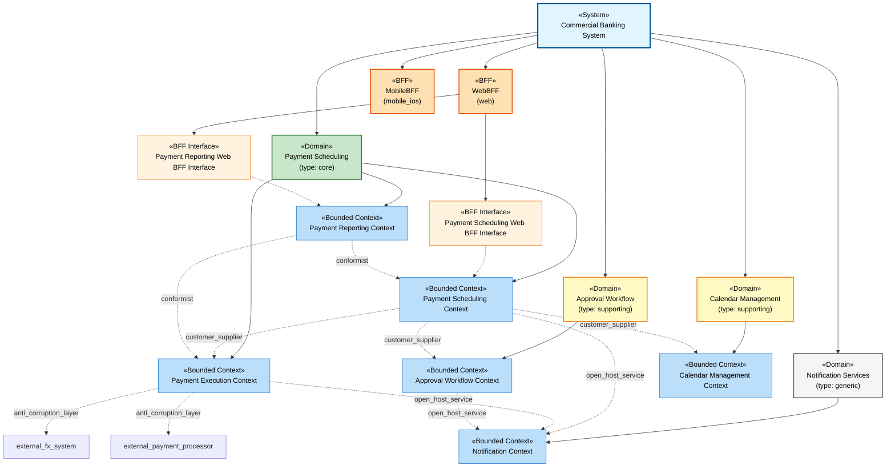

# Commercial Banking System

**System ID**: `sys_commercial_banking`
**Version**: 2.0.0

Enterprise commercial banking platform for Canadian financial institutions

## Index

### Domains and Bounded Contexts

- [Payment Scheduling](#dom_payment_scheduling)
  - [Payment Scheduling Context](#bc_payment_scheduling)
  - [Payment Execution Context](#bc_payment_execution)
  - [Payment Reporting Context](#bc_payment_reporting)
- [Approval Workflow](#dom_approval_workflow)
  - [Approval Workflow Context](#bc_approval_workflow)
- [Calendar Management](#dom_calendar_management)
  - [Calendar Management Context](#bc_calendar_management)
- [Notification Services](#dom_notification)
  - [Notification Context](#bc_notification)

### Backend-for-Frontend (BFF) Scopes and Interfaces

- [WebBFF](#bff_web)
  - [Payment Scheduling Web BFF Interface](#bff_if_payment_scheduling_web)
  - [Payment Reporting Web BFF Interface](#bff_if_payment_reporting_web)
- [MobileBFF](#bff_mobile)

### Context Mappings

- **Payment Scheduling**
  - [Payment Scheduling to Execution Integration](#cm_payment_scheduling_to_payment_execution)
  - [Payment Scheduling to Approval Integration](#cm_payment_scheduling_to_approval_workflow)
  - [Payment Scheduling to Calendar Integration](#cm_payment_scheduling_to_calendar_management)
  - [Payment Execution to FX System Integration](#cm_payment_execution_to_fx_system)
  - [Payment Execution to Payment Processor Integration](#cm_payment_execution_to_payment_processor)
  - [Payment Scheduling to Notification Integration](#cm_payment_scheduling_to_notification)
  - [Payment Execution to Notification Integration](#cm_payment_execution_to_notification)
  - [Payment Reporting to Scheduling Integration](#cm_payment_reporting_to_payment_scheduling)
  - [Payment Reporting to Execution Integration](#cm_payment_reporting_to_payment_execution)
- **Approval Workflow**
  - [Approval Workflow to Notification Integration](#cm_approval_workflow_to_notification)

## System Architecture

## Domains

| Name | Type | Strategic Importance | Description |
| --- | --- | --- | --- |
| [Payment Scheduling](#dom_payment_scheduling) | core | critical | Core domain for scheduling future-dated and recurring payments across multiple payment types |
| [Approval Workflow](#dom_approval_workflow) | supporting | important | Supporting domain for managing approval policies and workflows |
| [Calendar Management](#dom_calendar_management) | supporting | important | Supporting domain for managing working day calendars across jurisdictions |
| [Notification Services](#dom_notification) | generic | standard | Generic domain for sending notifications to users and systems |

## Payment Scheduling

**Domain ID**: `dom_payment_scheduling`
**Type**: core
**Strategic Importance**: critical
**Investment Strategy**: Best team, significant investment in rich domain model - this is competitive advantage

Core domain for scheduling future-dated and recurring payments across multiple payment types

**Notes**: This is where we differentiate from competitors. Robust scheduling with approval workflows, working day calendars, and multi-payment-type support.

### Payment Scheduling Context

**Context ID**: `bc_payment_scheduling`
**Domain**: [Payment Scheduling](#dom_payment_scheduling) (`dom_payment_scheduling`)
**Team Ownership**: Payment Scheduling Team (6 engineers, 1 architect)

Core context managing payment templates, schedules, and recurring payment setup. Contains rich domain model for template lifecycle and scheduling rules.

#### Ubiquitous Language

| Term | Definition | Examples |
| --- | --- | --- |
| Payment Template | Reusable payment configuration containing all details needed to execute a payment | Monthly rent payment template, Bi-weekly payroll template |
| Scheduled Payment | A specific payment instance scheduled for future execution based on a template |  |
| Recurrence Pattern | Rules defining frequency of recurring payments (daily, weekly, monthly, etc.) |  |
| Value Date | The date when funds should be transferred |  |
| Execution Date | The actual date when payment processing occurs (nearest working day to value date) |  |
| Payment Group | Collection of payment templates that can be executed together as a batch |  |
| Approval Status | Current state of template in approval workflow (DRAFT, PENDING, APPROVED, REJECTED) |  |

#### Aggregates
- agg_payment_template
- agg_scheduled_payment
- agg_payment_group
- agg_schedule

#### Repositories
- repo_payment_template
- repo_scheduled_payment
- repo_payment_group
- repo_schedule

#### Domain Services
- svc_dom_payment_validation
- svc_dom_approval_policy
- svc_dom_working_day_calculation
- svc_dom_recurrence_calculation

#### Application Services
- svc_app_payment_template
- svc_app_scheduled_payment

### Payment Execution Context

**Context ID**: `bc_payment_execution`
**Domain**: [Payment Scheduling](#dom_payment_scheduling) (`dom_payment_scheduling`)
**Team Ownership**: Payment Execution Team (4 engineers)

Context responsible for executing scheduled payments, managing execution lifecycle, and handling failures and retries

#### Ubiquitous Language

| Term | Definition | Examples |
| --- | --- | --- |
| Payment Execution | The process of actually submitting a payment to the payment processor |  |
| Execution Status | Current state of execution (PENDING, SUCCESS, FAILED) |  |
| ACH Return | Payment returned by receiving bank due to insufficient funds or other reasons |  |
| FX Contract | Foreign exchange contract booked for wire payments at execution time |  |
| Retry Policy | Rules governing when and how many times to retry failed payments |  |

#### Aggregates
- agg_payment_execution
- agg_ach_return

#### Repositories
- repo_payment_execution

#### Application Services
- svc_app_payment_execution

#### Domain Events
- evt_payment_executed
- evt_payment_failed
- evt_ach_return_received
- evt_fx_contract_booked

### Payment Reporting Context

**Context ID**: `bc_payment_reporting`
**Domain**: [Payment Scheduling](#dom_payment_scheduling) (`dom_payment_scheduling`)
**Team Ownership**: Reporting Team (2 engineers)

Read-optimized context providing payment status views, activity reports, and analytics. Uses CQRS read models.

#### Ubiquitous Language

| Term | Definition | Examples |
| --- | --- | --- |
| Payment Status View | Current state and history of a payment |  |
| Activity Report | Summary of payment activity over a date range |  |
| Batch Status | Aggregate status of all payments in a payment group |  |

#### Application Services
- svc_app_payment_reporting

#### Domain Events
- evt_payment_scheduled
- evt_payment_executed
- evt_payment_cancelled

## Approval Workflow

**Domain ID**: `dom_approval_workflow`
**Type**: supporting
**Strategic Importance**: important
**Investment Strategy**: Adequate team, moderate investment - good enough implementation

Supporting domain for managing approval policies and workflows

**Notes**: Important for compliance and control, but not differentiating. Focus on correctness over innovation.

### Approval Workflow Context

**Context ID**: `bc_approval_workflow`
**Domain**: [Approval Workflow](#dom_approval_workflow) (`dom_approval_workflow`)
**Team Ownership**: Workflow Team (3 engineers)

Context managing approval policies, workflow state, and approver assignment based on company-specific rules

#### Ubiquitous Language

| Term | Definition | Examples |
| --- | --- | --- |
| Approval Policy | Rules determining when approval is required (e.g., high-value payments, specific payment types) |  |
| Approver | User with authority to approve or reject templates |  |
| Approval Chain | Sequence of approvers for multi-level approval workflows |  |
| Delegation | Temporary transfer of approval authority to another user |  |

#### Application Services
- svc_app_approval_workflow

#### Domain Events
- evt_template_submitted_for_approval
- evt_template_approved
- evt_template_rejected

## Calendar Management

**Domain ID**: `dom_calendar_management`
**Type**: supporting
**Strategic Importance**: important
**Investment Strategy**: Adequate team, moderate investment - consider buying commercial calendar solution

Supporting domain for managing working day calendars across jurisdictions

**Notes**: Critical for correctness but not differentiating. Multi-jurisdiction calendar rules are complex but well-understood.

### Calendar Management Context

**Context ID**: `bc_calendar_management`
**Domain**: [Calendar Management](#dom_calendar_management) (`dom_calendar_management`)
**Team Ownership**: Calendar Team (2 engineers)

Context managing working day calendars, holiday schedules, and jurisdiction-specific rules for Canada and international destinations

#### Ubiquitous Language

| Term | Definition | Examples |
| --- | --- | --- |
| Working Day | Day when payments can be processed (excludes weekends and holidays) |  |
| Jurisdiction | Geographic region with specific calendar rules (Canada, US, UK, etc.) |  |
| Holiday Calendar | List of non-working days for a jurisdiction |  |
| Settlement Day | Next available working day for payment settlement |  |

#### Application Services
- svc_app_calendar_management

## Notification Services

**Domain ID**: `dom_notification`
**Type**: generic
**Strategic Importance**: standard
**Investment Strategy**: Minimal investment - buy off-the-shelf solution or use platform services

Generic domain for sending notifications to users and systems

**Notes**: Pure commodity. Use SendGrid, Twilio, or similar SaaS providers.

### Notification Context

**Context ID**: `bc_notification`
**Domain**: [Notification Services](#dom_notification) (`dom_notification`)
**Team Ownership**: Platform Team (shared service)

Generic context for sending notifications via email, SMS, push notifications, and webhooks

#### Application Services
- svc_app_notification

## Backend-for-Frontend (BFF) Scopes

## WebBFF

**BFF ID**: `bff_web`
**Client Type**: web
**Serves Interface**: Web browser-based commercial banking interface for desktop users
**Owned By Team**: Web Frontend Team (frontend)

#### Aggregates From Contexts
- [bc_payment_scheduling](#bc_payment_scheduling)
- [bc_payment_execution](#bc_payment_execution)
- [bc_payment_reporting](#bc_payment_reporting)

#### Provides

**Endpoints**:
| Path | Method | Aggregates From | Description |
| --- | --- | --- | --- |
| /api/web/payments/templates | POST | bc_payment_scheduling | Create payment template aggregating validation from multiple contexts |
| /api/web/payments/templates/{id} | GET | bc_payment_scheduling, bc_payment_reporting | Get template with status and history from reporting |
| /api/web/payments/schedule | POST | bc_payment_scheduling, bc_calendar_management | Schedule payment with working day validation |
| /api/web/payments/dashboard | GET | bc_payment_scheduling, bc_payment_execution, bc_payment_reporting | Dashboard aggregating data from all payment contexts |

**Data Aggregation**:
- Strategy: parallel
- Example: Dashboard endpoint calls scheduling, execution, and reporting contexts in parallel, combines results

**Transformations**:
| From Context | Transformation Type | Description |
| --- | --- | --- |
| bc_payment_scheduling | field_mapping | Map domain PaymentTemplate to web-friendly TemplateDTO |
| bc_payment_reporting | denormalization | Flatten nested payment history into single-level array for web tables |

**Client Optimizations**:
- Pagination for large payment lists
- Field selection to minimize payload size
- Caching of reference data (payment types, jurisdictions)

#### Responsibilities
- Data Aggregation: ✓
- Client-Specific Orchestration: ✓
- Presentation Logic: ✓
- Format Translation: ✓
- Business Logic: ✗
- Transaction Management: ✗
- Direct Persistence: ✗

#### Architecture
- **Layer**: integration
- **Pattern Type**: bff
- **Upstream Dependencies**: api_gateway
- **Calls**: application_service, bounded_context_api

#### Anti-Patterns (What to Avoid)
- Shared Business Logic: ✗
- Generic Cross-Cutting Concerns: ✗
- Direct Database Access: ✗
- Serving Multiple Client Types: ✗

### Payment Scheduling Web BFF Interface

**Interface ID**: `bff_if_payment_scheduling_web`
**BFF Scope**: [bff_web](#bff_web)
**Primary Context**: [bc_payment_scheduling](#bc_payment_scheduling)
**Base Path**: `/api/web/payments`

#### Additional Contexts
- [bc_calendar_management](#bc_calendar_management)
- [bc_approval_workflow](#bc_approval_workflow)

#### Endpoints
| Path | Method | Operation Type | Description | Delegates To | Aggregates From |
| --- | --- | --- | --- | --- | --- |
| /templates | POST | command | Create payment template | cmd_create_payment_template | bc_payment_scheduling |
| /templates/{id}/submit | POST | command | Submit template for approval | cmd_submit_template_for_approval |  |
| /templates | GET | query | List user templates | qry_list_templates | bc_payment_scheduling, bc_approval_workflow |
| /schedule | POST | command | Schedule future or recurring payment | cmd_schedule_future_payment, cmd_schedule_recurring_payment | bc_payment_scheduling, bc_calendar_management |

#### Execution Model
- **Model**: blocking
- **Error Handling Strategy**: fail_fast
- **Error Handling Description**: Return errors immediately to web client for user correction

#### Technology Stack
- **Framework**: Micronaut
- **Controller Annotation**: @Controller
- **Layer**: infrastructure

### Payment Reporting Web BFF Interface

**Interface ID**: `bff_if_payment_reporting_web`
**BFF Scope**: [bff_web](#bff_web)
**Primary Context**: [bc_payment_reporting](#bc_payment_reporting)
**Base Path**: `/api/web/reports`

#### Additional Contexts
- [bc_payment_scheduling](#bc_payment_scheduling)
- [bc_payment_execution](#bc_payment_execution)

#### Endpoints
| Path | Method | Operation Type | Description | Delegates To | Aggregates From |
| --- | --- | --- | --- | --- | --- |
| /payments/status/{id} | GET | query | Get detailed payment status | qry_get_payment_status | bc_payment_reporting, bc_payment_execution |
| /activity | GET | query | Generate activity report | qry_get_activity_report | bc_payment_reporting |

#### Execution Model
- **Model**: async
- **Error Handling Strategy**: partial_response
- **Error Handling Description**: Return partial data if some contexts unavailable

#### Technology Stack
- **Framework**: Micronaut
- **Controller Annotation**: @Controller
- **Layer**: infrastructure

## MobileBFF

**BFF ID**: `bff_mobile`
**Client Type**: mobile_ios
**Serves Interface**: iOS/Android mobile banking application for on-the-go payment management
**Owned By Team**: Mobile Frontend Team (mobile)

#### Aggregates From Contexts
- [bc_payment_scheduling](#bc_payment_scheduling)
- [bc_payment_execution](#bc_payment_execution)
- [bc_payment_reporting](#bc_payment_reporting)

#### Provides

**Endpoints**:
| Path | Method | Aggregates From | Description |
| --- | --- | --- | --- |
| /api/mobile/payments/quick-schedule | POST | bc_payment_scheduling, bc_calendar_management | Simplified scheduling optimized for mobile UX |
| /api/mobile/payments/recent | GET | bc_payment_execution, bc_payment_reporting | Recent payments with minimal data for mobile bandwidth |

**Data Aggregation**:
- Strategy: sequential
- Example: Mobile endpoints fetch minimal data first, additional details on demand

**Transformations**:
| From Context | Transformation Type | Description |
| --- | --- | --- |
| bc_payment_reporting | filtering | Return only essential fields for mobile bandwidth constraints |

**Client Optimizations**:
- Bandwidth optimization for mobile networks
- Image size reduction
- Aggressive caching strategy
- Pagination with small page sizes

#### Responsibilities
- Data Aggregation: ✓
- Client-Specific Orchestration: ✓
- Presentation Logic: ✓
- Format Translation: ✓
- Business Logic: ✗
- Transaction Management: ✗
- Direct Persistence: ✗

#### Architecture
- **Layer**: integration
- **Pattern Type**: bff
- **Upstream Dependencies**: api_gateway
- **Calls**: application_service, bounded_context_api

#### Anti-Patterns (What to Avoid)
- Shared Business Logic: ✗
- Generic Cross-Cutting Concerns: ✗
- Direct Database Access: ✗
- Serving Multiple Client Types: ✗

## Bounded Context Relationships

| Mapping | Upstream Context | Downstream Context | Relationship Type | Integration Pattern |
| --- | --- | --- | --- | --- |
| [Payment Scheduling to Execution Integration](#cm_payment_scheduling_to_payment_execution) | [Payment Scheduling Context](#bc_payment_scheduling) | [Payment Execution Context](#bc_payment_execution) | Customer Supplier | Event-driven architecture via domain events. Scheduling context publishes PaymentScheduled event, execution context subscribes. |
| [Payment Scheduling to Approval Integration](#cm_payment_scheduling_to_approval_workflow) | [Payment Scheduling Context](#bc_payment_scheduling) | [Approval Workflow Context](#bc_approval_workflow) | Customer Supplier | REST API calls for synchronous approval checks + events for workflow state changes |
| [Payment Scheduling to Calendar Integration](#cm_payment_scheduling_to_calendar_management) | [Payment Scheduling Context](#bc_payment_scheduling) | [Calendar Management Context](#bc_calendar_management) | Customer Supplier | REST API with Anti-Corruption Layer to isolate from calendar system complexity |
| [Payment Execution to FX System Integration](#cm_payment_execution_to_fx_system) | [Payment Execution Context](#bc_payment_execution) | external_fx_system | Anti Corruption Layer | REST API with comprehensive ACL including facades, adapters, and translators |
| [Payment Execution to Payment Processor Integration](#cm_payment_execution_to_payment_processor) | [Payment Execution Context](#bc_payment_execution) | external_payment_processor | Anti Corruption Layer | REST API with ACL. Separate adapters for each payment type (ACH, Wire, Interac, etc.) |
| [Payment Scheduling to Notification Integration](#cm_payment_scheduling_to_notification) | [Payment Scheduling Context](#bc_payment_scheduling) | [Notification Context](#bc_notification) | Open Host Service | Event bus. Notification context provides published interface, multiple contexts publish events. |
| [Payment Execution to Notification Integration](#cm_payment_execution_to_notification) | [Payment Execution Context](#bc_payment_execution) | [Notification Context](#bc_notification) | Open Host Service | Event bus. Execution publishes execution events, notification delivers user notifications. |
| [Approval Workflow to Notification Integration](#cm_approval_workflow_to_notification) | [Approval Workflow Context](#bc_approval_workflow) | [Notification Context](#bc_notification) | Open Host Service | Event bus. Approval workflow publishes approval decisions, notification alerts stakeholders. |
| [Payment Reporting to Scheduling Integration](#cm_payment_reporting_to_payment_scheduling) | [Payment Reporting Context](#bc_payment_reporting) | [Payment Scheduling Context](#bc_payment_scheduling) | Conformist | CQRS event sourcing. Reporting builds read models by consuming events from scheduling. |
| [Payment Reporting to Execution Integration](#cm_payment_reporting_to_payment_execution) | [Payment Reporting Context](#bc_payment_reporting) | [Payment Execution Context](#bc_payment_execution) | Conformist | CQRS event sourcing. Reporting consumes execution events to build status views. |

### Payment Scheduling to Execution Integration

**Mapping ID**: `cm_payment_scheduling_to_payment_execution`
**Upstream**: [bc_payment_scheduling](#bc_payment_scheduling)
**Downstream**: [bc_payment_execution](#bc_payment_execution)
**Relationship Type**: customer_supplier

**Integration Pattern**: Event-driven architecture via domain events. Scheduling context publishes PaymentScheduled event, execution context subscribes.

#### Translation Map
- ScheduledPayment (Scheduling) → PaymentExecution (Execution)
- Template → ExecutionParameters

**Notes**: Clear separation: scheduling owns 'when' and 'what', execution owns 'how'. Event-based for loose coupling.

### Payment Scheduling to Approval Integration

**Mapping ID**: `cm_payment_scheduling_to_approval_workflow`
**Upstream**: [bc_payment_scheduling](#bc_payment_scheduling)
**Downstream**: [bc_approval_workflow](#bc_approval_workflow)
**Relationship Type**: customer_supplier

**Integration Pattern**: REST API calls for synchronous approval checks + events for workflow state changes

#### Translation Map
- PaymentTemplate → ApprovalRequest
- TemplateId → RequestId

**Notes**: Scheduling requests approval decisions, approval workflow provides them. Bidirectional event flow for status updates.

### Payment Scheduling to Calendar Integration

**Mapping ID**: `cm_payment_scheduling_to_calendar_management`
**Upstream**: [bc_payment_scheduling](#bc_payment_scheduling)
**Downstream**: [bc_calendar_management](#bc_calendar_management)
**Relationship Type**: customer_supplier

**Integration Pattern**: REST API with Anti-Corruption Layer to isolate from calendar system complexity

#### Anti-Corruption Layer Details

**Facades**:
- WorkingDayFacade

**Adapters**:
- CalendarApiAdapter

**Translators**:
- JurisdictionTranslator

**Notes**: ACL protects scheduling domain from calendar system changes. Facade provides clean working day calculation interface.

### Payment Execution to FX System Integration

**Mapping ID**: `cm_payment_execution_to_fx_system`
**Upstream**: [bc_payment_execution](#bc_payment_execution)
**Downstream**: external_fx_system
**Relationship Type**: anti_corruption_layer

**Integration Pattern**: REST API with comprehensive ACL including facades, adapters, and translators

#### Translation Map
- Payment → FXTradeRequest
- PaymentAmount → TradePrincipal

#### Anti-Corruption Layer Details

**Facades**:
- FXContractFacade

**Adapters**:
- FXSystemApiAdapter
- FXResponseTranslator

**Translators**:
- CurrencyCodeTranslator
- ExchangeRateTranslator

**Notes**: External FX system (out of scope). ACL essential to protect domain from external vendor changes.

### Payment Execution to Payment Processor Integration

**Mapping ID**: `cm_payment_execution_to_payment_processor`
**Upstream**: [bc_payment_execution](#bc_payment_execution)
**Downstream**: external_payment_processor
**Relationship Type**: anti_corruption_layer

**Integration Pattern**: REST API with ACL. Separate adapters for each payment type (ACH, Wire, Interac, etc.)

#### Anti-Corruption Layer Details

**Facades**:
- PaymentProcessorFacade

**Adapters**:
- ACHAdapter
- WireAdapter
- InteracAdapter
- BillPaymentAdapter

**Translators**:
- PaymentTypeTranslator
- AccountNumberTranslator

**Notes**: External payment processor (out of scope). ACL provides uniform interface despite different payment type APIs.

### Payment Scheduling to Notification Integration

**Mapping ID**: `cm_payment_scheduling_to_notification`
**Upstream**: [bc_payment_scheduling](#bc_payment_scheduling)
**Downstream**: [bc_notification](#bc_notification)
**Relationship Type**: open_host_service

**Integration Pattern**: Event bus. Notification context provides published interface, multiple contexts publish events.

**Notes**: Notification is open host service. Scheduling publishes events, notification subscribes and handles delivery.

### Payment Execution to Notification Integration

**Mapping ID**: `cm_payment_execution_to_notification`
**Upstream**: [bc_payment_execution](#bc_payment_execution)
**Downstream**: [bc_notification](#bc_notification)
**Relationship Type**: open_host_service

**Integration Pattern**: Event bus. Execution publishes execution events, notification delivers user notifications.

**Notes**: Same open host pattern. Execution context doesn't know about notification details.

### Approval Workflow to Notification Integration

**Mapping ID**: `cm_approval_workflow_to_notification`
**Upstream**: [bc_approval_workflow](#bc_approval_workflow)
**Downstream**: [bc_notification](#bc_notification)
**Relationship Type**: open_host_service

**Integration Pattern**: Event bus. Approval workflow publishes approval decisions, notification alerts stakeholders.

**Notes**: Approval workflow remains decoupled from notification mechanism.

### Payment Reporting to Scheduling Integration

**Mapping ID**: `cm_payment_reporting_to_payment_scheduling`
**Upstream**: [bc_payment_reporting](#bc_payment_reporting)
**Downstream**: [bc_payment_scheduling](#bc_payment_scheduling)
**Relationship Type**: conformist

**Integration Pattern**: CQRS event sourcing. Reporting builds read models by consuming events from scheduling.

**Notes**: Reporting conforms to scheduling's event structure. No translation, direct projection.

### Payment Reporting to Execution Integration

**Mapping ID**: `cm_payment_reporting_to_payment_execution`
**Upstream**: [bc_payment_reporting](#bc_payment_reporting)
**Downstream**: [bc_payment_execution](#bc_payment_execution)
**Relationship Type**: conformist

**Integration Pattern**: CQRS event sourcing. Reporting consumes execution events to build status views.

**Notes**: Reporting conforms to execution's events. Read-only, eventual consistency acceptable.