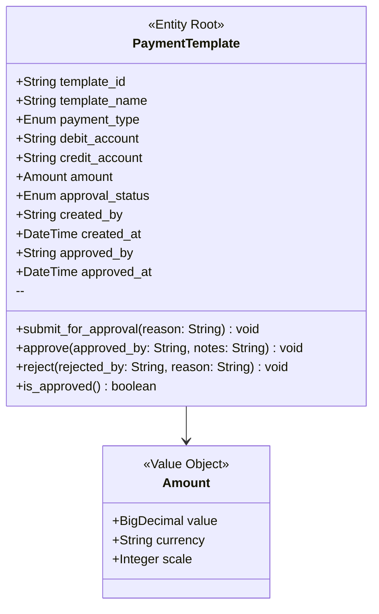
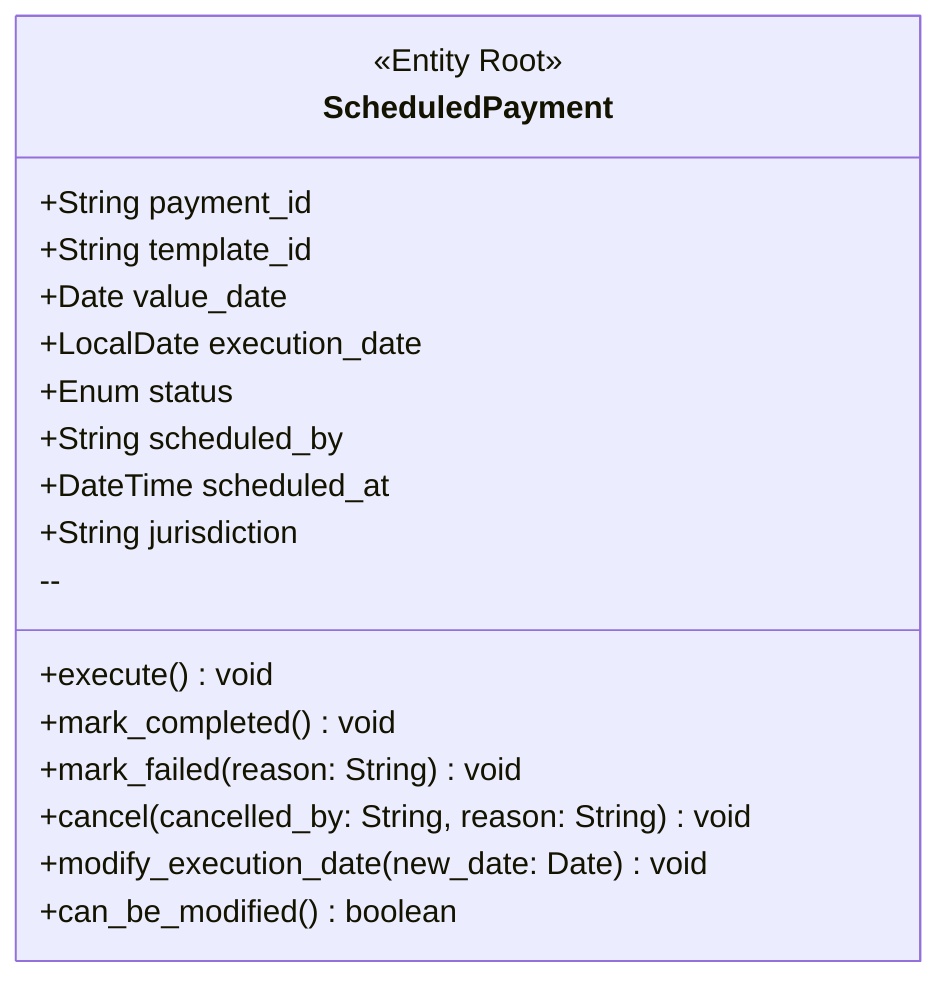
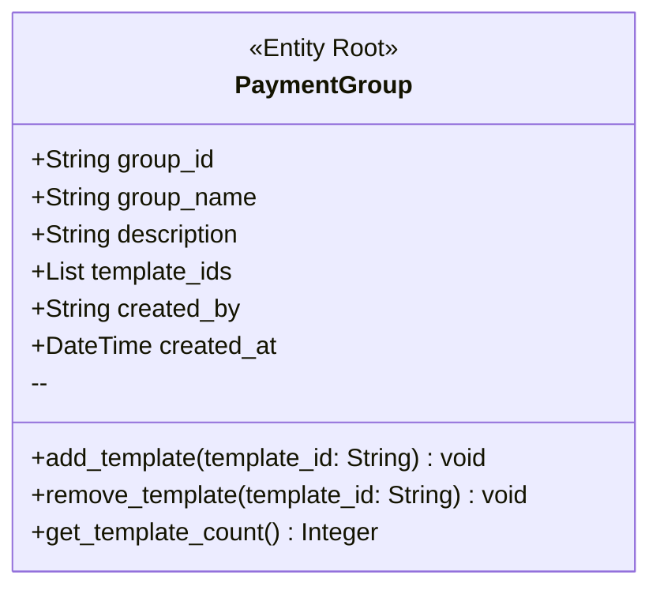
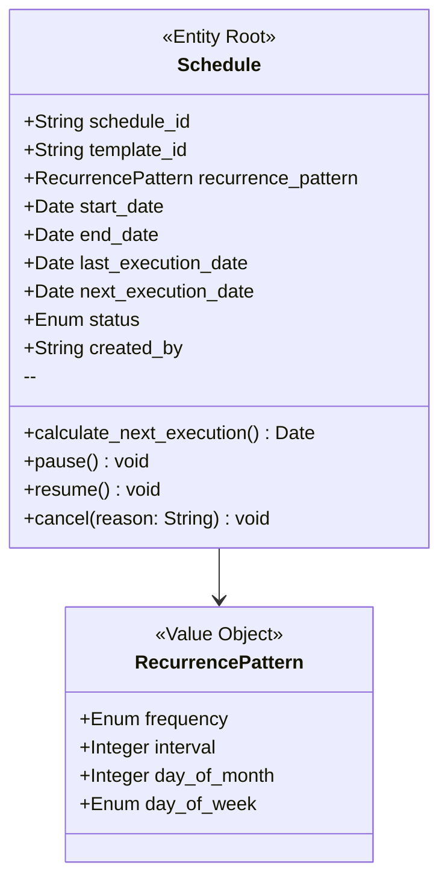

# Payment Scheduling Context

**Context ID**: `bc_payment_scheduling`
**Domain**: dom_payment_scheduling
**Description**: Core bounded context managing payment templates, schedules, recurring payment setup, and payment lifecycle within the payment scheduling domain

---

## Application Services

| Name | Description |
| --- | --- |
| [Payment Template Application Service](#svc_app_payment_template) | Orchestrates payment template use cases including creation, approval workflow, and lifecycle management |
| [Scheduled Payment Application Service](#svc_app_scheduled_payment) | Orchestrates payment scheduling use cases including future-dated and recurring payment scheduling |

## Domain Services

| Name | Description |
| --- | --- |
| [Working Day Calculation Service](#svc_dom_working_day_calculation) | Calculates valid execution dates based on jurisdiction-specific working day calendars |
| [Payment Validation Service](#svc_dom_payment_validation) | Validates payment details according to payment type-specific rules |
| [Recurrence Calculation Service](#svc_dom_recurrence_calculation) | Calculates next execution dates based on recurrence patterns |
| [Approval Policy Service](#svc_dom_approval_policy) | Determines approval requirements based on company-specific policies |

## Aggregates

| Name | Description |
| --- | --- |
| [Payment Template Aggregate](#agg_payment_template) | All required payment fields must be valid |
| [Scheduled Payment Aggregate](#agg_scheduled_payment) | Must reference a valid approved template |
| [Payment Group Aggregate](#agg_payment_group) | Group must have at least one template |
| [Schedule Aggregate](#agg_schedule) | Valid recurrence pattern required |

## Repositories

| Name | Description |
| --- | --- |
| [Payment Template Repository](#repo_payment_template) | Persistence for Payment Template Aggregate |
| [Scheduled Payment Repository](#repo_scheduled_payment) | Persistence for Scheduled Payment Aggregate |
| [Payment Group Repository](#repo_payment_group) | Persistence for Payment Group Aggregate |
| [Schedule Repository](#repo_schedule) | Persistence for Schedule Aggregate |

## Payment Template Aggregate

**Aggregate ID**: `agg_payment_template`
**Root Entity**: [Payment Template](#ent_payment_template)
**Size Estimate**: Small

### Description

All required payment fields must be valid

### Entities
- [Payment Template](#ent_payment_template) (root)

### Value Objects
- [Payment Template Id](#vo_payment_template_id)
- [Payment Type](#vo_payment_type)
- [Account Number](#vo_account_number)
- [Amount](#vo_amount)
- [Approval Status](#vo_approval_status)
- [User Id](#vo_user_id)

### Consistency Rules
- All required payment fields must be valid for the payment type
- Amount rules must be enforced based on payment type
- Approval status transitions must follow workflow

### Invariants
- Template data must be complete and valid
- Cannot modify template after it has been approved
- Payment type specific validations must pass

### Aggregate UML Diagram

## Scheduled Payment Aggregate

**Aggregate ID**: `agg_scheduled_payment`
**Root Entity**: [Scheduled Payment](#ent_scheduled_payment)
**Size Estimate**: Small

### Description

Must reference a valid approved template

### Entities
- [Scheduled Payment](#ent_scheduled_payment) (root)

### Value Objects
- [Payment Id](#vo_payment_id)
- [Payment Template Id](#vo_payment_template_id)
- [Execution Date](#vo_execution_date)
- [Payment Status](#vo_payment_status)
- [Jurisdiction Code](#vo_jurisdiction_code)
- [User Id](#vo_user_id)

### Consistency Rules
- Must reference a valid approved template
- Execution date must be valid working day
- Status transitions must be valid

### Invariants
- Cannot execute before value date
- Cannot modify after execution starts
- Execution date must respect working day calendar

### Aggregate UML Diagram

## Payment Group Aggregate

**Aggregate ID**: `agg_payment_group`
**Root Entity**: [Payment Group](#ent_payment_group)
**Size Estimate**: Small

### Description

Group must have at least one template

### Entities
- [Payment Group](#ent_payment_group) (root)

### Value Objects
- [Payment Group Id](#vo_payment_group_id)
- [Payment Template Id](#vo_payment_template_id)
- [User Id](#vo_user_id)

### Consistency Rules
- Must contain at least one template
- All templates must be approved
- No duplicate templates

### Invariants
- Group must have minimum one template
- Templates must exist and be approved
- Template IDs must be unique within group

### Aggregate UML Diagram

## Schedule Aggregate

**Aggregate ID**: `agg_schedule`
**Root Entity**: [Schedule](#ent_schedule)
**Size Estimate**: Medium

### Description

Valid recurrence pattern required

### Entities
- [Schedule](#ent_schedule) (root)

### Value Objects
- [Schedule Id](#vo_schedule_id)
- [Payment Template Id](#vo_payment_template_id)
- [Recurrence Pattern](#vo_recurrence_pattern)
- [Execution Date](#vo_execution_date)
- [User Id](#vo_user_id)

### Consistency Rules
- Recurrence pattern must be valid
- Next execution must be calculated correctly
- Must respect working day calendar

### Invariants
- Valid recurrence pattern required
- Cannot overlap existing active schedules
- Execution dates must be working days

### Aggregate UML Diagram

### Payment Template Id Value Object

**Value Object ID**: `vo_payment_template_id`
**Name**: Payment Template Id
**Description**: Unique identifier for a payment template
**Immutable**: ✓

#### Attributes

| Name | Type | Required | Description |
| --- | --- | --- | --- |
| id | String | ✓ | UUID string representation |

#### Validation Rules
- Must be non-null and non-empty
- Must be valid UUID format

#### Equality Criteria
- id

### Payment Id Value Object

**Value Object ID**: `vo_payment_id`
**Name**: Payment Id
**Description**: Unique identifier for a scheduled payment
**Immutable**: ✓

#### Attributes

| Name | Type | Required | Description |
| --- | --- | --- | --- |
| id | String | ✓ | UUID string representation |

#### Validation Rules
- Must be valid UUID

#### Equality Criteria
- id

### Schedule Id Value Object

**Value Object ID**: `vo_schedule_id`
**Name**: Schedule Id
**Description**: Unique identifier for a payment schedule
**Immutable**: ✓

#### Attributes

| Name | Type | Required | Description |
| --- | --- | --- | --- |
| id | String | ✓ |  |

#### Validation Rules
- Must be valid UUID

#### Equality Criteria
- id

### Payment Group Id Value Object

**Value Object ID**: `vo_payment_group_id`
**Name**: Payment Group Id
**Description**: Unique identifier for a payment group
**Immutable**: ✓

#### Attributes

| Name | Type | Required | Description |
| --- | --- | --- | --- |
| id | String | ✓ |  |

#### Validation Rules
- Must be valid UUID

#### Equality Criteria
- id

### Account Number Value Object

**Value Object ID**: `vo_account_number`
**Name**: Account Number
**Description**: Bank account number with validation
**Immutable**: ✓

#### Attributes

| Name | Type | Required | Description |
| --- | --- | --- | --- |
| account_number | String | ✓ | Account number in standard format |

#### Validation Rules
- Must be non-empty
- Must match valid account number pattern
- Must pass checksum validation

#### Equality Criteria
- account_number

### Amount Value Object

**Value Object ID**: `vo_amount`
**Name**: Amount
**Description**: Monetary amount with currency
**Immutable**: ✓

#### Attributes

| Name | Type | Required | Description |
| --- | --- | --- | --- |
| value | BigDecimal | ✓ | Numerical amount |
| currency | String | ✓ | ISO 4217 currency code (CAD, USD, EUR, etc.) |
| scale | Integer | ✓ | Decimal places (typically 2) |

#### Validation Rules
- Value must be positive or AVAILABLE_BALANCE keyword
- Currency must be valid ISO 4217 code
- Scale must be appropriate for currency (2 for CAD/USD)

#### Equality Criteria
- value
- currency

### Payment Type Value Object

**Value Object ID**: `vo_payment_type`
**Name**: Payment Type
**Description**: Enumeration of supported payment types
**Immutable**: ✓

#### Attributes

| Name | Type | Required | Description |
| --- | --- | --- | --- |
| type | Enum | ✓ | ACCOUNT_TRANSFER, BILL_PAYMENT, ACH_CREDIT, ACH_DEBIT, INTERAC_SEND, WIRE |

#### Validation Rules
- Must be one of the defined enum values

#### Equality Criteria
- type

### Execution Date Value Object

**Value Object ID**: `vo_execution_date`
**Name**: Execution Date
**Description**: Date when payment should execute (must be working day)
**Immutable**: ✓

#### Attributes

| Name | Type | Required | Description |
| --- | --- | --- | --- |
| date | LocalDate | ✓ |  |

#### Validation Rules
- Cannot be in the past
- Must be a valid working day for jurisdiction

#### Equality Criteria
- date

### Recurrence Pattern Value Object

**Value Object ID**: `vo_recurrence_pattern`
**Name**: Recurrence Pattern
**Description**: Pattern defining recurring payment frequency
**Immutable**: ✓

#### Attributes

| Name | Type | Required | Description |
| --- | --- | --- | --- |
| frequency | Enum | ✓ | DAILY, WEEKLY, BIWEEKLY, MONTHLY, QUARTERLY, ANNUALLY |
| interval | Integer | ✓ | Number of frequency periods between executions (e.g., 2 for bi-weekly) |
| day_of_month | Integer | ✗ | For monthly patterns, day of month (1-31) |
| day_of_week | Enum | ✗ | For weekly patterns, day of week |

#### Validation Rules
- Interval must be positive
- Day of month must be between 1 and 31 if specified
- Frequency and interval must be compatible

#### Equality Criteria
- frequency
- interval
- day_of_month
- day_of_week

### Payment Status Value Object

**Value Object ID**: `vo_payment_status`
**Name**: Payment Status
**Description**: Current status of a scheduled payment
**Immutable**: ✓

#### Attributes

| Name | Type | Required | Description |
| --- | --- | --- | --- |
| status | Enum | ✓ | DRAFT, SCHEDULED, EXECUTING, COMPLETED, FAILED, CANCELLED |

#### Validation Rules
- Must be one of the defined enum values

#### Equality Criteria
- status

### Approval Status Value Object

**Value Object ID**: `vo_approval_status`
**Name**: Approval Status
**Description**: Approval state of a payment template
**Immutable**: ✓

#### Attributes

| Name | Type | Required | Description |
| --- | --- | --- | --- |
| status | Enum | ✓ | DRAFT, PENDING_APPROVAL, APPROVED, REJECTED |

#### Validation Rules
- Must be one of the defined enum values
- State transitions must follow approval workflow

#### Equality Criteria
- status

### Jurisdiction Code Value Object

**Value Object ID**: `vo_jurisdiction_code`
**Name**: Jurisdiction Code
**Description**: Geographic jurisdiction for calendar rules
**Immutable**: ✓

#### Attributes

| Name | Type | Required | Description |
| --- | --- | --- | --- |
| code | String | ✓ | ISO country code (CA, US, UK, etc.) |

#### Validation Rules
- Must be valid ISO 3166-1 alpha-2 country code

#### Equality Criteria
- code

### User Id Value Object

**Value Object ID**: `vo_user_id`
**Name**: User Id
**Description**: Identifier for a user in the system
**Immutable**: ✓

#### Attributes

| Name | Type | Required | Description |
| --- | --- | --- | --- |
| id | String | ✓ |  |

#### Validation Rules
- Must be non-empty

#### Equality Criteria
- id

## Payment Template Repository

**Repository ID**: `repo_payment_template`
**Aggregate**: [Payment Template Aggregate](#agg_payment_template)

### Interface Methods

| Method | Parameters | Returns | Description |
| --- | --- | --- | --- |
| save | template: PaymentTemplate | void | Persist a payment template |
| find_by_id | template_id: String | Optional<PaymentTemplate> | Find template by ID |
| find_by_user | user_id: String | List<PaymentTemplate> | Find all templates for a user |
| find_pending_approval |  | List<PaymentTemplate> | Find templates pending approval |

## Scheduled Payment Repository

**Repository ID**: `repo_scheduled_payment`
**Aggregate**: [Scheduled Payment Aggregate](#agg_scheduled_payment)

### Interface Methods

| Method | Parameters | Returns | Description |
| --- | --- | --- | --- |
| save | payment: ScheduledPayment | void | Persist a scheduled payment |
| find_by_id | payment_id: String | Optional<ScheduledPayment> | Find payment by ID |
| find_by_execution_date | execution_date: Date | List<ScheduledPayment> | Find payments scheduled for execution on a specific date |
| find_by_user_and_date_range | user_id: String, start_date: Date, end_date: Date | List<ScheduledPayment> | Find user's payments within date range |

## Payment Group Repository

**Repository ID**: `repo_payment_group`
**Aggregate**: [Payment Group Aggregate](#agg_payment_group)

### Interface Methods

| Method | Parameters | Returns | Description |
| --- | --- | --- | --- |
| save | group: PaymentGroup | void |  |
| find_by_id | group_id: String | Optional<PaymentGroup> |  |
| find_by_user | user_id: String | List<PaymentGroup> |  |

## Schedule Repository

**Repository ID**: `repo_schedule`
**Aggregate**: [Schedule Aggregate](#agg_schedule)

### Interface Methods

| Method | Parameters | Returns | Description |
| --- | --- | --- | --- |
| save | schedule: Schedule | void |  |
| find_by_id | schedule_id: String | Optional<Schedule> |  |
| find_active_schedules |  | List<Schedule> | Find all active recurring schedules |
| find_due_for_execution | as_of_date: Date | List<Schedule> | Find schedules with next execution date today or earlier |

## Working Day Calculation Service

**Service ID**: `svc_dom_working_day_calculation`
**Type**: Domain Service

### Description

Calculates valid execution dates based on jurisdiction-specific working day calendars

### Methods

| Method | Parameters | Returns | Description |
| --- | --- | --- | --- |
| calculate_execution_date | value_date: Date, jurisdiction: String | Date | Calculate nearest working day for a value date |
| is_working_day | date: Date, jurisdiction: String | Boolean | Check if a date is a working day |
| next_working_day | date: Date, jurisdiction: String | Date | Get next working day after a given date |

## Payment Validation Service

**Service ID**: `svc_dom_payment_validation`
**Type**: Domain Service

### Description

Validates payment details according to payment type-specific rules

### Methods

| Method | Parameters | Returns | Description |
| --- | --- | --- | --- |
| validate_payment_details | payment_type: Enum, amount: Money, debit_account: String, credit_account: String | ValidationResult | Validate payment details for a specific payment type |
| validate_ach_payment | amount: Money | Boolean | ACH-specific validation rules |
| validate_wire_payment | amount: Money, destination_country: String | Boolean | Wire payment specific validation |

## Recurrence Calculation Service

**Service ID**: `svc_dom_recurrence_calculation`
**Type**: Domain Service

### Description

Calculates next execution dates based on recurrence patterns

### Methods

| Method | Parameters | Returns | Description |
| --- | --- | --- | --- |
| calculate_next_execution_date | pattern: RecurrencePattern, last_execution_date: Date, jurisdiction: String | Date | Calculate next execution date from recurrence pattern |
| calculate_all_occurrences | pattern: RecurrencePattern, start_date: Date, end_date: Date | List<Date> | Calculate all occurrence dates within a date range |

## Approval Policy Service

**Service ID**: `svc_dom_approval_policy`
**Type**: Domain Service

### Description

Determines approval requirements based on company-specific policies

### Methods

| Method | Parameters | Returns | Description |
| --- | --- | --- | --- |
| requires_approval | payment_type: Enum, amount: Money, created_by: String | Boolean | Check if template requires approval |
| get_required_approvers | template_id: String | List<String> | Get list of required approvers for a template |

## Payment Template Application Service

**Service ID**: `svc_app_payment_template`
**Type**: Application Service

### Description

Orchestrates payment template use cases including creation, approval workflow, and lifecycle management

### Operations

#### create_template (Command)

**Type**: Command
**Parameters**:
- command: CreatePaymentTemplateCmd (required)
**Returns**: String

**Transaction Boundary**:
- Is Transactional: ✓
- Modifies Aggregates: agg_payment_template
- Consistency Type: transactional

**Workflow**:
1. Validates input (✓)
2. Creates new aggregate
3. Invokes domain operations: validate_payment_details, requires_approval (via Payment Validation Service, Approval Policy Service)
4. Persists aggregate (✓)
5. Publishes events: evt_payment_template_created

#### submit_for_approval (Command)

**Type**: Command
**Parameters**:
- command: SubmitTemplateForApprovalCmd (required)
**Returns**: void

**Transaction Boundary**:
- Is Transactional: ✓
- Modifies Aggregates: agg_payment_template
- Consistency Type: transactional

**Workflow**:
1. Validates input (✓)
2. Loads aggregates: agg_payment_template
3. Invokes domain operations: submit_for_approval
4. Persists aggregate (✓)
5. Publishes events: evt_template_submitted_for_approval

#### approve_template (Command)

**Type**: Command
**Parameters**:
- command: ApproveTemplateCmd (required)
**Returns**: void

**Transaction Boundary**:
- Is Transactional: ✓
- Modifies Aggregates: agg_payment_template
- Consistency Type: transactional

**Workflow**:
1. Validates input (✓)
2. Loads aggregates: agg_payment_template
3. Invokes domain operations: approve
4. Persists aggregate (✓)
5. Publishes events: evt_template_approved

#### reject_template (Command)

**Type**: Command
**Parameters**:
- command: RejectTemplateCmd (required)
**Returns**: void

**Transaction Boundary**:
- Is Transactional: ✓
- Modifies Aggregates: agg_payment_template
- Consistency Type: transactional

**Workflow**:
2. Loads aggregates: agg_payment_template
3. Invokes domain operations: reject
4. Persists aggregate (✓)
5. Publishes events: evt_template_rejected

#### get_template (Query)

**Type**: Query
**Parameters**:
- template_id: String (required)
**Returns**: TemplateSummary

**Workflow**:
1. Validates input (✓)
2. Loads aggregates: agg_payment_template
3. Returns DTO: TemplateSummary

## Scheduled Payment Application Service

**Service ID**: `svc_app_scheduled_payment`
**Type**: Application Service

### Description

Orchestrates payment scheduling use cases including future-dated and recurring payment scheduling

### Operations

#### schedule_future_payment (Command)

**Type**: Command
**Parameters**:
- command: ScheduleFuturePaymentCmd (required)
**Returns**: String

**Transaction Boundary**:
- Is Transactional: ✓
- Modifies Aggregates: agg_scheduled_payment
- Consistency Type: transactional

**Workflow**:
1. Validates input (✓)
2. Loads aggregates: agg_payment_template
3. Invokes domain operations: calculate_execution_date, is_working_day (via Working Day Calculation Service)
4. Persists aggregate (✓)
5. Publishes events: evt_payment_scheduled

#### schedule_recurring_payment (Command)

**Type**: Command
**Parameters**:
- command: ScheduleRecurringPaymentCmd (required)
**Returns**: String

**Transaction Boundary**:
- Is Transactional: ✓
- Modifies Aggregates: agg_schedule
- Consistency Type: transactional

**Workflow**:
1. Validates input (✓)
2. Loads aggregates: agg_payment_template
3. Invokes domain operations: calculate_next_execution_date (via Recurrence Calculation Service, Working Day Calculation Service)
4. Persists aggregate (✓)
5. Publishes events: evt_recurring_payment_scheduled

#### cancel_payment (Command)

**Type**: Command
**Parameters**:
- command: CancelPaymentCmd (required)
**Returns**: void

**Transaction Boundary**:
- Is Transactional: ✓
- Modifies Aggregates: agg_scheduled_payment
- Consistency Type: transactional

**Workflow**:
2. Loads aggregates: agg_scheduled_payment
3. Invokes domain operations: cancel
4. Persists aggregate (✓)
5. Publishes events: evt_payment_cancelled

#### modify_payment (Command)

**Type**: Command
**Parameters**:
- command: ModifyPaymentCmd (required)
**Returns**: void

**Transaction Boundary**:
- Is Transactional: ✓
- Modifies Aggregates: agg_scheduled_payment
- Consistency Type: transactional

**Workflow**:
2. Loads aggregates: agg_scheduled_payment
3. Invokes domain operations: modify_execution_date (via Working Day Calculation Service)
4. Persists aggregate (✓)
5. Publishes events: evt_payment_modified

#### get_payment_status (Query)

**Type**: Query
**Parameters**:
- payment_id: String (required)
**Returns**: PaymentStatusSummary

**Workflow**:
2. Loads aggregates: agg_scheduled_payment
3. Returns DTO: PaymentStatusSummary

## Domain Events

### Payment Template Created

**Event ID**: `evt_payment_template_created`
**Aggregate**: [Payment Template Aggregate](#agg_payment_template)

#### Payload

| Field | Type | Description |
| --- | --- | --- |
| template_id | String |  |
| payment_type | String |  |
| amount | String |  |
| created_by | String |  |
| created_at | String |  |

### Template Submitted For Approval

**Event ID**: `evt_template_submitted_for_approval`
**Aggregate**: [Payment Template Aggregate](#agg_payment_template)

#### Payload

| Field | Type | Description |
| --- | --- | --- |
| template_id | String |  |
| submitted_by | String |  |
| submitted_at | String |  |

### Template Approved

**Event ID**: `evt_template_approved`
**Aggregate**: [Payment Template Aggregate](#agg_payment_template)

#### Payload

| Field | Type | Description |
| --- | --- | --- |
| template_id | String |  |
| approved_by | String |  |
| approved_at | String |  |

### Template Rejected

**Event ID**: `evt_template_rejected`
**Aggregate**: [Payment Template Aggregate](#agg_payment_template)

#### Payload

| Field | Type | Description |
| --- | --- | --- |
| template_id | String |  |
| rejected_by | String |  |
| rejection_reason | String |  |
| rejected_at | String |  |

### Payment Scheduled

**Event ID**: `evt_payment_scheduled`
**Aggregate**: [Scheduled Payment Aggregate](#agg_scheduled_payment)

#### Payload

| Field | Type | Description |
| --- | --- | --- |
| payment_id | String |  |
| template_id | String |  |
| value_date | String |  |
| execution_date | String |  |
| scheduled_by | String |  |

### Recurring Payment Scheduled

**Event ID**: `evt_recurring_payment_scheduled`
**Aggregate**: [Schedule Aggregate](#agg_schedule)

#### Payload

| Field | Type | Description |
| --- | --- | --- |
| schedule_id | String |  |
| template_id | String |  |
| recurrence_pattern | String |  |
| next_execution_date | String |  |

### Payment Cancelled

**Event ID**: `evt_payment_cancelled`
**Aggregate**: [Scheduled Payment Aggregate](#agg_scheduled_payment)

#### Payload

| Field | Type | Description |
| --- | --- | --- |
| payment_id | String |  |
| cancelled_by | String |  |
| cancellation_reason | String |  |
| cancelled_at | String |  |

### Payment Modified

**Event ID**: `evt_payment_modified`
**Aggregate**: [Scheduled Payment Aggregate](#agg_scheduled_payment)

#### Payload

| Field | Type | Description |
| --- | --- | --- |
| payment_id | String |  |
| modifications | String | JSON describing what was changed |
| modified_by | String |  |
| modified_at | String |  |

## Command Interfaces

### Payment Template Commands Interface

**Command Interface ID**: `cmd_payment_template_commands`
**Description**: Command interface for payment template operations

#### Create Payment Template Cmd

**Record Name**: CreatePaymentTemplateCmd
**Intent**: create

**Parameters**:

| Name | Type | Required | Description |
| --- | --- | --- | --- |
| template_name | String | ✓ |  |
| payment_type | String | ✓ |  |
| debit_account | String | ✓ |  |
| credit_account | String | ✓ |  |
| amount | String | ✓ |  |
| currency | String | ✓ |  |
| created_by | String | ✓ |  |

**Returns**:
- Type: domain_id
- Value Object: [Payment Template Id](#vo_payment_template_id)

**Modifies Aggregate**: [Payment Template Aggregate](#agg_payment_template)

**Publishes Events**:
- [Payment Template Created](#evt_payment_template_created)

#### Submit Template For Approval Cmd

**Record Name**: SubmitTemplateForApprovalCmd
**Intent**: submit

**Parameters**:

| Name | Type | Required | Description |
| --- | --- | --- | --- |
| template_id | String | ✓ |  |
| reason | String | ✓ |  |
| submitted_by | String | ✓ |  |

**Returns**:
- Type: void

**Modifies Aggregate**: [Payment Template Aggregate](#agg_payment_template)

**Publishes Events**:
- [Template Submitted For Approval](#evt_template_submitted_for_approval)

#### Approve Template Cmd

**Record Name**: ApproveTemplateCmd
**Intent**: approve

**Parameters**:

| Name | Type | Required | Description |
| --- | --- | --- | --- |
| template_id | String | ✓ |  |
| approved_by | String | ✓ |  |
| approval_notes | String | ✗ |  |

**Returns**:
- Type: void

**Modifies Aggregate**: [Payment Template Aggregate](#agg_payment_template)

**Publishes Events**:
- [Template Approved](#evt_template_approved)

**Audit Fields**: approved_by, approval_notes

#### Reject Template Cmd

**Record Name**: RejectTemplateCmd
**Intent**: reject

**Parameters**:

| Name | Type | Required | Description |
| --- | --- | --- | --- |
| template_id | String | ✓ |  |
| rejected_by | String | ✓ |  |
| rejection_reason | String | ✓ |  |

**Returns**:
- Type: void

**Modifies Aggregate**: [Payment Template Aggregate](#agg_payment_template)

**Publishes Events**:
- [Template Rejected](#evt_template_rejected)

**Audit Fields**: rejected_by, rejection_reason

### Scheduled Payment Commands Interface

**Command Interface ID**: `cmd_scheduled_payment_commands`
**Description**: Command interface for scheduled payment operations

#### Schedule Future Payment Cmd

**Record Name**: ScheduleFuturePaymentCmd
**Intent**: schedule

**Parameters**:

| Name | Type | Required | Description |
| --- | --- | --- | --- |
| template_id | String | ✓ |  |
| value_date | String | ✓ |  |
| jurisdiction | String | ✓ |  |
| scheduled_by | String | ✓ |  |

**Returns**:
- Type: domain_id
- Value Object: [Payment Id](#vo_payment_id)

**Modifies Aggregate**: [Scheduled Payment Aggregate](#agg_scheduled_payment)

**Publishes Events**:
- [Payment Scheduled](#evt_payment_scheduled)

#### Schedule Recurring Payment Cmd

**Record Name**: ScheduleRecurringPaymentCmd
**Intent**: schedule

**Parameters**:

| Name | Type | Required | Description |
| --- | --- | --- | --- |
| template_id | String | ✓ |  |
| recurrence_pattern | String | ✓ |  |
| start_date | String | ✓ |  |
| end_date | String | ✗ |  |
| jurisdiction | String | ✓ |  |
| scheduled_by | String | ✓ |  |

**Returns**:
- Type: domain_id
- Value Object: [Schedule Id](#vo_schedule_id)

**Modifies Aggregate**: [Schedule Aggregate](#agg_schedule)

**Publishes Events**:
- [Recurring Payment Scheduled](#evt_recurring_payment_scheduled)

#### Cancel Payment Cmd

**Record Name**: CancelPaymentCmd
**Intent**: cancel

**Parameters**:

| Name | Type | Required | Description |
| --- | --- | --- | --- |
| payment_id | String | ✓ |  |
| cancelled_by | String | ✓ |  |
| cancellation_reason | String | ✓ |  |

**Returns**:
- Type: void

**Modifies Aggregate**: [Scheduled Payment Aggregate](#agg_scheduled_payment)

**Publishes Events**:
- [Payment Cancelled](#evt_payment_cancelled)

**Audit Fields**: cancelled_by, cancellation_reason

#### Modify Payment Cmd

**Record Name**: ModifyPaymentCmd
**Intent**: modify

**Parameters**:

| Name | Type | Required | Description |
| --- | --- | --- | --- |
| payment_id | String | ✓ |  |
| new_value_date | String | ✗ |  |
| new_amount | String | ✗ |  |
| modified_by | String | ✓ |  |

**Returns**:
- Type: void

**Modifies Aggregate**: [Scheduled Payment Aggregate](#agg_scheduled_payment)

**Publishes Events**:
- [Payment Modified](#evt_payment_modified)

## Query Interfaces

### Payment Template Queries Interface

**Query Interface ID**: `qry_payment_template_queries`
**Description**: Query interface for retrieving payment template data

#### get Template

**Method Name**: getTemplate
**Description**: Get detailed template information

**Parameters**:

| Name | Type | Required | Description |
| --- | --- | --- | --- |
| template_id | String | ✓ |  |

**Result Record**: TemplateSummary

**Result Structure**:

| Field | Type | Serialization | Description |
| --- | --- | --- | --- |
| template_id | String | UUID as string |  |
| template_name | String |  |  |
| payment_type | String | Enum as string |  |
| amount | String | Money as formatted string |  |
| approval_status | String | Enum as string |  |
| created_by | String |  |  |
| created_at | String | ISO 8601 timestamp |  |

**Bypasses Domain Model**: ✗

#### list Templates

**Method Name**: listTemplates
**Description**: List all templates for a user

**Parameters**:

| Name | Type | Required | Description |
| --- | --- | --- | --- |
| user_id | String | ✓ |  |

**Result Record**: TemplateListSummary

**Result Structure**:

| Field | Type | Serialization | Description |
| --- | --- | --- | --- |
| templates | String |  | JSON array of template summaries |

**Bypasses Domain Model**: ✗

#### list Pending Approvals

**Method Name**: listPendingApprovals
**Description**: List templates pending approval

**Result Record**: PendingApprovalsSummary

**Result Structure**:

| Field | Type | Serialization | Description |
| --- | --- | --- | --- |
| pending_templates | String |  | JSON array of templates awaiting approval |

**Bypasses Domain Model**: ✗

### Scheduled Payment Queries Interface

**Query Interface ID**: `qry_scheduled_payment_queries`
**Description**: Query interface for retrieving scheduled payment data

#### get Payment Status

**Method Name**: getPaymentStatus
**Description**: Get current status and details of a payment

**Parameters**:

| Name | Type | Required | Description |
| --- | --- | --- | --- |
| payment_id | String | ✓ |  |

**Result Record**: PaymentStatusSummary

**Result Structure**:

| Field | Type | Serialization | Description |
| --- | --- | --- | --- |
| payment_id | String |  |  |
| status | String | Enum as string |  |
| value_date | String | Date as ISO string |  |
| execution_date | String | Date as ISO string |  |
| amount | String | Money formatted |  |
| payment_type | String |  |  |

**Bypasses Domain Model**: ✗

**Optimizations**:
- Denormalized: ✗
- Cached: ✓
- Indexed: ✓

#### list Scheduled Payments

**Method Name**: listScheduledPayments
**Description**: List scheduled payments within date range

**Parameters**:

| Name | Type | Required | Description |
| --- | --- | --- | --- |
| user_id | String | ✓ |  |
| start_date | String | ✓ |  |
| end_date | String | ✓ |  |

**Result Record**: PaymentListSummary

**Result Structure**:

| Field | Type | Serialization | Description |
| --- | --- | --- | --- |
| payments | String |  | JSON array of payment summaries |

**Bypasses Domain Model**: ✗

**Optimizations**:
- Denormalized: ✓
- Cached: ✗
- Indexed: ✓

#### list Payments By Group

**Method Name**: listPaymentsByGroup
**Description**: List all payments in a payment group

**Parameters**:

| Name | Type | Required | Description |
| --- | --- | --- | --- |
| group_id | String | ✓ |  |

**Result Record**: GroupPaymentsSummary

**Result Structure**:

| Field | Type | Serialization | Description |
| --- | --- | --- | --- |
| group_id | String |  |  |
| group_name | String |  |  |
| payments | String |  | JSON array of payments in group |

**Bypasses Domain Model**: ✗

